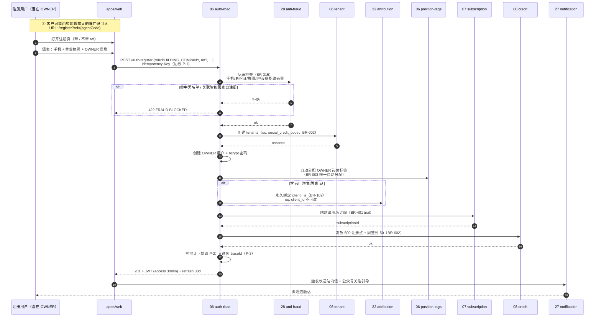
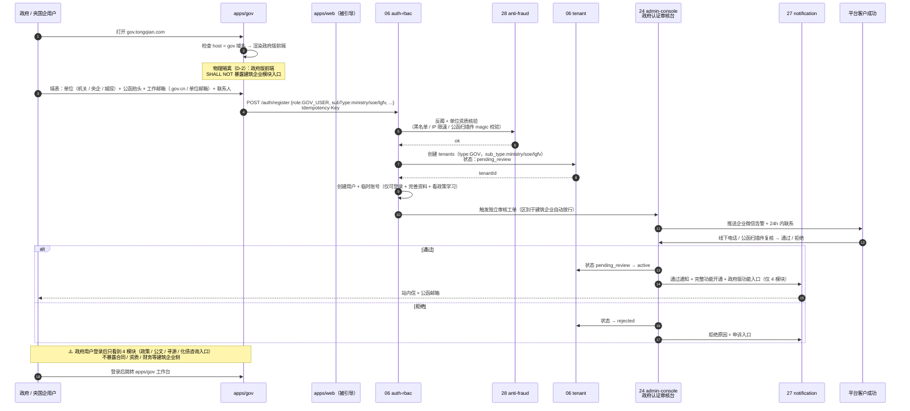
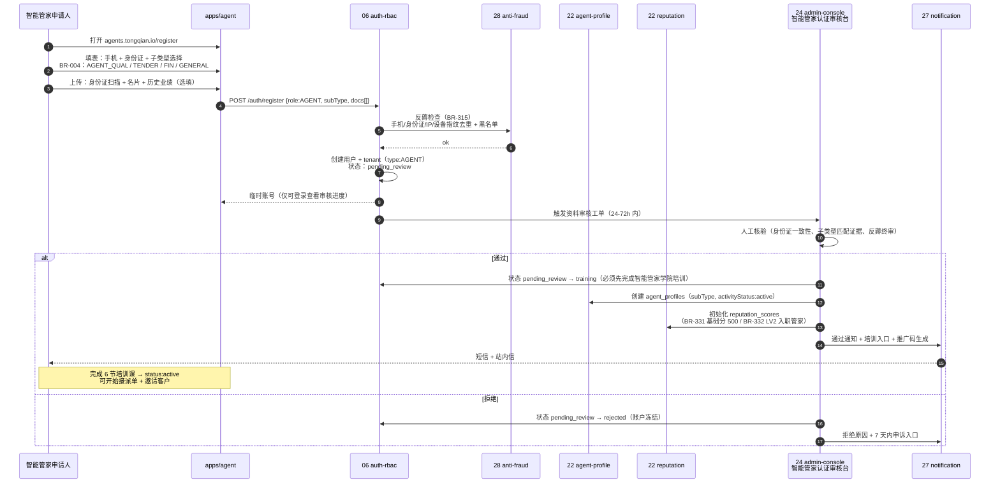
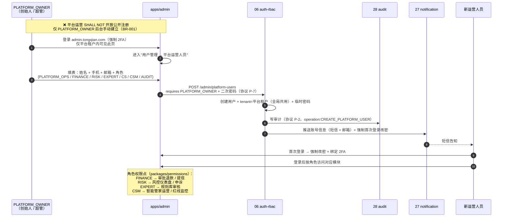
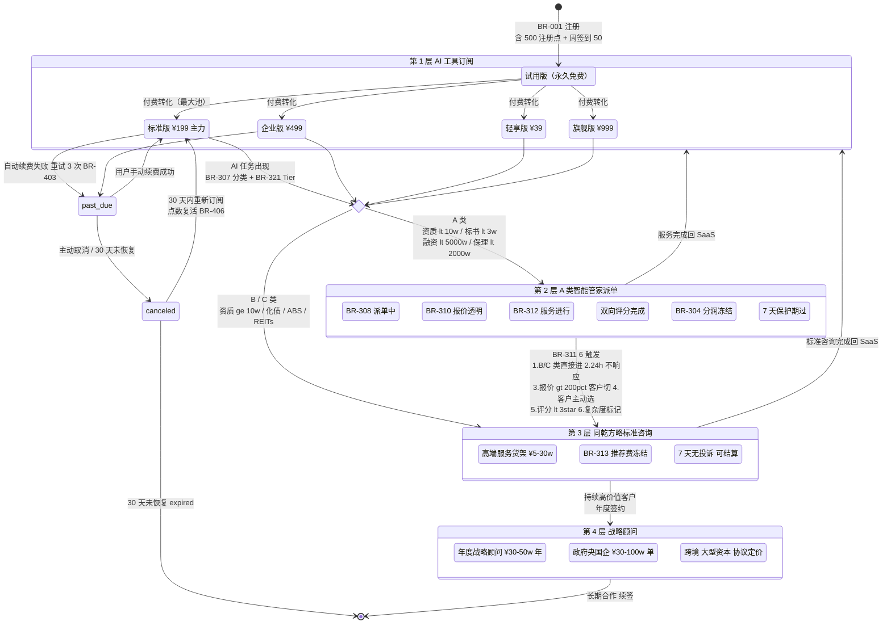
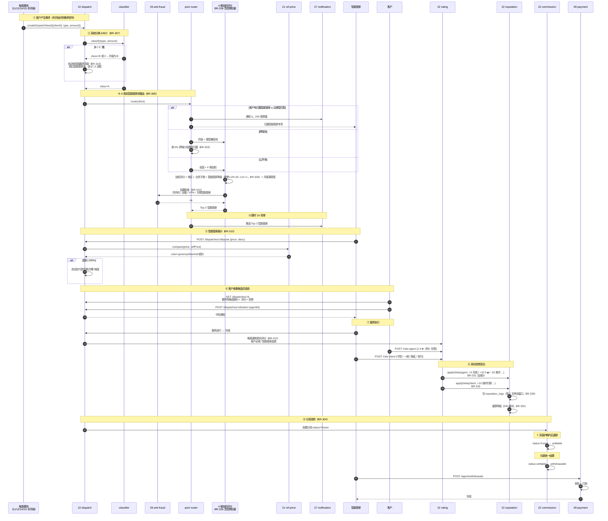
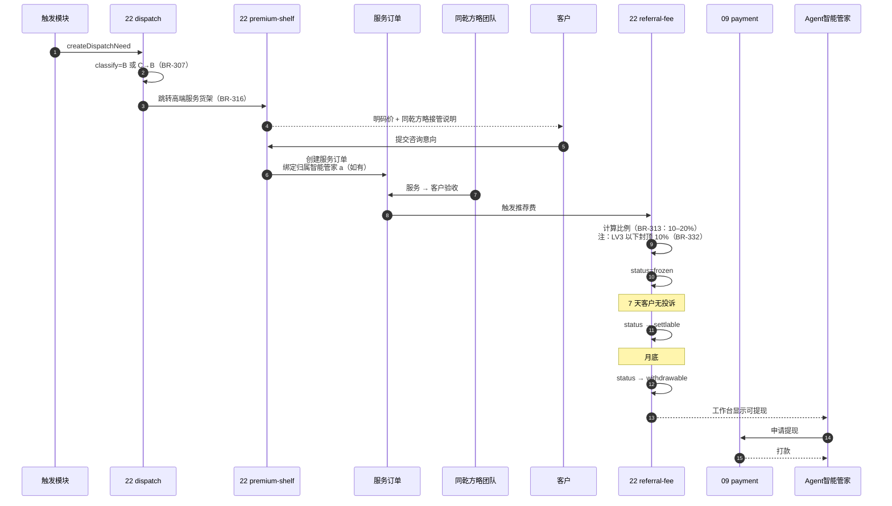
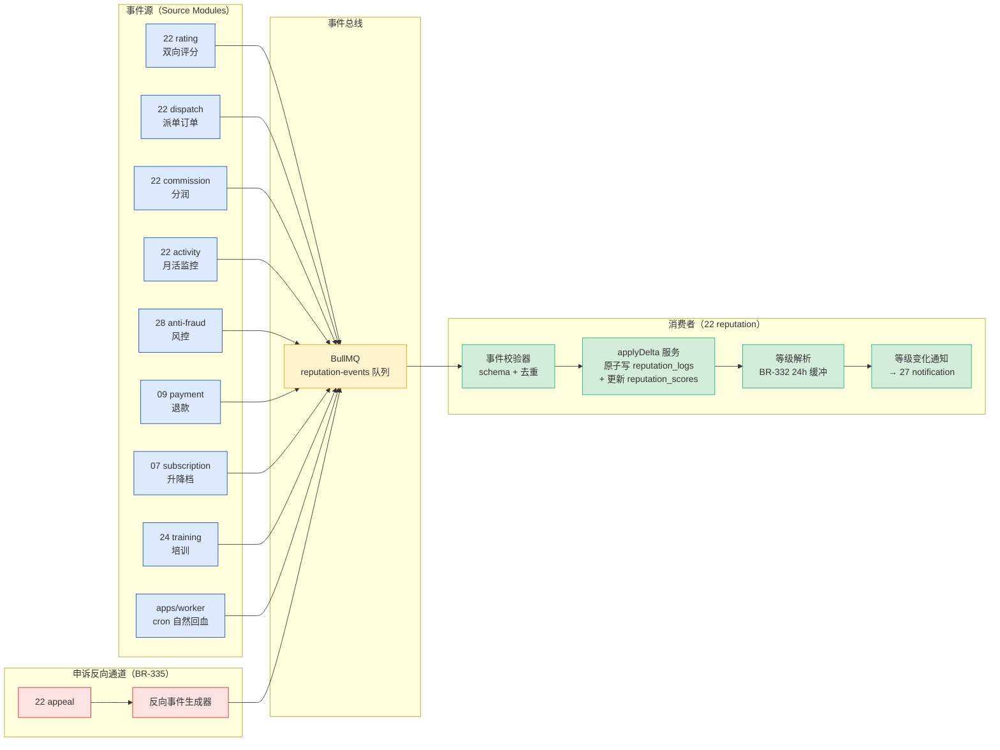
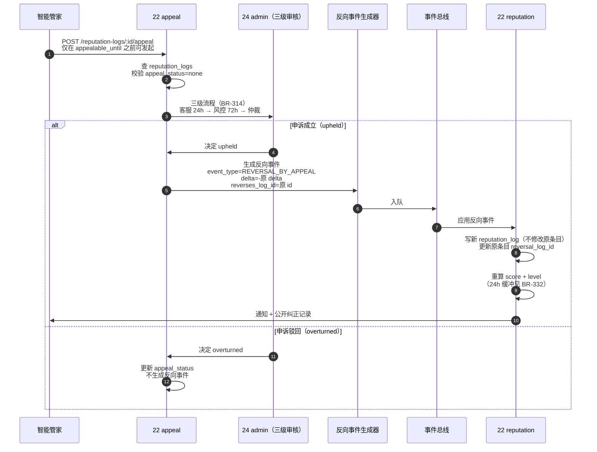
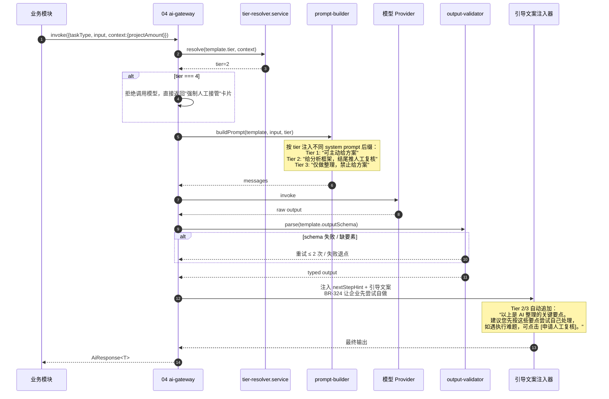

# 00 项目顶层 Spec - Design / Flows（业务流程时序与状态机）

> **本文档定位**：[`design.md`](./design.md) 的姊妹篇，专门收纳跨模块的**时序图**与**状态机**。Codex 撰写每个子 Spec 时引用本文章节编号即可。
>
> **拆分原因**：原 `design.md` 单文件 1962 行违反 [`memory-management.md` §3.1](../../steering/memory-management.md)"单文件 ≤ 500 行"硬约束。本文承接原 §3 / §6 / §7 / §8 / §9 五个章节，与 [`design-protocols.md`](./design-protocols.md) 一起把 design 总规模降到每文件 ≤ 800 行。
>
> **本文涵盖**：
> - §3 4 大用户大类的注册流程时序图
> - §6 三层服务漏斗的状态机（客户生命周期）
> - §7 派单决策的核心序列图
> - §8 信誉分变动的事件溯源设计
> - §9 AI 输出 Tier 分级的实现机制

---

## 3. 4 大用户大类的注册流程时序图

### 3.1 TL;DR

> 4 类用户的注册路径不同：建筑企业含归属智能管家推广码识别 + OWNER 创建 + 默认岗位；政府 / 央国企走独立审核 + 独立前端跳转；智能管家需选子类型 + 实名资料审核 + 强制培训 + 信誉分初始化（**零保证金**，2026-05-16 ADR-AUTO 取消）；平台运营无公开注册，由超管手动建立。**4 张图均共享相同的反薅 / traceId / 审计基础设施（协议 P-1 至 P-3，见 [`design-protocols.md` 附录 A](./design-protocols.md)）**。

### 3.2 流程 1：建筑企业用户注册（含归属智能管家推广码 + OWNER + 岗位标签）

涉及子 Spec：[`06-auth-rbac`] / [`07-subscription-billing`] / [`08-credit-system`] / [`22-agent-workspace`] / [`27-notification-center`] / [`28-security-compliance`]

**关联 BR**：BR-001 / BR-002 / BR-003 / BR-102 / BR-315 / BR-401 / BR-602



❗ **关键约束**：
- OWNER 是注册时**唯一自动分配**的岗位，其他 30+ 岗位由 OWNER 后续邀请员工时分配（BR-003）。
- `client_attributions.client_id` 是 **DB 唯一索引** + 业务层不可改，`agent_id` 一经写入永久不可修改（BR-102）。

### 3.3 流程 2：政府 / 央国企用户注册（含独立审核 + 政府版前端跳转）

涉及子 Spec：[`06-auth-rbac`] / [`23-gov-soe-workspace`] / [`24-admin-console`] / [`27-notification-center`] / [`28-security-compliance`]

**关联 BR**：BR-001 / BR-002 / BR-005 / BR-104 / BR-315



❗ **关键约束**：
- 政府版**独立前端**（apps/gov），与建筑企业版**物理隔离**（BR-005）。共用同一后端但走独立审核工单流。
- 数据导出受 BR-104 强约束（OWNER + 二次密码 + 审计）。

### 3.4 流程 3：智能管家用户注册（子类型 + 实名资料审核 + 强制培训 + 信誉分初始化）

> **2026-05-16 ADR-AUTO 变更**：早期版本要求 ¥1000 保证金，正式取消。改为零门槛入驻 + 实名资料审核 + 强制培训通关 + 信誉分约束。理由：保证金构成合伙人招募阻力，且与"推荐 0 抽成"理念冲突；实名 + 培训 + 信誉分更适合长期运营。

涉及子 Spec：[`06-auth-rbac`] / [`22-agent-workspace`] / [`24-admin-console`] / [`27-notification-center`] / [`28-security-compliance`]

**关联 BR**：BR-001 / BR-004 / BR-301 / BR-306 / BR-315 / BR-331 / BR-332



❗ **关键约束**：
- 智能管家子类型决定派单匹配规则（BR-004 / BR-336 业务子类匹配维度）。
- **零保证金**（已取消，无需 [`09-payment-gateway`] 介入）。准入门槛靠：实名审核 + 强制培训 + 信誉分约束 + LV1 重启 6 次保护期上限（BR-331）。
- 信誉分基础 500 + LV2 入职管家（BR-331 / BR-332）。培训未通过期间（status=training）**SHALL NOT** 进入派单池。
- 培训未通过 / 拒绝注册：账户进入 rejected 冻结，7 天内可申诉，不涉及任何资金回退。

### 3.5 流程 4：平台运营用户创建（超管手动建立，无公开注册）

涉及子 Spec：[`06-auth-rbac`] / [`24-admin-console`] / [`27-notification-center`] / [`28-security-compliance`]

**关联 BR**：BR-001 / BR-002 / BR-005



❗ **关键约束**：
- 平台运营人员属于**单一平台租户**，权限按角色（不是岗位标签）划分。
- 任何创建 / 删除 / 角色变更 **MUST** 走审批 + 审计（协议 P-2 / P-7）。
- 强制 2FA + 异地登录二次验证（[`security-rules.md` §1](../../steering/security-rules.md)）。

---

## 6. 三层服务漏斗的状态机（客户生命周期）

### 6.1 TL;DR

> 这是**整个产品的商业核心闭环**，跨越 [`07`] / [`22`] / [`11`] / [`13`] / [`14`] / [`15`] 等多个子 Spec。从**注册（试用）→ 付费 → A 类派单 → B/C 类同乾方略接管 → 战略顾问签约**的完整客户生命周期。**关键状态：trial → paying → dispatched → consulting → strategic**。

### 6.2 完整客户生命周期状态机



### 6.3 各阶段触发条件 / 转化目标 / 关联 BR

| 阶段 | 触发条件 | 中性目标（首年）| 红线（BR-901）| 关联 BR |
|---|---|---|---|---|
| 试用 → 付费 | 试用版完成 ≥ 1 次 AI 任务 + 提醒 + 签到 | ≥ 12% | — | BR-001 / BR-401 / BR-602 |
| 付费 → 智能管家派单 | A 类需求 + BR-308 路由 | 月活客户的 30% | — | BR-307 / BR-308 / BR-310 |
| 智能管家派单 → 同乾方略 | BR-311 6 触发任一 | A 类的 10% | — | BR-311 / BR-313 / BR-316 |
| 付费 → 同乾方略标准咨询 | B / C 类需求 + BR-322 引导 | ≥ 5% | < 2% 触发应急 | BR-307 / BR-321 / BR-322 / BR-316 |
| 标准咨询 → 战略顾问 | 持续高价值 + 客户成功跟进 | 标准咨询的 8% | — | — |
| 任意阶段 → past_due | 自动续费失败 + 重试 3 次 | — | — | BR-403 |
| canceled → 复活 | 30 天内重新订阅 | — | — | BR-406 |

### 6.4 关键状态字段（数据表归属）

| 状态 | 字段 | 表 | 子 Spec |
|---|---|---|---|
| trial / paying_* / past_due / canceled / reactivated / expired | `subscriptions.status` | `subscriptions` | [`07`] |
| dispatched / quoted / in_service / rated / commission_* | `dispatches.status` | `dispatches` | [`22`] |
| consulting / referral_fee_* | `referral_fees.status` | `referral_fees` | [`22`] |
| strategic_* | `consulting_orders.contract_type` | `consulting_orders` | [`22`] / [`24`] |

❗ 完整的"订阅生命周期"子状态机（trial / active / paused / change_plan 等内部细节）见 [`07-subscription-billing` design.md]，本节只展示**核心商业漏斗**层面。

---

## 7. 派单决策的核心序列图

### 7.1 TL;DR

> 体现 [`ADR-002`](../../../docs/decisions/2025-05-15-adr-002-dispatch-mechanism.md) 完整 6 步流程：**需求分类 → 池路由 → 4 维加权匹配 → 报价标色 → 客户选择 → 服务执行 → 双向评分 → 信誉变动 → 推荐费 / 分润结算**。覆盖 BR-307 至 BR-316、BR-331 至 BR-336。

### 7.2 完整派单流程序列图（含信誉与结算）

涉及子 Spec：[`22`] / [`21`] / [`27`] / [`09`]



### 7.3 B/C 类直接同乾方略接管（推荐费给智能管家）



❗ **关键约束**：
- 归属智能管家绑定在订单创建时确认，后续不可改（BR-102）。
- 推荐费状态机 `frozen → settlable → withdrawable → paid` 与智能管家分润状态机统一（BR-304）。
- 智能管家等级 LV3 以下接 B 类推荐费**仅按 10% 计**（BR-332），无法享受 15–20% 上限。

---

## 8. 信誉分变动的事件溯源设计

### 8.1 TL;DR

> 每条信誉分加减都通过**事件**触发，每条事件可追溯（事件源 + 时间戳 + 关联订单 + 申诉状态）。**申诉成立时反向回滚事件**（不修改原事件，新增"反向事件"，保持审计完整性）。事件最终一致性，等级变化有 24h 缓冲。

### 8.2 事件类型枚举（`packages/types/reputation/event-type.ts`）

```ts
enum ReputationEventType {
  // 智能管家加分（BR-331）
  AGENT_ORDER_COMPLETED = 'agent.order.completed',         // +5
  AGENT_RECEIVED_5STAR = 'agent.received.5star',           // +10
  AGENT_MONTHLY_TOP = 'agent.monthly.top',                 // +30 月度均分 ≥ 4.5★
  AGENT_REFERRED_NEW_AGENT = 'agent.referred.new_agent',   // +50
  AGENT_REFERRED_BIG_DEAL = 'agent.referred.big_deal',     // +100 推荐 B 类大单
  AGENT_REGION_PARTNER = 'agent.region.partner',           // +200/年
  AGENT_TRAINING_COMPLETED = 'agent.training.completed',   // +20/课
  AGENT_CONTINUOUS_ACTIVE = 'agent.continuous.active',     // +50 连续 12 月月活
  AGENT_NATURAL_RECOVERY = 'agent.natural.recovery',       // +20/月（cron）

  // 智能管家减分（BR-331）
  AGENT_RECEIVED_LOW_RATING = 'agent.received.low_rating', // -20 差评 < 3★
  AGENT_COMPLAINT_VALIDATED = 'agent.complaint.validated', // -50 投诉成立
  AGENT_QUOTE_OVERPRICED = 'agent.quote.overpriced',       // -10 超价 200%
  AGENT_NO_RESPONSE_24H = 'agent.no_response.24h',         // -5
  AGENT_SUSPENDED = 'agent.suspended',                     // -100
  AGENT_PENDING_DISPOSE = 'agent.pending.dispose',         // -300
  AGENT_RISK_VIOLATION = 'agent.risk.violation',           // -200
  AGENT_BLACKLISTED = 'agent.blacklisted',                 // 一票否决归零

  // 客户加分（BR-333）
  CLIENT_PAYMENT_ON_TIME = 'client.payment.on_time',       // +10
  CLIENT_GAVE_GOOD_RATING = 'client.gave.good_rating',     // +5
  CLIENT_RATED_ON_TIME = 'client.rated.on_time',           // +5
  CLIENT_CONTINUOUS_PAYING = 'client.continuous.paying',   // +50 连续 6 月付费
  CLIENT_UPGRADED_PLAN = 'client.upgraded.plan',           // +30

  // 客户减分（BR-333）
  CLIENT_PAYMENT_DELAYED = 'client.payment.delayed',       // -30
  CLIENT_PAYMENT_REFUSED = 'client.payment.refused',       // -100
  CLIENT_MALICIOUS_RATING = 'client.malicious.rating',     // -50
  CLIENT_REFUNDED_TOO_MANY = 'client.refunded.too_many',   // -50
  CLIENT_FRAUD_DETECTED = 'client.fraud.detected',         // -200

  // 反向事件（申诉成立）
  REVERSAL_BY_APPEAL = 'reversal.by.appeal',               // 与原事件等额反向
}
```

### 8.3 事件流架构图



### 8.4 事件溯源数据模型（`reputation_logs` 关键字段）

```prisma
model ReputationLog {
  id              String   @id @default(cuid())
  entity_id       String   // userId（客户）/ agentId（智能管家）
  entity_type     EntityType  // 'agent' | 'client'
  event_type      String   // ReputationEventType
  delta           Int      // 加减分（带符号）
  source_module   String   // 事件源模块（如 '22 rating'）
  source_resource String?  // 关联资源 ID（如 dispatchId / orderId）
  reason          String   // 人类可读说明
  metadata        Json?    // 额外上下文

  // 申诉相关（BR-335）
  appealable_until DateTime    // 创建后 7 天
  appeal_status    AppealStatus @default(none) // none / pending / upheld / overturned
  reversal_log_id  String?     // 若被反向，指向反向事件 id
  reverses_log_id  String?     // 若是反向事件，指向被反向的原事件 id

  // 标准字段
  tenant_id   String?  // null 表示跨租户事件（如平台层风控）
  created_at  DateTime @default(now())
  created_by  String?  // 系统事件为 null
  trace_id    String   // 协议 P-3

  @@index([entity_id, entity_type, created_at])
  @@index([appeal_status])
}
```

### 8.5 申诉反向回滚机制



❗ **关键约束**：
- **永不删除原事件**：审计完整性（[`security-rules.md` §13](../../steering/security-rules.md)）。
- **反向事件等额反向**：原事件 -20 → 反向事件 +20，分数恢复。
- **7 天申诉窗口**：`appealable_until = createdAt + 7d`，超期不可申诉。
- **缓冲期累加**：24h 缓冲期内分数继续累加但等级不变（BR-332），用 BullMQ 延迟任务实现。

### 8.6 PBT 强制要求（落点 [`22`]）

| 属性 | 描述 |
|---|---|
| 分数边界 | ∀ 任意行为序列：分数 ∈ [0, 1000] |
| 反向回滚还原性 | ∀ 事件 e + 反向事件 r：score(after r) = score(before e) |
| 等级单调性 | ∀ 任意分数：等级解析 ∈ {LV1..LV5} 且单调 |
| 自然回血上限 | ∀ 月度活跃：自然回血 ≤ +20/月 |

---

## 9. AI 输出 Tier 分级的实现机制

### 9.1 TL;DR

> Tier 在 **PromptTemplate 中以函数形式声明**（`tier(ctx) => 1|2|3|4`）。`ai-gateway/tier-resolver.service.ts` 在调用前解析，决定输出深度 + nextStepHint + 引导文案。**所有 AI 输出强制带 4 要素**（disclaimer / tier / confidence / nextStepHint，BR-322）。

### 9.2 PromptTemplate 中的 Tier 配置

```ts
// apps/api/src/prompts/risk-review/contract-review-pro.ts
import { z } from 'zod';
import { PromptTemplate } from '@/ai-gateway/types';
import { ContractReviewOutputSchema } from './schemas';

export const ContractReviewProPrompt: PromptTemplate = {
  taskType: AiTaskType.CONTRACT_REVIEW_PRO,
  version: 'v3',
  description: '专业级合同审查',

  // ❗ Tier 解析函数（BR-321）
  tier: (ctx: TierContext) => {
    if (ctx.projectAmount < 10_000_000) return 1;       // < ¥1000 万 → 主动指导
    if (ctx.projectAmount < 50_000_000) return 2;       // ¥1000–5000 万 → 分析 + 人工复核
    return 3;                                            // ≥ ¥5000 万 → 仅整理 + 引导
  },

  // 模型配置
  primaryModel: 'claude-sonnet-4-6',
  fallbackModel: 'qwen-max',
  needsSanitize: true,

  // System Prompt（依赖 tier 的部分由 builder 注入）
  systemPrompt: `你是建筑业资深合同律师...

【红线表述清单（BR-323）】
❌ 禁用："必须"、"一定"、"绝对"、"我建议你这样做"
✅ 必用："建议关注"、"通常做法"、"参考行业惯例"`,

  // 输出 schema（强制 4 要素，BR-322）
  outputSchema: ContractReviewOutputSchema,

  fallbackText: '抱歉，AI 暂时无法处理本次请求，已退还点数，请稍后重试。',
};
```

### 9.3 4 强制要素 schema（packages/types/ai-report/required-elements.ts）

```ts
import { z } from 'zod';

export const RequiredElementsSchema = z.object({
  // BR-322 强制要素 1
  disclaimer: z.string().min(20).default(
    '本报告由 AI 生成，仅作为日常参考工具使用，不构成专业法律 / 财务 / 投资意见。' +
    '重大决策请咨询持牌专业人士或同乾方略团队。'
  ),
  // BR-322 强制要素 2
  tier: z.union([z.literal(1), z.literal(2), z.literal(3), z.literal(4)]),
  // BR-322 强制要素 3
  confidence: z.enum(['high', 'medium', 'low']),
  // BR-322 强制要素 4
  nextStepHint: z.enum([
    'use-directly',              // Tier 1
    'apply-human-review',        // Tier 2
    'apply-tongqian-consult',    // Tier 3
    'mandatory-human-takeover',  // Tier 4
  ]),
});

// 业务输出 schema 必须 .merge(RequiredElementsSchema)
export const ContractReviewOutputSchema = z.object({
  summary: z.object({/* ... */}),
  risks: z.array(z.object({/* ... */})).max(60),
  recommendations: z.array(z.string()).max(10),
}).merge(RequiredElementsSchema);
```

### 9.4 AI Gateway 调度时序



### 9.5 Tier 输出格式差异

| Tier | 输出风格 | nextStepHint | UI 表现 |
|---|---|---|---|
| 1 | 可执行方案 + 具体建议 | `use-directly` | 报告底部按钮：保存 / 复制 |
| 2 | 分析框架 + 关键风险点 | `apply-human-review` | 报告底部按钮：申请人工复核（连接 [`24-admin-console`] 工单）|
| 3 | 信息整理 + 风险提示，**SHALL NOT 出方案** | `apply-tongqian-consult` | 报告底部按钮：申请同乾方略咨询（跳 `/services/premium`）|
| 4 | **拒绝输出**，仅信息卡片 + 转人工 | `mandatory-human-takeover` | 全屏卡片：直接转人工（不可关闭）|

### 9.6 PBT 强制要求（落点 [`04`]）

| 属性 | 描述 |
|---|---|
| Tier 解析单调性 | ∀ projectAmount ↑：tier ∈ {1,2,3} 单调非递减（边界除外）|
| 4 要素完整性 | ∀ AI 输出：schema.parse 失败 ⟹ 4 要素缺失 |
| 红线表述拦截 | ∀ AI 输出：不含 "必须 / 一定 / 绝对" 等词 |
| 脱敏 round-trip | ∀ 输入 x：unmask(mask(x)) === x（BR-504）|

---

## 章节交叉引用

| 主题 | 见 |
|---|---|
| 整体架构总图 + 17 大功能区 + 5 大架构决策 | [`design.md` §2](./design.md) |
| 28 个子 Spec 依赖图 + 串行/并行约束 | [`design.md` §4](./design.md) |
| 61 条 BR → 物理实现位置映射表 | [`design.md` §5](./design.md) |
| packages 层级关系 + 错误码命名空间 | [`design.md` §11](./design.md) |
| 8 个关键设计权衡 | [`design.md` §14](./design.md) |
| 开放问题与延后决策 | [`design.md` §15](./design.md) |
| 4 层 WHERE 多租户隔离 4 道防线 | [`design-protocols.md` §10](./design-protocols.md) |
| 部署与发布架构（灰度 / 回滚）| [`design-protocols.md` §12](./design-protocols.md) |
| 5 个跨子 Spec e2e 集成测试场景 | [`design-protocols.md` §13](./design-protocols.md) |
| 跨模块协议 P-1 至 P-8 | [`design-protocols.md` 附录 A](./design-protocols.md) |
