# 00 项目顶层 Spec - Design / Protocols（多租户 / 部署 / 集成测试 / 跨模块协议）

> **本文档定位**：[`design.md`](./design.md) 的姊妹篇，专门收纳**横切性技术协议**。Codex 撰写每个子 Spec 时引用本文章节编号即可。
>
> **拆分原因**：原 `design.md` 单文件 1962 行违反 [`memory-management.md` §3.1](../../steering/memory-management.md)"单文件 ≤ 500 行"硬约束。本文承接原 §10 / §12 / §13 + 附录 A 四个章节。
>
> **本文涵盖**：
> - §10 多租户隔离的代码层实现（4 层 WHERE 4 道防线）
> - §12 部署与发布架构（灰度 / 回滚 / 一二期演进）
> - §13 跨子 Spec 的 Workflow 级集成测试场景
> - 附录 A 跨模块协议 P-1 至 P-8
> - 附录 B 顶层 Spec 维护责任表

---

## 10. 多租户隔离的代码层实现（4 层 WHERE）

### 10.1 TL;DR

> 4 道防线确保所有查询自动带 4 层 WHERE，**业务代码无法绕过**：① 请求级 `TenantContext`（AsyncLocalStorage）→ ② `BaseRepository` 强制注入 → ③ Prisma middleware 兜底拦截 → ④ 单测 + e2e 跨租户用例。BR-101 是不可妥协的安全底线。

### 10.2 4 层 WHERE 的语义

```
where: {
  tenant_id:   ctx.tenantId,                            // 第 1 层：租户隔离（必备）
  scope_type:  ctx.scopeType,                           // 第 2 层：公司层 vs 项目层
  ...(ctx.projectId  && { project_id: ctx.projectId }), // 第 3 层：项目隔离
  ...(ctx.ownerOnly  && { owner_id:  ctx.userId }),     // 第 4 层：个人隔离
  deleted_at: null,                                     // 软删除过滤
}
```

### 10.3 防线 1：TenantContext（请求级上下文）

`apps/api/src/common/context/tenant-context.service.ts`

```ts
import { AsyncLocalStorage } from 'async_hooks';

interface TenantCtx {
  tenantId: string;
  userId: string;
  scopeType: 'tenant' | 'project' | 'owner';
  projectId?: string;
  ownerOnly?: boolean;
  roles: Role[];
  positionTags: PositionTag[];
  traceId: string;
}

export class TenantContextService {
  private storage = new AsyncLocalStorage<TenantCtx>();

  run<T>(ctx: TenantCtx, fn: () => Promise<T>): Promise<T> {
    return this.storage.run(ctx, fn);
  }

  get(): TenantCtx {
    const ctx = this.storage.getStore();
    if (!ctx) throw new TenantContextMissingError();
    return ctx;
  }
}
```

由 **TenantContextMiddleware** 在 JWT 解析成功后初始化，整个请求生命周期可获取。Worker 任务通过 BullMQ 消息体传递并重建 context。

### 10.4 防线 2：BaseRepository 基类强制 tenant_id

`apps/api/src/database/repository/base.repository.ts`

```ts
export abstract class BaseRepository<TModel> {
  constructor(
    protected prisma: PrismaService,
    protected ctxService: TenantContextService,
  ) {}

  /** 通用查询：自动注入 4 层 WHERE */
  protected withScope<W extends object>(extra: W): W & ScopeWhere {
    const ctx = this.ctxService.get();
    return {
      ...extra,
      tenant_id: ctx.tenantId,
      scope_type: ctx.scopeType,
      ...(ctx.projectId && { project_id: ctx.projectId }),
      ...(ctx.ownerOnly && { owner_id: ctx.userId }),
      deleted_at: null,
    } as W & ScopeWhere;
  }

  async findMany(args: { where?: object; /* ... */ }): Promise<TModel[]> {
    return (this.prisma as any)[this.modelName].findMany({
      ...args,
      where: this.withScope(args.where ?? {}),
    });
  }

  /** 创建：自动注入 tenant_id + created_by */
  async create(data: object): Promise<TModel> {
    const ctx = this.ctxService.get();
    return (this.prisma as any)[this.modelName].create({
      data: { ...data, tenant_id: ctx.tenantId, created_by: ctx.userId },
    });
  }
}
```

❗ **业务代码 SHALL NOT 直接 import PrismaService**，必须通过对应 Repository。

### 10.5 防线 3：Prisma Middleware（兜底拦截）

`apps/api/src/database/prisma/scope-guard.middleware.ts`

```ts
prisma.$use(async (params, next) => {
  const SYSTEM_MODELS = ['Tenant', 'User', 'GlobalConfig', 'PlatformAudit',
    'KnowledgeRule', 'ReferencePrice'];  // 跨租户共享表

  if (SYSTEM_MODELS.includes(params.model!)) {
    return next(params);
  }

  // 读操作：检查 where 是否含 tenant_id
  if (['findMany', 'findFirst', 'count', 'aggregate'].includes(params.action)) {
    const where = params.args.where ?? {};
    if (!where.tenant_id) {
      throw new ScopeViolationError(
        `Query on ${params.model} without tenant_id WHERE`
      );
    }
  }

  // 写操作：检查 data 是否带 tenant_id
  if (['create', 'createMany', 'update', 'updateMany'].includes(params.action)) {
    const data = params.args.data;
    if (Array.isArray(data) ? !data[0]?.tenant_id : !data.tenant_id) {
      // updateMany 必须有 tenant_id WHERE
      if (params.action.startsWith('update') && !params.args.where?.tenant_id) {
        throw new ScopeViolationError(
          `Update on ${params.model} without tenant_id`
        );
      }
    }
  }

  return next(params);
});
```

### 10.6 防线 4：单测 + e2e 跨租户隔离测试

```ts
describe('ContractRepository - tenant isolation (BR-101)', () => {
  it('SHALL NOT 跨租户查询', async () => {
    // 创建租户 A 的合同
    await ctxService.run({ tenantId: 'A', userId: 'a1', /* ... */ }, async () => {
      await contractRepo.create({ name: 'A 的合同' });
    });
    // 切换到租户 B 查询，应返回空
    const result = await ctxService.run({ tenantId: 'B', userId: 'b1', /* ... */ }, async () => {
      return contractRepo.findMany({});
    });
    expect(result).toHaveLength(0);
  });

  it('Prisma middleware 拦截无 tenant_id WHERE', async () => {
    await expect(
      // 故意绕过 BaseRepo
      prisma.contract.findMany({ where: { name: 'foo' } })
    ).rejects.toThrow(ScopeViolationError);
  });
});

// e2e 跨角色越权测试
describe('GET /api/v1/contracts/:id - 跨租户越权', () => {
  it('返回 404（不暴露存在性）', async () => {
    const tokenA = await loginAs('userA', 'tenantA');
    const tokenB = await loginAs('userB', 'tenantB');
    const { body: { data } } = await request(app)
      .post('/api/v1/contracts')
      .set('Authorization', `Bearer ${tokenA}`)
      .send({ name: 'A 的合同' });

    await request(app)
      .get(`/api/v1/contracts/${data.id}`)
      .set('Authorization', `Bearer ${tokenB}`)
      .expect(404);  // 不返回 403，避免泄漏存在性
  });
});
```

### 10.7 例外清单（系统级表，不需 4 层 WHERE）

| 表 | 原因 |
|---|---|
| `tenants` / `users` | 注册 / 鉴权前置，跨租户 |
| `global_configs` / `platform_audit` | 平台层 |
| `knowledge_*` / `reference_prices` / `policies` | 跨租户共享知识 |
| `subscription_plans` | 全局定价 |
| `lottery_events` | 全局抽点活动 |

❗ 例外清单**集中维护**在 `apps/api/src/database/prisma/system-models.ts`，新增必须先发 ADR。

---

## 12. 部署与发布架构

### 12.1 TL;DR

> 引用 [`docs/architecture.md` §6](../../../docs/architecture.md)。**一期单 VPS + Docker Compose**，通过 GitHub Actions 自动构建镜像 → 推 ACR → SSH 部署。**灰度发布**用 docker-compose 双 instance + Nginx 流量切分；**回滚**通过 `previous` tag 镜像快速切回。

### 12.2 GitHub → VPS 发布流水线

```mermaid
graph LR
  subgraph 开发["开发"]
    Dev[开发者本地]
  end

  subgraph CI["GitHub Actions"]
    Lint[lint + typecheck + test]
    Build[Docker build]
    PushACR[push 阿里云 ACR<br/>tag: sha + version + previous]
    E2E[关键路径 e2e]
  end

  subgraph Stage["staging（develop 分支）"]
    StageDeploy[SSH staging VPS<br/>docker-compose up -d]
    StageHealth[健康检查 30s]
  end

  subgraph Prod["production（main 分支）"]
    ProdGreen[绿组 docker-compose<br/>新镜像]
    ProdBlue[蓝组 docker-compose<br/>当前镜像]
    Nginx[Nginx 流量切分<br/>100 / 0 → 50 / 50 → 0 / 100]
    ProdHealth[健康检查 5min]
    Rollback[失败 → docker-compose<br/>切回 previous tag]
  end

  Dev -->|push feature/*| Lint
  Lint --> Build
  Build --> PushACR
  PushACR --> E2E
  E2E -->|merge to develop| StageDeploy
  StageDeploy --> StageHealth
  StageHealth -->|merge to main| ProdGreen
  ProdGreen --> Nginx
  ProdBlue --> Nginx
  Nginx --> ProdHealth
  ProdHealth -->|健康| ProdGreen
  ProdHealth -->|失败| Rollback

  classDef ok fill:#d4edda,stroke:#10b981
  classDef warn fill:#fff3cd,stroke:#f59e0b
  classDef err fill:#fde2e2,stroke:#dc2626

  class Lint,Build,PushACR,E2E,StageDeploy,StageHealth ok
  class ProdGreen,Nginx,ProdHealth warn
  class Rollback err
```



### 12.3 灰度发布机制（关键参数）

| 阶段 | 流量比例 | 观察时长 | 触发回滚的指标 |
|---|---|---|---|
| 阶段 1：金丝雀 | 5% | 10 min | 错误率 ≥ 1% / P95 ≥ 2× baseline |
| 阶段 2：小流量 | 25% | 30 min | 错误率 ≥ 0.5% / 业务红线（BR-901）异常 |
| 阶段 3：半流量 | 50% | 1 h | 同上 |
| 阶段 4：全流量 | 100% | 持续 | — |

**实现机制**（一期简化版）：
- Nginx upstream 双 server（绿 / 蓝）+ `weight` 调整
- `infra/nginx/canary.sh` 脚本一键切换权重
- Prometheus + Grafana 监控触发自动告警，**不自动回滚**（OPC 模式人工决策）

### 12.4 回滚策略

| 场景 | 操作 | RTO |
|---|---|---|
| 单服务故障 | `docker-compose -f prod.yml up -d --no-deps {svc}:previous` | ≤ 2 min |
| 数据库 schema 不兼容 | `prisma migrate resolve --rolled-back` + 应用回滚 | ≤ 30 min |
| 严重数据问题 | 还原 PG 全量备份（凌晨 03:00 OSS） | ≤ 4 h（RTO 上限）|
| Provider 故障 | 后台一键切渠道（BR-507）| ≤ 60 s |

❗ **回滚红线**：
- ❌ SHALL NOT `git push -f` 已合并 main 的提交
- ❌ SHALL NOT 直接修改生产 DB 数据（必须经 migration）
- ✅ 优先用 `git revert` + 走完整流水线

### 12.5 一期 vs 二期演进

| 维度 | 一期（OPC） | 二期演进触发 |
|---|---|---|
| 计算 | 单 VPS 8C16G | 客户 ≥ 5 万 → 双 VPS 热备（ADR-011 潜）|
| 数据库 | PG 主从 | 读库横扩 |
| 缓存 | Redis 主备 | 多分片 |
| 编排 | Docker Compose | ❌ SHALL NOT 上 K8s（[`requirements.md` §10](./requirements.md)）|
| 部署 | 半自动 + 人工灰度 | 自动化蓝绿 |

---

## 13. 跨子 Spec 的 Workflow 级集成测试场景

### 13.1 TL;DR

> 5 个端到端测试场景，每个串联多个子 Spec，作为 e2e 套件的关键验收线。**每次 PR CI 必跑全部 5 个**，跑不过不能合 main。这些场景**也是顶层 Spec 自身验证子 Spec 集成正确性**的金标准。

### 13.2 场景 1：建筑企业完整付费 + 合同审查闭环

> 建筑企业注册 → 订阅 ¥199 → 上传合同审查 → 付款 → 收到老板版 + 详细版报告

**涉及子 Spec**：[`06`] / [`07`] / [`08`] / [`09`] / [`04`] / [`13`] / [`10`] / [`27`] / [`28`]

**验收点**：
1. 注册成功 + 默认试用版（BR-001 / BR-401）
2. 订阅 ¥199 成功 + 自动续费默认开（BR-403）+ 注册赠 500 + 周签到 50（BR-602）
3. 上传 PDF 合同 → AI Gateway 调用（BR-501–502）→ 扣点 1500（基础 300 / 专业 1500）
4. tier=1（< ¥1000 万）→ AI 主动给方案（BR-321）+ 4 强制要素（BR-322）
5. ≤ 30s 返回老板版 H5 报告 + ≤ 5min 生成详细版 PDF（[`requirements.md` R3.3](./requirements.md)）
6. 报告含同乾方略联合品牌（旗舰版）/ 标准品牌（其他档）
7. 通知触达（站内信 + 公众号）

**Playwright 关键路径片段**：
```ts
test('建筑企业完整付费 + 合同审查', async ({ page }) => {
  await page.goto('/register');
  await page.fill('[name=phone]', '13800000000');
  await page.fill('[name=businessLicense]', '91110000XXXXXXX');
  // 注册 → 默认 trial
  await expect(page).toHaveURL('/dashboard');
  await page.click('text=升级订阅');
  await page.click('text=标准版 ¥199');
  // 微信支付 mock 回调 success
  await mockWechatCallback(page, 'success');
  // 上传合同
  await page.goto('/contracts/new');
  await page.setInputFiles('[type=file]', 'fixtures/contract-1m.pdf');
  await expect(page.locator('text=审查中')).toBeVisible();
  // 等待 ≤ 30s
  await expect(page.locator('text=老板版报告')).toBeVisible({ timeout: 30000 });
  // 校验 4 要素
  await expect(page.locator('text=Tier 1')).toBeVisible();
  await expect(page.locator('text=AI 信心度')).toBeVisible();
  await expect(page.locator('text=本报告由 AI 生成')).toBeVisible();
});
```

### 13.3 场景 2：A 类资质升级派单 → 评分 → 信誉变动

> 客户产生资质升级需求（< ¥10 万）→ A 类派单 → 智能管家接单 → 报价 → 评分 → 信誉变动

**涉及子 Spec**：[`14`] / [`22`] / [`21`] / [`27`] / [`09`]

**验收点**：
1. [`14-qualification-guard`] 识别"二级 → 一级"需求 + 金额 < ¥10 万
2. [`22-agent-workspace`] dispatch 模块 classify=A → 路由（归属 → 跨域 → 公开）
3. 4 维加权（含信誉等级 BR-336）→ Top 3 智能管家限时 1h 抢单
4. 智能管家报价 → ref-price 标色（BR-310）
5. 客户选定 → 服务进行 → 完成
6. 强制双向评分（BR-312，客户必填）
7. 信誉事件入队 → reputation_logs 写入（BR-331 / BR-333）
8. 等级变化通知（BR-332 24h 缓冲）
9. 分润 frozen → 7 天后 settlable → 月底 withdrawable（BR-304）

### 13.4 场景 3：B 类 ABS 需求 → 同乾方略接管 + 智能管家推荐费

> 客户产生 ABS 需求 → B 类直接同乾方略 → 智能管家拿推荐费

**涉及子 Spec**：[`19`] / [`22`] / [`24`] / [`09`]

**验收点**：
1. [`19-cashflow-finance`] 识别"ABS 申报"复杂度 → tier=3
2. AI 输出 nextStepHint=`apply-tongqian-consult`（BR-321 / BR-322）
3. classify=B（直接进高端货架，BR-307）→ 跳 `/services/premium`
4. 客户在高端服务货架提交意向 → 创建 consulting_order，绑定归属智能管家 a
5. 同乾方略服务 → 客户验收
6. 推荐费计算（BR-313：ABS 类 10–15%，LV3 以下封顶 10%）
7. 状态机 frozen（7 天）→ settlable（月底）→ withdrawable
8. 智能管家工作台显示推荐费看板（BR-313）

### 13.5 场景 4：智能管家推荐客户 + 二级裂变（智能管家推荐智能管家）

> 智能管家 a 推广码 → 客户 X 注册 + 订阅 → a 拿 30%；a 推荐智能管家 b → b 接单 → a 永久拿 b 的 10%

**涉及子 Spec**：[`06`] / [`22`] / [`07`] / [`08`] / [`09`]

**验收点**：
1. 智能管家 a 持有推广码 + 推荐链接（BR-301）
2. 客户 X 通过 `?ref=aCode` 注册 → `client_attributions` 永久绑定（BR-102）
3. X 订阅 ¥199（首年）→ a 月度获 30%（BR-302）→ status=frozen
4. a 邀请智能管家 b 加盟 → `agent_relations` 自引用，level=2（BR-301 二级封顶）
5. b 首笔分润达 ¥1000 → a 一次性奖 ¥200（BR-305）
6. b 后续所有分润 → a 永久拿 10%（BR-305）
7. 试图 a → b → c → d 三级 → 系统拒绝（`AGENT.LEVEL_EXCEEDED`）

### 13.6 场景 5：自动续费失败 → past_due → 短信 → 客户挽回

> 自动续费失败 → past_due → 短信通知 → 客户手动续费成功 / 30 天未恢复 → canceled

**涉及子 Spec**：[`07`] / [`09`] / [`27`] / [`08`]

**验收点**：
1. 续费 cron 扫描到期日 -7 / -3 / -1 → 推送提醒（BR-403）
2. 到期当天扣款 → 失败 → 重试 1（24h 后）→ 重试 2 → 重试 3 → 仍失败
3. 状态 active → past_due，停用付费功能（BR-403）
4. past_due 后 7 天内挽回率监控（OQ-008）
5. 用户手动续费 → 状态 past_due → active；点数复活（BR-406）
6. 30 天未恢复 → canceled
7. 30 天内重新订阅 → 复活（点数 frozen_until 解除）；超 30 天 → 点数作废

### 13.7 PBT 在子 Spec 的落点（统一表）

| 场景 | 子 Spec | PBT 强度 | 关联属性 |
|---|---|---|---|
| Prompt 输出 schema round-trip | [`04`] + 全部杀手锏 | **强制** | schema.parse 双向 |
| 派单 A/B/C 分类（BR-307）| [`22`] | **强制** | 输入金额 + 类型 → 分类正确 |
| 信誉分加减（BR-331）| [`22`] | **强制** | 任意行为序列 → 分数 ∈ [0, 1000] |
| 智能管家等级解析（BR-332）| [`22`] | **强制** | 任意分数 → 等级 ∈ {LV1..LV5} 单调 |
| 4 维加权评分（BR-336）| [`22`] | **强制** | 任意池 → Top 3 顺序稳定 |
| 报价标色（BR-310）| [`21`] / [`22`] | **强制** | 任意报价 + 参考价 → 颜色枚举正确 |
| 阶梯优惠 counter（BR-402）| [`07`] | **强制** | 任意续费序列 → counter 单调或重置 |
| 退款金额（BR-202）| [`09`] | **强制** | 任意天数 + 金额 → 可退金额单调非增 |
| 数据脱敏 round-trip（BR-504）| [`04`] / [`28`] | **强制** | unmask(mask(x)) === x |
| 4 强制要素 schema | [`04`] | **强制** | LLM 输出 → schema 校验拒绝缺失 |
| 4 层 WHERE 自动注入（BR-101）| [`02`] | **强制** | 任意 query → 包含 4 层 + deleted_at |
| 反向回滚还原性（信誉申诉）| [`22`] | **强制** | 原 + 反向 → 分数恢复 |
| 简单 CRUD | 全部 | 不要求 | 用例子测试 |
| UI 渲染 / 布局 | [`03`] / 全前端 | 不要求 | snapshot / RTL |
| IaC（docker-compose 等）| [`01`] | 不要求 | — |

### 13.8 覆盖率基线

| 模块 | 目标 |
|---|---|
| 核心商业（[`06`] / [`07`] / [`08`] / [`09`]）| ≥ 85% |
| 杀手锏（[`11`]–[`15`]）| ≥ 75% |
| AI Gateway（[`04`]）| ≥ 80% |
| 横向能力（[`21`] / [`22`] / [`28`]）| ≥ 80% |
| 工具函数（packages/utils）| ≥ 90% |
| 前端组件 | ≥ 60% |

---

## 附录 A：跨模块协议汇总（Cross-cutting Contracts）

> 子 Spec 引用本节编号，**SHALL NOT** 在自己 design 中重复定义。

| 协议 | 编号 | 实现位置 | 适用范围 |
|---|---|---|---|
| 写操作幂等性（Idempotency-Key 头）| **P-1** | `apps/api/src/common/interceptors/idempotency.interceptor.ts`（[`02`]）| 全部非 GET |
| 审计日志（不可删除）| **P-2** | `apps/api/src/modules/audit/`（[`28`]）+ `audit_log` 月度分区 | 见 [`design.md` §5](./design.md) BR-201 / 203 / 502 / 504 等 |
| 链路追踪（traceId 全链路透传）| **P-3** | `apps/api/src/common/middleware/trace-id.middleware.ts`（[`02`]）+ AsyncLocalStorage + pino | 全部 |
| 多租户 4 层 WHERE 模板 | **P-4** | `apps/api/src/database/repository/base.repository.ts`（[`02`]）| 全部业务表（系统表例外，§10.7）|
| AI Gateway 调用约定 | **P-5** | `apps/api/src/ai-gateway/`（[`04`]）| 全部 AI 任务 |
| 错误码命名空间（`MODULE.SUBMODULE.CODE`）| **P-6** | `packages/errors/codes.ts`（[`02`]）| 全部业务错误，命名空间见 [`design.md` §11.5](./design.md) |
| 审批流统一接口 | **P-7** | `apps/api/src/modules/approval/`（[`06`]）| 退款 / 提现 / 用印 / 数据导出 / 申诉 等 |
| 长任务 / 异步约定 | **P-8** | BullMQ + SSE / 轮询（[`02`] / [`04`]）| 耗时 ≥ 3s 的任务 |

### A.1 P-1 幂等性

**契约**：
- 客户端在所有非 GET 请求中携带 `Idempotency-Key` 头（UUIDv4）
- 服务端按 `(userId, endpoint, idempotencyKey)` 缓存 24 小时
- 同 key 重复请求 → 直接返回首次结果（不重复执行业务逻辑）

**实现位置**：`apps/api/src/common/interceptors/idempotency.interceptor.ts`（在 [`02-shared-contracts`] 实现）。

### A.2 P-2 审计日志

**契约字段**（见 [`packages/types/common/audit.ts`]）：
```ts
interface AuditLog {
  id: string;
  trace_id: string;
  user_id: string | null;       // 系统事件为 null
  tenant_id: string | null;
  action: string;               // CREATE_TENANT / APPROVE_REFUND / ...
  resource: string;             // 'tenant' / 'refund' / ...
  resource_id: string | null;
  before: unknown | null;       // 操作前快照
  after: unknown | null;        // 操作后快照
  ip: string;
  user_agent: string;
  created_at: Date;             // append-only
}
```

**约束**：
- ❌ SHALL NOT 删除 / 修改任何 audit_log 记录
- ✅ 按月分区（`audit_log_2025_05` / `audit_log_2025_06` / ...）
- ✅ 6 年留存（PIPL / 数据安全法）

### A.3 P-3 链路追踪

**契约**：
- 网关层生成 `X-Trace-Id` 头（如客户端无）
- 通过 AsyncLocalStorage 在请求生命周期透传
- pino 日志 + 错误响应 + audit_log + AI 调用 全部带 traceId
- Worker 任务通过 BullMQ 消息体传递 traceId

### A.4 P-4 多租户 4 层 WHERE 模板

见本文档 §10。

### A.5 P-5 AI Gateway 调用约定

**契约**：
```ts
const result = await aiGateway.invoke({
  taskType: AiTaskType.CONTRACT_REVIEW_PRO,
  userId: user.id,
  tenantId: user.tenantId,
  input: { /* 任务输入 */ },
  context: { /* tier 解析所需 */ },
  options: { enableCache: true, timeoutMs: 60000 },
});
// → result: { data, traceId, modelUsed, cost, tier, confidence, nextStepHint }
```

❌ 业务代码 SHALL NOT 直接 import 模型 SDK。详见 [`ai-gateway-rules.md`](../../steering/ai-gateway-rules.md)。

### A.6 P-6 错误码命名空间

格式：`{MODULE}.{SUBMODULE}.{ERROR}`，命名空间分配见 [`design.md` §11.5](./design.md)。

### A.7 P-7 审批流统一接口

**契约**：
```ts
interface ApprovalFlow {
  id: string;
  type: 'refund' | 'withdrawal' | 'data-export' | 'appeal' | 'platform-user-create';
  status: 'pending' | 'in-progress' | 'approved' | 'rejected' | 'expired';
  steps: ApprovalStep[];
  resource_type: string;
  resource_id: string;
  initiator_id: string;
  // ...
}

interface ApprovalStep {
  step_no: number;
  approver_role: PlatformRole | UserRole;
  approver_id: string | null;
  required: boolean;
  decision: 'approved' | 'rejected' | 'pending';
  reason: string | null;
  signed_at: Date | null;
  // 高敏感操作：双因子（密码 + 短信）
  requires_2fa: boolean;
}
```

实现在 `apps/api/src/modules/approval/`（[`06-auth-rbac`]）。

### A.8 P-8 长任务 / 异步约定

**契约**：
- 耗时 ≥ 3s 的任务**必须**走异步：
  - `POST /api/v1/{resource}/tasks` → 201 + `{ taskId, status: 'queued' }`
  - `GET /api/v1/tasks/:taskId` → 200 + 当前进度
  - 或 SSE 推送 `/api/v1/tasks/:taskId/events`
- 短任务（< 3s）保留同步通道（chat / 短指令）

---

## 附录 B：顶层 Spec 维护责任

| 触发事件 | 维护动作 | 负责 |
|---|---|---|
| 任一 BR 新增 / 修改 / 删除 | 更新 [`requirements.md` §8](./requirements.md) + [`design.md` §5](./design.md) BR 映射表 + 写 ADR | 创始人 + 对应子 Spec owner |
| 任一子 Spec 新增 / 拆分 / 合并 | 更新 [`design.md` §4](./design.md) 依赖图 + [`README.md`](../README.md) + 写 ADR | 创始人 |
| 任一关键时序图变更（[`design-flows.md` §3 / §7 / §8](./design-flows.md)）| 更新对应文件 + 通知所有相关子 Spec | 对应子 Spec owner |
| 任一状态机变更（[`design-flows.md` §6](./design-flows.md)）| 更新对应文件 + 同步对应子 Spec | 对应子 Spec owner + 创始人 |
| 任一跨模块协议（本附录 A）变更 | 更新本文档 + 全部相关子 Spec 检查影响 | 创始人 |
| 任一开放问题（OQ / DOQ）有结论 | 更新 [`design.md` §15](./design.md) + [`requirements.md` §12](./requirements.md) + 写 ADR | 创始人 |
| 红线指标越界（BR-901）| 启动应急响应 + 写月度复盘到 `docs/changelog/` | 创始人 + 客户成功 |

---

## 章节交叉引用

| 主题 | 见 |
|---|---|
| 整体架构总图 + 17 大功能区 + 5 大架构决策 | [`design.md` §2](./design.md) |
| 28 个子 Spec 依赖图 + 串行/并行约束 | [`design.md` §4](./design.md) |
| 61 条 BR → 物理实现位置映射表 | [`design.md` §5](./design.md) |
| packages 层级关系 + 错误码命名空间 | [`design.md` §11](./design.md) |
| 8 个关键设计权衡 + 开放问题 | [`design.md` §14 / §15](./design.md) |
| 4 大用户大类注册时序图 | [`design-flows.md` §3](./design-flows.md) |
| 三层服务漏斗状态机 | [`design-flows.md` §6](./design-flows.md) |
| 派单决策核心序列图 | [`design-flows.md` §7](./design-flows.md) |
| 信誉分变动事件溯源 | [`design-flows.md` §8](./design-flows.md) |
| AI 输出 Tier 实现机制 | [`design-flows.md` §9](./design-flows.md) |
