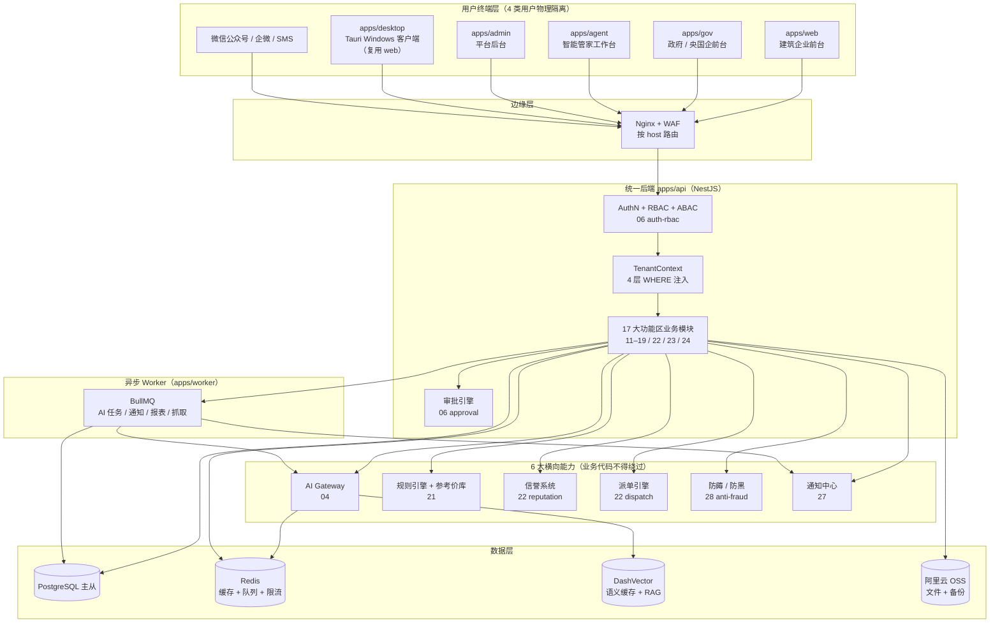
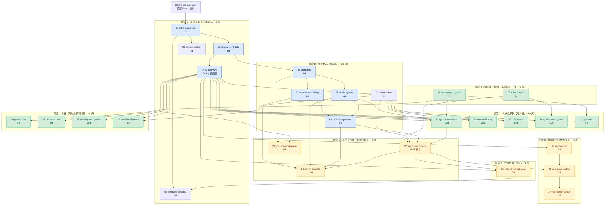
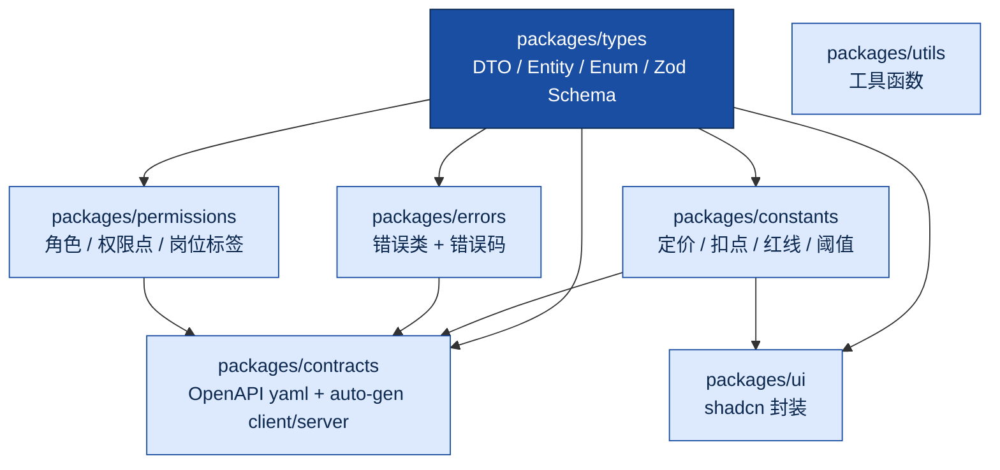

# 00 项目顶层 Spec - Design

> **本文档定位**：28 个子 Spec 的"宪法引用层"。本文档**不实现具体功能**，只定义"哪条 BR 在哪里实现、子 Spec 之间的依赖关系、跨模块协议"。Codex / Claude Code 撰写每个子 Spec 时**必须**先读此文档，引用本文中的依赖图、BR 映射表、状态机与跨模块协议编号。
>
> **本文档为顶层 Design 总入口**，因体积控制（[`memory-management.md` §3.1](../../steering/memory-management.md) 强制单文件 ≤ 800 行）拆分为 3 份：
>
> - **本文** `design.md`：架构总图、依赖图、BR 映射表、packages 层级、关键权衡、开放问题
> - [`design-flows.md`](./design-flows.md)：4 大注册时序、漏斗状态机、派单序列、信誉事件溯源、AI Tier 机制
> - [`design-protocols.md`](./design-protocols.md)：多租户 4 道防线、部署架构、e2e 集成测试、跨模块协议 P-1 至 P-8

---

## 1. Introduction

### 1.1 TL;DR

> 本文档把 [`requirements.md`](./requirements.md) 中的 12 个 Requirement、61 条 BR、17 大功能区、4 大用户大类、28 个子 Spec **物理化**为：依赖图、注册时序、BR → 实现位置映射、跨模块协议、状态机、测试场景、设计权衡。其他子 Spec 引用本文 + flows + protocols 三份文件即可，**不重复定义**。

### 1.2 边界（本文做什么 / 不做什么）

| ✅ 顶层 Design**做** | ❌ 顶层 Design**不做** |
|---|---|
| 引用并扩展 [`docs/architecture.md`](../../../docs/architecture.md) 已有架构 | 重写架构（架构细节仍以 `architecture.md` 为唯一源）|
| 提供 28 个子 Spec 的**依赖图**与**并行策略** | 详述任一子 Spec 的内部设计 |
| 提供 BR-001 至 BR-902 共 **61 条 BR** 的物理实现位置映射表 | 提供具体表结构（具体 schema 在子 Spec）|
| 提供 4 大用户大类的注册时序图 + 派单 / 信誉等关键跨模块时序（→ flows）| 单模块内部时序（在子 Spec）|
| 提供**三层服务漏斗** + **AI Tier 分级** 等核心商业 / AI 状态机（→ flows）| 列出全部状态机（其余在子 Spec）|
| 提供**跨模块协议**（idempotency / 审计 / traceId / 多租户 WHERE / 错误码命名空间，→ protocols）| 重述 steering 已规定的编码约束 |
| 提供**性能 / 可用性 / 安全顶层架构决策** | 单模块的性能优化（在子 Spec）|
| 提供**关键设计权衡**与**开放问题** | 复述 [`requirements.md` §12](./requirements.md) 已列的业务开放问题 |

### 1.3 BR 数量说明

⚠️ **关于 BR 数量**：用户原稿中的"48 条 BR"与 `requirements.md §8` 实际定义的 **61 条 BR** 不一致。本设计**以 `requirements.md` 为准**，覆盖全部 61 条。分布如下：

| 节 | BR 范围 | 数量 |
|---|---|---|
| §8.1 注册租户 | BR-001 至 BR-005 | 5 |
| §8.2 多租户隔离 | BR-101 至 BR-104 | 4 |
| §8.3 客户保护期 / 退款 | BR-201 至 BR-205 | 5 |
| §8.4 智能管家裂变 | BR-301 至 BR-306 | 6 |
| §8.5 订阅 / 续费 / 点数 | BR-401 至 BR-407 | 7 |
| §8.6 AI 调用 / 扣点 | BR-501 至 BR-508 | 8 |
| §8.7 上瘾机制 | BR-601 至 BR-604 | 4 |
| §8.8 派单 / 防黑 | BR-307 至 BR-316 | 10 |
| §8.9 AI 边界 | BR-321 至 BR-324 | 4 |
| §8.10 信誉机制 | BR-331 至 BR-336 | 6 |
| §8.11 风险红线 | BR-901 至 BR-902 | 2 |
| **合计** | | **61** ✅ |

### 1.4 关键引用文档

| 引用对象 | 路径 |
|---|---|
| 顶层 Spec Requirements | [`./requirements.md`](./requirements.md) |
| Design 子文档 | [`./design-flows.md`](./design-flows.md) / [`./design-protocols.md`](./design-protocols.md) |
| Codex / Claude Code 总指令 | [`AGENTS.md`](../../../AGENTS.md) |
| 整体架构 | [`docs/architecture.md`](../../../docs/architecture.md) |
| 商业模型（定价 / 分润 / 上瘾 / 派单 / AI 边界 / 信誉）| [`docs/business-model.md`](../../../docs/business-model.md) |
| 术语表 | [`docs/glossary.md`](../../../docs/glossary.md) |
| 启动期决策 ADR-001 | [`docs/decisions/2025-05-15-initial-decisions.md`](../../../docs/decisions/2025-05-15-initial-decisions.md) |
| 派单 + 防黑 + AI 边界 + 信誉 ADR-002 | [`docs/decisions/2025-05-15-adr-002-dispatch-mechanism.md`](../../../docs/decisions/2025-05-15-adr-002-dispatch-mechanism.md) |
| 28 子 Spec 路线图 | [`.kiro/specs/README.md`](../README.md) |
| 13 份全局规则 | [`.kiro/steering/`](../../steering/) |

### 1.5 PBT 适用性结论

❗ **本顶层 Spec 不适用 PBT**。它不产出业务代码，只是依赖图 + BR 映射 + 跨模块协议 + 状态机定义层，没有可被"对所有输入 X 都成立的属性 P(X)"刻画的可测函数。**省略 Correctness Properties 节**。

子 Spec 的 PBT 落点统一定义在 [`design-protocols.md` §13.7](./design-protocols.md)。

---

## 2. 整体架构总图

### 2.1 TL;DR

> 一张总图（引用 [`docs/architecture.md` §1](../../../docs/architecture.md)），重点突出 **4 大用户大类的入口分流** 与 **17 大功能区到子 Spec 的归属**。完整架构以 `architecture.md` 为唯一源，本节不复述。

### 2.2 4 大用户大类入口分流图



### 2.3 17 大功能区归属表（功能区 → 子 Spec → 主用户大类）

| 编号 | 功能区 | 子 Spec | 主用户大类 |
|---|---|---|---|
| A | 经营机会区 | [`11-opportunity-radar`] | 建筑企业 |
| B | 投标赋能区 | [`12-tender-factory`] | 建筑企业 |
| C | 资质护航区 | [`14-qualification-guard`] | 建筑企业 |
| D | 风险审查区 | [`13-risk-review`] | 建筑企业 |
| E | 经营成本工具区 | [`15-ops-toolkit`] | 建筑企业 |
| F | 项目部生产区 | [`16-project-site`] | 建筑企业（≥ ¥499 档）|
| G | 造价 / 预算粗判区 | [`17-cost-estimate`] | 建筑企业 |
| H | 图纸智能区 | [`18-drawing-recognition`] | 建筑企业 |
| I | 现金流 / 融资区 | [`19-cashflow-finance`] | 建筑企业 |
| J | 报告中心区 | [`10-report-center`] | 全部（横切）|
| K | 智能管家工作台区 | [`22-agent-workspace`] | 智能管家 |
| L | 政府 / 央国企区 | [`23-gov-soe-workspace`] | 政府 / 央国企 |
| M | 平台后台区 | [`24-admin-console`] | 平台运营 |
| N | AI 全局入口区 | [`25-ai-chat-hub`] | 全部（横切）|
| O | 上瘾运营区 | [`26-addiction-system`] | 建筑企业 + 智能管家 |
| P | 通知触达区 | [`27-notification-center`] | 全部（横切）|
| Q | 合规与安全区 | [`28-security-compliance`] | 全部（横切）|

### 2.4 顶层 5 大架构决策（最高级别约束）

| 决策 | 选择 | 影响 |
|---|---|---|
| **D-1 部署架构** | 单 VPS + Docker Compose（一期）+ PG 主从 + Redis 主备 + OSS 跨区域备份 | [`01-infra-monorepo`] / [`design-protocols.md` §12](./design-protocols.md) |
| **D-2 前端拓扑** | ❗ 4 大 Web 子应用 + 1 桌面端，**物理隔离**、共用同一 API + 同一 Auth | [`01`] / [`02`] / [`05`] / [`23`] / [`24`] |
| **D-3 共享契约层** | ❗ 5 个 packages（types / contracts / permissions / errors / constants）作为**强制物理边界** | [`02-shared-contracts`] / §11 |
| **D-4 横向能力层** | ❗ 6 大横向引擎（AI Gateway / 审批 / 规则 / 信誉 / 派单 / 风控），业务代码**不得绕过** | [`04`] / [`06`] / [`21`] / [`22`] / [`28`] |
| **D-5 AI 调用收口** | ❗ AI Gateway 是所有 AI 调用的**唯一入口**，业务代码禁止 import 模型 SDK | [`04-ai-gateway`] / [`design-flows.md` §9](./design-flows.md) |

---

## 3. 业务流程时序图（已迁移）

> 4 大用户大类的注册时序图（建筑企业 / 政府 / 智能管家 / 平台运营）已迁移至 [`design-flows.md` §3](./design-flows.md)。

---

## 4. 28 个子 Spec 的依赖图

### 4.1 TL;DR

> 7 阶段路线图：阶段 1 基础设施（必须串行）→ 阶段 2 商业核心（强串行）→ 阶段 3 杀手锏 + 补充（**互不依赖，可并行**）→ 阶段 4 知识库 / 规则（与阶段 3 并行）→ 阶段 5 用户工作台 → 阶段 6 横向能力 → 阶段 7 合规总审。**关键阻塞节点**：[`02-shared-contracts`] → [`04-ai-gateway`] → 后续所有 AI 模块。

### 4.2 完整依赖图（28 个子 Spec 全覆盖）



### 4.3 串行 / 并行约束（撰写顺序硬规则）

| 阶段 | 撰写约束 | 工作量 | 优先级 |
|---|---|---|---|
| 1 基础设施 | `01 → (02 ∥ 03 ∥ 05) → 04` | ~3 周 | **P0** ❗ 必须先于一切业务模块 |
| 2 商业核心 | `06 → (07 ∥ 08) → 09 → 10` | ~2.5 周 | **P0** ❗ 杀手锏前置 |
| 3 杀手锏 + 补充 | **5 杀手锏 + 4 补充全部并行**（11–19）| ~10 周 | **P1** 可分配多会话同时推进 |
| 4 知识 + 规则 | `20 ∥ 21`（与 3 并行）| ~3 周 | **P1** |
| 5 工作台 | `22` 优先 → `24`；`23` 与 `22` 并行 | ~3 周 | **P1** 依赖 3 完成大部分 |
| 6 横向能力 | `25 → 26 → 27` 串行 | ~2 周 | **P2** |
| 7 合规总审 | `28` 单独 | ~1 周 | **P2** |

**总工作量估算（OPC 模式 + Codex 主导）**：阶段 1–7 合计约 **22–24 周**，与 [`ADR-001`](../../../docs/decisions/2025-05-15-initial-decisions.md) 的"6 个月开发期"目标一致（含 buffer / 联调 / 内测）。

### 4.4 关键阻塞节点

| 节点 | 为什么阻塞 | 一旦延期的影响 |
|---|---|---|
| ❗ [`02-shared-contracts`] | types / errors / openapi 是所有模块的物理边界 | 全部后续模块 |
| ❗ [`04-ai-gateway`] | 全部 AI 任务（11–19、23、25）的唯一入口 | 5 大杀手锏全部 |
| ❗ [`06-auth-rbac`] | 鉴权 + RBAC + 多租户 + 审批 | 商业核心 + 工作台 |
| ❗ [`10-report-center`] | 杀手锏的统一报告输出层 | 11–14、19 |
| ❗ [`22-agent-workspace`] | 派单 + 信誉 + 评分 + 推荐费 + 申诉的核心 | 24 / 26 / 28 |

### 4.5 并行开发的契约前置（防 Codex 失忆 / 冲突）

并行做多个子 Spec 时，**必须遵守 [`memory-management.md` §11](../../steering/memory-management.md) 的"4 个先行"**：

1. **共享类型先行**：跨子 Spec 用到的 DTO / Enum / 错误码 → 先合 `packages/types` / `packages/errors`
2. **OpenAPI 先行**：新 API → 先合 `packages/contracts/openapi.yaml`
3. **数据库先行**：schema 改动 → 先合 `prisma/schema.prisma` + migration
4. **Spec 先行**：发现 spec 缺漏先补 spec / 先发 ADR，再写代码

### 4.6 关键依赖摘要

| 子 Spec | 强依赖 | 弱依赖（可桩） |
|---|---|---|
| [`04-ai-gateway`] | [`02`]（types / errors）| [`08`]（扣点；可先桩）|
| [`06-auth-rbac`] | [`02`] | — |
| [`07-subscription-billing`] | [`06`] | [`09`]（支付；可先桩）|
| [`08-credit-system`] | [`06`] | [`04`] / [`07`] / [`09`]（互相消费）|
| [`09-payment-gateway`] | [`06`] / [`07`] / [`08`] | [`22`]（推荐费；可先桩）|
| [`10-report-center`] | [`04`] | [`11`]–[`19`] 杀手锏（消费方）|
| [`11`]–[`19`] 杀手锏 / 补充 | [`04`] / [`10`] | [`20`]（知识库）/ [`21`]（规则库）|
| [`22-agent-workspace`] | [`06`] / [`08`] / [`09`] | [`21`]（参考价）/ [`11`]（机会派单源头）|
| [`24-admin-console`] | [`06`] / [`07`] / [`08`] / [`09`] / [`22`] | 全部模块运营字段 |
| [`25-ai-chat-hub`] | [`04`] | 全部杀手锏（任务编排目标）|
| [`26-addiction-system`] | [`06`] / [`08`] / [`25`] | — |
| [`27-notification-center`] | [`06`] / [`26`] | 微信公众号 / 企微 / 阿里短信外部依赖 |
| [`28-security-compliance`] | 全部 | 横切，最后总审 |

---

## 5. 全局业务规则（BR）→ 物理实现位置映射表

### 5.1 TL;DR

> 61 条 BR（BR-001 至 BR-902）按编号顺序整理。每条标注：**子 Spec / packages / 代码位置 / 数据表 / 关键 API / 前端入口**。子 Spec 实现 BR 时**必须**在自己的 design.md 中引用本表的位置，新增实现位置必须先发 ADR。

### 5.2 §8.1 注册与租户规则（BR-001 至 BR-005）

| BR | 名称 | 子 Spec | packages | 代码位置 | 数据表 | 关键 API | 前端入口 |
|---|---|---|---|---|---|---|---|
| BR-001 | 4 大注册类型 | [`06`] | `permissions/roles.ts`<br/>`types/auth/register.dto.ts` | `apps/api/src/modules/auth/registration/` | `users` / `tenants` | `POST /api/v1/auth/register` | `/register`（web / agent / gov）|
| BR-002 | 一租户一企业 | [`06`] | `errors/auth/tenant-already-exists.ts` | `apps/api/src/modules/tenant/tenant.service.ts` | `tenants`（uq: `social_credit_code`）| `POST /api/v1/tenants` | `/onboarding/tenant` |
| BR-003 | 岗位标签由 OWNER 分配 | [`06`] / [`24`] | `permissions/position-tags.ts`<br/>`types/user/invite.dto.ts` | `apps/api/src/modules/user/invite/` | `user_position_tags`（多对多）| `POST /api/v1/users/invite`<br/>`POST /api/v1/users/:id/position-tags` | `apps/web/(main)/team/` |
| BR-004 | 智能管家子类型必填 | [`06`] | `permissions/agent-subtypes.ts` | `apps/api/src/modules/auth/registration/agent-registration.service.ts` | `agent_profiles.subtype` | `POST /api/v1/auth/register`（含 `agentSubtype`）| `apps/agent/register/` |
| BR-005 | 4 前端物理隔离 | [`01`] / [`02`] | — | `apps/web` / `apps/gov` / `apps/agent` / `apps/admin`（独立打包）| — | 同一 `apps/api`，按 host 路由 | 4 子域名 |

### 5.3 §8.2 多租户与数据归属（BR-101 至 BR-104）

| BR | 名称 | 子 Spec | packages | 代码位置 | 数据表 | 关键 API | 前端入口 |
|---|---|---|---|---|---|---|---|
| BR-101 | 4 层数据隔离 WHERE | [`02`] / [`06`] | `types/tenant/scope.ts`<br/>`permissions/scope-guard.ts` | `apps/api/src/database/repository/base.repository.ts`（强制注入） | 全部业务表 | 全部 API（拦截器层）| — |
| BR-102 | 客户归属永久绑定 | [`06`] / [`22`] | `errors/agent/attribution-locked.ts` | `apps/api/src/modules/auth/registration/attribution.service.ts` | `client_attributions`（uq: `client_id`，`agent_id` 不可改）| `POST /api/v1/auth/register?ref=xxx` | `/register?ref={agentCode}` |
| BR-103 | 智能管家清退归属重分配 | [`22`] / [`27`] | `types/agent/reassignment.ts` | `apps/api/src/modules/agent/reassignment.service.ts` | `client_attributions`（更新）| `POST /api/v1/admin/agents/:id/dispose` | `apps/admin` 智能管家管理页 |
| BR-104 | 数据导出权限 | [`06`] / [`28`] | `permissions/data-export.ts` | `apps/api/src/modules/data-export/`（审批 + 二次密码 + 审计）| `data_export_requests` / `audit_log` | `POST /api/v1/data-exports/request`<br/>`POST /api/v1/data-exports/:id/confirm` | `apps/web/(main)/settings/data-export/` |

### 5.4 §8.3 客户保护期与退款（BR-201 至 BR-205）

| BR | 名称 | 子 Spec | packages | 代码位置 | 数据表 | 关键 API | 前端入口 |
|---|---|---|---|---|---|---|---|
| BR-201 | 客户保护期 7 天 | [`09`] / [`22`] | `constants/refund-policy.ts` | `apps/api/src/modules/refund/protection-period.service.ts`<br/>`apps/api/src/modules/agent/commission-clawback.service.ts` | `orders` / `refunds` / `agent_commissions` | `POST /api/v1/refunds/request` | `/orders/:id/refund` |
| BR-202 | 订阅退款分级 | [`09`] | `constants/refund-tiers.ts` | `apps/api/src/modules/refund/refund-rule.service.ts` | `refunds.tier` | 同上 | 同上 |
| BR-203 | 退款审批分级 | [`06`] / [`09`] | `permissions/refund-approval.ts` | `apps/api/src/modules/refund/`<br/>`apps/api/src/modules/approval/` | `approval_flows` / `approval_steps` | `POST /api/v1/approvals/:id/sign` | `apps/admin` 退款审批 |
| BR-204 | AI 失败退点 idempotent | [`04`] / [`08`] | `errors/credit/refund-idempotency.ts`<br/>`types/credit/refund.dto.ts` | `apps/api/src/ai-gateway/credit/refund.service.ts` | `credit_logs`（含 `idempotency_key` 唯一）| 内部，不暴露 | — |
| BR-205 | 阶梯优惠返现实现 | [`07`] | `constants/subscription-tiers.ts` | `apps/api/src/modules/subscription/discount-rebate.service.ts` | `orders`（原价）+ `credit_logs`（赠送差价）| `POST /api/v1/subscriptions/:id/renew` | `/billing/renew` |

### 5.5 §8.4 智能管家裂变与分润（BR-301 至 BR-306）

| BR | 名称 | 子 Spec | packages | 代码位置 | 数据表 | 关键 API | 前端入口 |
|---|---|---|---|---|---|---|---|
| BR-301 | 三层裂变结构 | [`22`] | `constants/fission-rates.ts`<br/>`errors/agent/level-exceeded.ts` | `apps/api/src/modules/agent/fission/` | `agent_relations`（自引用 ≤ 2 级）/ `client_attributions` | `GET /api/v1/agents/me/fission-tree` | `apps/agent` 我的下线 |
| BR-302 | 订阅分润比例 | [`22`] | `constants/commission-rates.ts` | `apps/api/src/modules/agent/commission/calculator.service.ts` | `agent_commissions`（type: `subscribe_y1`/`subscribe_y2+`/`topup`）| 内部 | — |
| BR-303 | 派单 0 抽成 + 跨域 5% | [`22`] | `constants/dispatch-rates.ts` | `apps/api/src/modules/dispatch/settlement.service.ts` | `dispatches.cross_domain_fee` | — | — |
| BR-304 | 分润递延状态机 | [`22`] / [`09`] | `types/agent/commission-status.ts` | `apps/api/src/modules/agent/commission/lifecycle.service.ts` | `agent_commissions.status`（frozen → settlable → withdrawable → paid）| `POST /api/v1/agent/commissions/:id/withdraw` | `apps/agent` 收益页 |
| BR-305 | 智能管家推荐奖励 | [`22`] | `constants/agent-referral-bonus.ts` | `apps/api/src/modules/agent/referral/` | `agent_referrals` / `agent_referral_bonuses` | — | `apps/agent` 邀请下线 |
| BR-306 | 智能管家月活红线 | [`22`] / [`24`] | `constants/agent-activity-thresholds.ts` | `apps/api/src/modules/agent/activity/monitor.service.ts`（cron 每日）| `agent_profiles.activity_status` / `agent_activity_logs` | `GET /api/v1/admin/agents/dormant` | `apps/admin` 智能管家运营 |

### 5.6 §8.5 订阅、续费、点数（BR-401 至 BR-407）

| BR | 名称 | 子 Spec | packages | 代码位置 | 数据表 | 关键 API | 前端入口 |
|---|---|---|---|---|---|---|---|
| BR-401 | 5 档订阅 | [`07`] | `constants/subscription-plans.ts` | `apps/api/src/modules/subscription/plans/` | `subscription_plans` | `GET /api/v1/subscriptions/plans` | `/billing/plans` |
| BR-402 | 阶梯优惠 counter | [`07`] | `constants/discount-ladders.ts` | `apps/api/src/modules/subscription/ladder.service.ts` | `subscriptions.consecutive_months` | 内部 | — |
| BR-403 | 自动续费 + 重试 3 | [`07`] / [`09`] / [`27`] | `types/subscription/auto-renewal.ts` | `apps/api/src/modules/subscription/auto-renewal.worker.ts` | `subscriptions.auto_renew` / `subscriptions.status`（active / past_due）| `PATCH /api/v1/subscriptions/:id/auto-renewal` | `/billing/settings` |
| BR-404 | 点数有效期分类 | [`08`] | `types/credit/expiry.ts` | `apps/api/src/modules/credit/expiry.service.ts`（cron）| `credit_lots`（`source` + `expires_at`）| — | `/credits/lots` |
| BR-405 | 点数 UI 一致性 | [`02`] / [`03`] / [`08`] | `constants/currency-display.ts` | `packages/ui/src/components/data-display/credit-display.tsx`（强制使用）| — | — | 全前端 |
| BR-406 | 重新订阅 30 天恢复 | [`07`] / [`08`] | `constants/reactivation-window.ts` | `apps/api/src/modules/subscription/reactivation.service.ts` | `subscriptions.canceled_at` / `credit_lots`（标记 `frozen_until`）| `POST /api/v1/subscriptions/reactivate` | `/billing/reactivate` |
| BR-407 | 升降档规则 | [`07`] / [`09`] | `types/subscription/change-plan.ts` | `apps/api/src/modules/subscription/change-plan.service.ts` | `subscription_changes` | `POST /api/v1/subscriptions/:id/change-plan` | `/billing/change-plan` |

### 5.7 §8.6 AI 调用与扣点（BR-501 至 BR-508）

| BR | 名称 | 子 Spec | packages | 代码位置 | 数据表 | 关键 API | 前端入口 |
|---|---|---|---|---|---|---|---|
| BR-501 | AI Gateway 唯一入口 | [`04`] | `types/ai-task.ts`（`AiTaskType` 枚举，40+ 起步类型见 [`04` R14](../04-ai-gateway/requirements.md)）| `apps/api/src/ai-gateway/` 全部 | `ai_tasks` / `ai_task_logs` | 内部 SDK：`aiGateway.invoke(...)` | — |
| BR-502 | 扣点 9 步流程 | [`04`] / [`08`] | — | `apps/api/src/ai-gateway/orchestrator.service.ts` | `ai_tasks` / `credit_logs` / `audit_log` | 内部 | — |
| BR-503 | 毛利底线 70% | [`04`] / [`24`] | `constants/credit-pricing.ts`<br/>`constants/cost-floor.ts` | `apps/api/src/ai-gateway/cost-meter.service.ts` | `ai_cost_logs` | `GET /api/v1/admin/cost/profit-margin` | `apps/admin` AI 成本页 |
| BR-504 | 数据出境必须脱敏 | [`04`] / [`28`] | `types/ai-task/sanitize-mask.ts` | `apps/api/src/ai-gateway/sanitizer/` | `ai_export_audit` | 内部 | — |
| BR-505 | 数据出境授权 | [`06`] / [`28`] | `permissions/data-export-consent.ts` | `apps/api/src/modules/auth/consent/` | `user_consents`（type: `oversea_model`）| `POST /api/v1/users/me/consents` | `/settings/privacy` |
| BR-506 | 缓存 + 命中退点 | [`04`] / [`08`] | `types/ai-task/cache-strategy.ts` | `apps/api/src/ai-gateway/cache/`（精确 + 语义）| Redis（精确）+ DashVector（语义）| 内部 | — |
| BR-507 | 多渠道 failover | [`04`] | `types/ai-task/provider.ts` | `apps/api/src/ai-gateway/providers/router.service.ts` | `ai_provider_health` | `GET /api/v1/admin/ai/providers/health` | `apps/admin` 渠道页 |
| BR-508 | 限流上限 | [`04`] / [`28`] | `constants/ai-rate-limits.ts` | `apps/api/src/common/guards/ai-rate-limit.guard.ts` | Redis（计数器）| 全部 AI API | — |

### 5.8 §8.7 上瘾机制（BR-601 至 BR-604）

| BR | 名称 | 子 Spec | packages | 代码位置 | 数据表 | 关键 API | 前端入口 |
|---|---|---|---|---|---|---|---|
| BR-601 | 9 大上瘾机制总览 | [`26`] | `types/addiction/loop.ts`（9 enum）| `apps/api/src/modules/addiction/` | 见 BR-602 至 604 | 见各子机制 | 全前端 |
| BR-602 | 签到累积奖励 | [`26`] / [`08`] | `constants/checkin-rewards.ts` | `apps/api/src/modules/addiction/checkin/` | `user_checkins` / `credit_lots`（gift）| `POST /api/v1/checkins`<br/>`GET /api/v1/checkins/streak` | `/dashboard` 签到 |
| BR-603 | 限时抽点频率 | [`26`] | `constants/lottery-schedule.ts` | `apps/api/src/modules/addiction/lottery/` | `lottery_events` / `lottery_winners` | `POST /api/v1/lottery/draw` | `/dashboard` 抽点入口 |
| BR-604 | 紧迫感推送日 ≤ 3 | [`26`] / [`27`] | `constants/urgency-limits.ts` | `apps/api/src/modules/notification/urgency-throttle.service.ts` | `notifications.urgency_today` | 内部 | — |

### 5.9 §8.8 派单决策与防黑（BR-307 至 BR-316）

> ⚠️ **BR-309 已废弃为空位**（旧"智能管家等级权重 LV5+10..LV1+1"被 BR-336 完全覆盖）。**实施时直接采用 BR-336，不再引用 BR-309 的旧数值**。本表中 BR-309 占位但不再单独映射实现位置。

| BR | 名称 | 子 Spec | packages | 代码位置 | 数据表 | 关键 API | 前端入口 |
|---|---|---|---|---|---|---|---|
| BR-307 | 需求 A/B/C 三分类 | [`22`] | `types/dispatch/need-class.ts`<br/>`constants/dispatch-thresholds.ts` | `apps/api/src/modules/dispatch/classifier.service.ts` | `dispatch_needs.class` | `POST /api/v1/dispatches/classify` | 全部杀手锏触发派单时 |
| BR-308 | A 类派单优先级 | [`22`] | — | `apps/api/src/modules/dispatch/router.service.ts` | `dispatches.pool`（owned/cross/public）| `POST /api/v1/dispatches/:id/route` | — |
| ~~BR-309~~ | ~~4 维加权匹配（旧等级权重）~~ | **已被 BR-336 覆盖** | 见 BR-336 | 见 BR-336 | — | — | — |
| BR-310 | 报价透明 + 参考价标色 | [`21`] / [`22`] | `types/dispatch/quote-color.ts` | `apps/api/src/modules/ref-price/`<br/>`apps/api/src/modules/dispatch/quote.service.ts` | `dispatch_quotes` / `reference_prices` | `POST /api/v1/dispatches/:id/quotes` | `apps/agent` 接单页 / `apps/web` 派单订单页 |
| BR-311 | 同乾方略接管 6 触发 | [`22`] | `constants/takeover-triggers.ts` | `apps/api/src/modules/dispatch/takeover.service.ts` | `dispatches.takeover_reason` | 内部 + `POST /api/v1/dispatches/:id/takeover` | — |
| BR-312 | 强制双向评分 | [`22`] | `errors/rating/required-before-settle.ts` | `apps/api/src/modules/rating/` | `agent_ratings` / `client_ratings` | `POST /api/v1/dispatches/:id/rate-agent`<br/>`POST /api/v1/dispatches/:id/rate-client` | 服务完成页 |
| BR-313 | 同乾方略推荐费 10–20% | [`22`] / [`09`] | `constants/referral-fee-rates.ts` | `apps/api/src/modules/agent/referral-fee.service.ts` | `referral_fees` | `GET /api/v1/agent/referral-fees` | `apps/agent` 推荐费 |
| BR-314 | 智能管家申诉三级流程 | [`22`] / [`24`] | `types/agent/appeal.ts` | `apps/api/src/modules/agent/appeal/` | `agent_appeals` / `appeal_steps` | `POST /api/v1/agent/appeals`<br/>`POST /api/v1/admin/appeals/:id/decide` | `apps/agent` 申诉 / `apps/admin` 处理 |
| BR-315 | 防薅 / 防黑 | [`28`] | `types/anti-fraud/`<br/>`errors/anti-fraud/` | `apps/api/src/modules/anti-fraud/`（注册 / 评分 / 退款 / 邀请 / IP / 设备）| `device_fingerprints` / `fraud_signals` / `blacklist_entries` | 内部拦截 + `GET /api/v1/admin/fraud/signals` | `apps/admin` 风控仪表盘 |
| BR-316 | 高端服务货架 | [`22`] / [`24`] | `constants/premium-services.ts` | `apps/api/src/modules/premium-shelf/` | `premium_service_items` | `GET /api/v1/premium-services`<br/>`POST /api/v1/premium-services/:id/inquire` | `/services/premium` |

### 5.10 §8.9 AI 指导边界（BR-321 至 BR-324）

| BR | 名称 | 子 Spec | packages | 代码位置 | 数据表 | 关键 API | 前端入口 |
|---|---|---|---|---|---|---|---|
| BR-321 | AI 输出 4 级 Tier | [`04`] / [`11`]–[`19`] / [`25`] | `types/ai-task/tier.ts`<br/>`constants/tier-thresholds.ts` | `apps/api/src/prompts/{module}/{task}.ts`（每个 Prompt 配 `tier(ctx)`）+ `apps/api/src/ai-gateway/tier-resolver.service.ts` | `ai_tasks.tier` | 内部 | 报告 UI 必显示 |
| BR-322 | AI 输出 4 强制要素 | [`04`] / [`10`] / [`25`] | `types/ai-report/required-elements.ts` | `apps/api/src/ai-gateway/output-validator.service.ts`（强制 zod schema）| `ai_tasks.confidence` / `ai_tasks.next_step` | 内部 | 报告 UI 必显示 |
| BR-323 | AI 不替代专业判断 | [`04`] | — | `apps/api/src/prompts/shared/system-base.ts`（红线表述清单）| — | — | — |
| BR-324 | 让企业先尝试自做 | [`04`] / [`25`] | — | Prompt 模板内引导文案 | — | — | 报告底部按钮 |

### 5.11 §8.10 信誉机制（BR-331 至 BR-336）

| BR | 名称 | 子 Spec | packages | 代码位置 | 数据表 | 关键 API | 前端入口 |
|---|---|---|---|---|---|---|---|
| BR-331 | 智能管家信誉分 0–1000 | [`22`] / [`24`] | `constants/reputation-rules.ts` | `apps/api/src/modules/reputation/agent/` | `reputation_scores`（agent / client 共表，区分 type）/ `reputation_logs` | `GET /api/v1/agent/reputation/me`<br/>`POST /api/v1/admin/reputation/:id/adjust` | `apps/agent` 信誉看板 / `apps/admin` 管理 |
| BR-332 | 智能管家 5 级等级 | [`22`] | `constants/reputation-levels.ts` | `apps/api/src/modules/reputation/level-resolver.service.ts` | `reputation_scores.level`（LV1–LV5）| 同上 | `apps/agent` 等级展示 |
| BR-333 | 客户信誉分 0–1000 | [`06`] / [`22`] | `constants/reputation-rules.ts` | `apps/api/src/modules/reputation/client/` | 同 BR-331 | `GET /api/v1/users/me/reputation` | `/profile/reputation` |
| BR-334 | 信誉公开度 | [`02`] / [`22`] / [`24`] | `permissions/reputation-visibility.ts` | `apps/api/src/modules/reputation/visibility.service.ts` | — | 派单 / 接单 API 按角色返回不同字段 | 派单 UI |
| BR-335 | 信誉申诉 | [`22`] / [`24`] | 复用 BR-314 | 复用 `apps/api/src/modules/agent/appeal/` | `reputation_appeals`（关联 `reputation_logs`）| `POST /api/v1/reputation-logs/:id/appeal` | `apps/agent` 申诉 |
| BR-336 | 信誉与派单联动（**含 4 维加权**）| [`22`] | `constants/dispatch-weights.ts` | `apps/api/src/modules/dispatch/scorer.service.ts` | — | 内部 | — |

### 5.12 §8.11 风险红线（BR-901 至 BR-902）

| BR | 名称 | 子 Spec | packages | 代码位置 | 数据表 | 关键 API | 前端入口 |
|---|---|---|---|---|---|---|---|
| BR-901 | 6 条红线实时监控 | [`24`] | `constants/red-lines.ts` | `apps/api/src/modules/admin-ops/red-line-monitor.service.ts`（cron 5min）| `red_line_alerts` / `metric_snapshots` | `GET /api/v1/admin/red-lines/status` | `apps/admin` 业务运营看板 |
| BR-902 | 每月红线自检报告 | [`24`] | — | `apps/api/src/modules/admin-ops/monthly-review.worker.ts`（每月 1 号 cron）| `monthly_reviews` | `GET /api/v1/admin/monthly-reviews/:yearMonth` | `apps/admin` 月报页 |

### 5.13 BR 覆盖度自检 ✅

⚠️ 子 Spec 撰写自检：每条 BR 必须能在对应子 Spec 的 design.md 中找到至少 1 个具体实现锚点。新增实现位置必须先发 ADR 并更新本表。

### 5.14 业务规则后台覆盖能力（运营可调整 vs 代码固化）

> ❗ **OPC 模式核心要求**：定价 / 阈值 / 分润 / 推荐费 / 信誉规则等**SHALL NOT** 仅写死在代码常量中，必须同时通过 `system_configs` 表暴露给运营后台（[`24-admin-console`]）。详见 [§14.10 权衡 9](#1410-权衡-9--业务参数后台覆盖-vs-代码常量)。

| BR | 是否需后台可调 | 默认值来源 | 后台覆盖位置 | 历史回溯 |
|---|---|---|---|---|
| BR-401 5 档订阅价 | ✅ 必须 | `packages/constants/subscription-plans.ts` | `system_configs.key='subscription.plans.v1'` | `system_config_history` 表 |
| BR-402 阶梯优惠 | ✅ 必须 | `packages/constants/discount-ladders.ts` | `system_configs.key='subscription.discount_ladders'` | 同上 |
| BR-302 订阅分润比例 30/20/15% | ✅ 必须 | `packages/constants/commission-rates.ts` | `system_configs.key='agent.commission_rates'` | 同上 |
| BR-303 跨域介绍费 5% | ✅ 必须 | `packages/constants/dispatch-rates.ts` | `system_configs.key='dispatch.cross_domain_fee'` | 同上 |
| BR-307 A/B/C 阈值 | ✅ 必须 | `packages/constants/dispatch-thresholds.ts` | `system_configs.key='dispatch.thresholds'` | 同上 |
| BR-313 推荐费 10–20% | ✅ 必须 | `packages/constants/referral-fee-rates.ts` | `system_configs.key='agent.referral_fee_rates'` | 同上 |
| BR-321 Tier 阈值 | ✅ 必须 | `packages/constants/tier-thresholds.ts` | `system_configs.key='ai.tier_thresholds.{taskType}'` | 同上 |
| BR-331/332/333 信誉规则 | ✅ 必须 | `packages/constants/reputation-rules.ts` | `system_configs.key='reputation.rules'` | 同上 |
| BR-336 派单 4 维权重 | ✅ 必须 | `packages/constants/dispatch-weights.ts` | `system_configs.key='dispatch.weights'` | 同上（DOQ-001）|
| BR-503 扣点价格 | ✅ 必须 | `packages/constants/credit-pricing.ts` | `system_configs.key='ai.credit_pricing.{taskType}'` | 同上 |
| BR-901 6 条红线阈值 | ✅ 必须 | `packages/constants/red-lines.ts` | `system_configs.key='ops.red_lines'` | 同上 |
| BR-101 4 层 WHERE 模板 | ❌ 代码固化 | `packages/permissions/scope-guard.ts` | — | — |
| BR-501 AI Gateway 入口 | ❌ 代码固化 | `apps/api/src/ai-gateway/` | — | — |
| BR-301 二级裂变封顶 | ❌ 代码固化（防作弊）| `packages/constants/fission-rates.ts` | — | — |

❗ **运营覆盖契约（[`02-shared-contracts`] D1/D2 任务输出）**：
- 每个"必须"项的 `packages/constants/` 文件**同时**导出 `seedSystemConfigs()` 函数 → 在 `prisma/seed/system-configs.seed.ts` 中调用，写入 `system_configs` 表初始值
- 业务代码读取顺序：`SystemConfigService.get(key)` → 失败回落到 `packages/constants` 默认值
- 后台修改 → 写 `system_config_history` + 触发缓存失效（Redis pub/sub）+ 审计日志（协议 P-2）

---

## 6. 三层服务漏斗状态机（已迁移）

> 详见 [`design-flows.md` §6](./design-flows.md)。

---

## 7. 派单决策核心序列图（已迁移）

> 详见 [`design-flows.md` §7](./design-flows.md)。

---

## 8. 信誉分变动事件溯源（已迁移）

> 详见 [`design-flows.md` §8](./design-flows.md)。

---

## 9. AI 输出 Tier 分级机制（已迁移）

> 详见 [`design-flows.md` §9](./design-flows.md)。

---

## 10. 多租户隔离 4 道防线（已迁移）

> 详见 [`design-protocols.md` §10](./design-protocols.md)。

---

## 11. 共享契约（packages/）层级关系

### 11.1 TL;DR

> 5 个包按依赖关系**单向流动**，禁止循环依赖。修改顺序：**types 先行 → constants / errors / permissions 跟随 → contracts 最后生成**。OpenAPI yaml 改完才能改后端实现，后端实现完才能改前端 client。

### 11.2 包间依赖图



### 11.3 哪些可互相 import / 哪些是单向

| 来源 | 目标 | 允许？ |
|---|---|---|
| `types` | （无）| ✅ types 是叶子根，不依赖任何包 |
| `constants` | `types` | ✅ |
| `errors` | `types` | ✅ |
| `permissions` | `types` | ✅ |
| `contracts` | `types` / `constants` / `errors` / `permissions` | ✅ |
| `ui` | `types` / `constants` | ✅ |
| `utils` | `types` | ✅ |
| 反向（如 `types` → `constants`）| | ❌ **循环依赖，CI 拒绝** |
| `contracts` → 业务代码 | | ❌ **方向反了** |
| 业务代码 → `packages/*` | | ✅ |
| 业务代码 → 其他业务代码 | | ❌（必须经 packages 中转）|

### 11.4 修改顺序（防 Codex 失忆 / 多会话冲突）

```
新增 / 修改一个跨模块 DTO 的标准流程：
  1. 改 packages/types  → commit + push
  2. 改 packages/errors（如有新错误码）→ commit
  3. 改 packages/permissions（如有新权限点）→ commit
  4. 改 packages/constants（如有新阈值）→ commit
  5. 改 packages/contracts/openapi.yaml → 跑 codegen → commit
  6. 改业务代码（apps/api / apps/web）→ commit

→ 每一步都必须独立 PR，CI 通过才能进下一步。
→ 多会话并行做不同业务时，1–5 必须由"主会话"集中改。
```

### 11.5 命名空间分配（防错误码冲突）

| 子 Spec | 错误码命名空间 |
|---|---|
| [`04-ai-gateway`] | `AI.*` |
| [`06-auth-rbac`] | `AUTH.*` / `PERM.*` / `TENANT.*` |
| [`07-subscription-billing`] | `SUB.*` |
| [`08-credit-system`] | `CREDIT.*` |
| [`09-payment-gateway`] | `PAY.*` |
| [`10-report-center`] | `REPORT.*` |
| [`11`]–[`19`] 杀手锏 / 补充 | `OPP.*` / `TENDER.*` / `CONTRACT.*` / `QUAL.*` / `OPS.*` / `SITE.*` / `COST.*` / `DRAW.*` / `CASH.*` |
| [`20`] / [`21`] | `KB.*` / `RULE.*` |
| [`22-agent-workspace`] | `AGENT.*` / `DISPATCH.*` / `RATING.*` / `REPUTATION.*` / `APPEAL.*` / `REFP.*` |
| [`23-gov-soe-workspace`] | `GOV.*` |
| [`24-admin-console`] | `ADMIN.*` |
| [`25-ai-chat-hub`] | `CHAT.*` |
| [`26-addiction-system`] | `ADDICT.*` |
| [`27-notification-center`] | `NOTIF.*` |
| [`28-security-compliance`] | `SEC.*` / `FRAUD.*` / `AUDIT.*` / `EXPORT.*` |

---

## 12. 部署与发布架构（已迁移）

> 详见 [`design-protocols.md` §12](./design-protocols.md)。

---

## 13. 跨子 Spec e2e 集成测试场景（已迁移）

> 详见 [`design-protocols.md` §13](./design-protocols.md)。

---

## 14. 关键设计权衡（Tradeoffs）

### 14.1 TL;DR

> 9 个关键权衡，每个说明：**我们选了什么、备选是什么、为什么选这个**。这些权衡是顶层 Spec 的决策固化，子 Spec **SHALL NOT** 在自己的 design 中重新评估这些权衡（除非发 ADR）。

### 14.2 权衡 1：多租户隔离 — `tenant_id` WHERE vs schema-per-tenant

| 维度 | ✅ 我们选：单库 + `tenant_id` WHERE | ❌ 备选：schema-per-tenant |
|---|---|---|
| 实现难度 | 简单（4 道防线，[`design-protocols.md` §10](./design-protocols.md)）| 复杂（动态切 schema） |
| 性能 | 高（单库主从）| 中（每租户连接 / 索引膨胀）|
| 隔离强度 | 中（依赖代码层）| 高（DB 层物理）|
| 运维成本 | 低 | 高（每新租户跑 migration）|
| 一期客户量 | 几千 → 完全够 | 几千 → 杀鸡用牛刀 |
| 二期演进 | 客户 ≥ 5 万再考虑分表（D-1）| — |

**为什么选**：OPC 模式下运维成本是关键，单库 + 4 道防线已经能保证 99.9% 安全。当客户量 ≥ 5 万再演进。

### 14.3 权衡 2：AI 调用 — 同步 vs 异步默认

| 维度 | ✅ 我们选：异步默认（≥ 3s 必走队列）| ❌ 备选：全部同步 |
|---|---|---|
| 用户体验 | 排队提示 + SSE / 轮询 | 长任务卡住 |
| 后端稳定性 | 高（不阻塞 API）| 低（连接池耗尽）|
| 重试 / 失败处理 | 队列原生支持 | 需自己实现 |
| 短任务（< 3s）| 仍可同步（chat / 短指令）| — |
| 实现复杂度 | 中（需 BullMQ + SSE）| 低 |

**为什么选**：5 大杀手锏的报告生成都是 30s+ 任务。异步默认是 OPC 模式扩缩容的前提。短任务（< 3s）保留同步通道（[`api-conventions.md` §13](../../steering/api-conventions.md)）。

### 14.4 权衡 3：派单匹配 — 算法计算 vs 规则引擎

| 维度 | ✅ 我们选：规则引擎 + 4 维加权 | ❌ 备选：ML 算法（推荐系统）|
|---|---|---|
| 可解释性 | 高（运营能在后台查权重）| 低（黑盒）|
| 数据要求 | 低（冷启动可用）| 高（需大量交互数据）|
| 调整灵活度 | 高（后台可视化改权重，DOQ-001）| 低（重训）|
| 上线时间 | 短（一期即可）| 长（需 6 个月+ 数据积累）|
| 公平性 | 高（智能管家可见加分细则）| 中（可能被诟病暗箱）|
| 二期演进 | 累计交互数据后引入 ML 辅助排序（潜 ADR）| — |

**为什么选**：派单是商业核心 + 智能管家信任的关键，必须可解释。规则引擎冷启动友好，运营调权重 → 信誉看板透明（BR-334）→ 智能管家可申诉（BR-335）形成闭环。

### 14.5 权衡 4：AI 输出 Tier — Prompt 模板内函数 vs 独立 Resolver

⚠️ 此条目为 [DOQ-003] 的预决策，**最终在 [`04-ai-gateway` design](../04-ai-gateway/) 阶段拍板**，本节给出顶层倾向。

| 维度 | ✅ 我们倾向：Prompt 模板内 `tier(ctx)` 函数 | 备选：独立 tier-resolver 服务 |
|---|---|---|
| 内聚性 | 高（业务规则与 Prompt 同源）| 中 |
| 共享逻辑 | 各 Prompt 独立，可能复制 | 高（统一规则）|
| 测试 | Prompt 单测包含 | 单独服务单测 |
| 灵活度 | 每任务可自定 | 统一规则受限 |
| 并发改动 | 与 Prompt 同步 | 改 resolver 影响所有 |

**为什么倾向 Prompt 模板内函数**：每个任务的金额阈值各异（合同 < ¥1000 万 vs 标书 < ¥3 万 服务费 vs 项目 < ¥5000 万），强行统一规则反而损失精度。但 ai-gateway 提供 `tier-resolver.service.ts` 作为统一入口，调用模板的 tier 函数 + 注入通用引导文案。

### 14.6 权衡 5：错误处理 — 状态码 + 错误码 vs 仅状态码

| 维度 | ✅ 我们选：HTTP status + 业务错误码 `MODULE.SUBMODULE.CODE` | ❌ 备选：仅 HTTP status |
|---|---|---|
| 客户端处理粒度 | 细（22 类业务错误可分别 toast）| 粗 |
| i18n | 易（按 code 查文案）| 难（status 通用）|
| 监控告警 | 易（按 code 聚合）| 难 |
| OpenAPI 文档 | 详细 | 简陋 |
| 实现成本 | 中（packages/errors 集中）| 低 |

**为什么选**：建筑业老板对"422 业务错误"和"500 服务器错误"的恢复路径完全不同，必须给客户端足够信息做差异化交互。命名空间隔离（§11.5）防多模块冲突。

### 14.7 权衡 6：审批流 — 数据驱动 vs 代码硬编码

| 维度 | ✅ 我们选：数据驱动审批引擎（[`06`] approval）| ❌ 备选：每业务硬编码审批 |
|---|---|---|
| 运营调整 | 后台可视化拖拽（[`24`] 审批流配置）| 改代码 + 上线 |
| 跨业务复用 | 高（退款 / 提现 / 用印 / 数据导出 共用）| 低 |
| 实现复杂度 | 中（需引擎）| 低（每业务 if-else）|
| OPC 友好 | 高 ❗ | 低 |

**为什么选**：OPC 模式下，运营人员（仅 1 人）必须能在后台配审批流，不能等开发上线。一次性投入审批引擎复用率极高（[`requirements.md` R6.1](./requirements.md)）。

### 14.8 权衡 7：信誉变动 — 实时计算 vs 事件溯源

| 维度 | ✅ 我们选：事件溯源（[`design-flows.md` §8](./design-flows.md)）+ 实时累加 score + 24h 缓冲等级 | ❌ 备选：纯实时计算 |
|---|---|---|
| 可审计性 | 高（每条加减分有源 + 可申诉）| 低（无流水）|
| 申诉支持 | 易（反向事件）| 难（需重算历史）|
| 等级稳定性 | 高（24h 缓冲防短期波动）| 低 |
| 性能 | 中（每事件入队）| 高 |
| 实现复杂度 | 中 | 低 |

**为什么选**：信誉是智能管家的"职业资产"（BR-331），必须可追溯 + 可申诉。BullMQ 异步入队不阻塞主链路，性能足够。

### 14.9 权衡 8：前端拓扑 — 4 独立子应用 vs 单 monorepo 路由分发

| 维度 | ✅ 我们选：4 独立子应用 + 共用 packages/ui（D-2）| ❌ 备选：单 Next.js 应用按路径分发 |
|---|---|---|
| 物理隔离强度 | 高（独立打包 + host 路由）| 低（同一 bundle）|
| 政府版安全要求 | 满足（BR-005）| 不满足（边界模糊）|
| 包体积 | 小（每子应用只含自己）| 大 |
| 共享 UI | packages/ui 复用 | 同一项目原生共享 |
| 部署灵活度 | 高（可单独发布）| 低 |
| Codex 并发开发 | 高（不同会话动不同 apps/）| 中 |
| 维护成本 | 中（需维护 4 个 next.config）| 低 |

**为什么选**：政府版（BR-005）要求物理隔离，无法在同一 bundle 实现。共享 UI 通过 packages/ui + workspace 解决重复代码问题。

### 14.10 权衡 9：业务参数 — 后台覆盖 vs 代码常量

| 维度 | ✅ 我们选：默认值在 `packages/constants` + 后台 `system_configs` 可覆盖 | ❌ 备选 1：仅常量 | ❌ 备选 2：仅 DB 配置 |
|---|---|---|---|
| 启动期上手 | 简单（默认即可用）| 简单 | 难（需先配 DB）|
| 运营调整速度 | 秒级（后台改 + Redis 失效）| 上线周期（改代码）| 秒级 |
| 类型安全 | 高（constants 编译期 + DB schema 校验）| 高 | 低 |
| 历史回溯 | 完整（`system_config_history` 表）| 仅 git log | 取决于实现 |
| OPC 友好 | 高 ❗ | 低 | 中 |
| 防误改 | 中（审批 + 审计）| 高（需 PR） | 低 |
| 缓存失效复杂度 | 中（Redis pub/sub）| 无 | 中 |

**为什么选**：OPC 模式定价 / 阈值变更频繁（如试点期试错），不能每次都走代码上线。但默认值仍以代码常量提供，新部署不依赖 DB 数据。**详见 §5.14 业务规则后台覆盖能力清单**。

❗ **强约束**：[`02-shared-contracts`] D1/D2 任务**必须**为每个标"必须"的 BR 同时输出：
1. `packages/constants/` 默认值（含 zod schema 校验）
2. `prisma/seed/system-configs.seed.ts` 初始值写入
3. `apps/api/src/modules/system-config/system-config.service.ts` 读取入口（缓存 + 失败回落常量）

---

## 15. 开放问题与延后决策

### 15.1 TL;DR

> 对应 [`requirements.md` §12](./requirements.md) 的 OQ-001 至 OQ-008 业务开放问题，每个给出**当前设计如何"留接口"以便未来扩展**。同时记录 6 个**设计层** DOQ（仅在子 Spec design 阶段才暴露）。

### 15.2 业务层 OQ 的设计接口

| OQ | 问题 | 当前设计如何留接口 | 关联子 Spec |
|---|---|---|---|
| OQ-001 | 海外模型直连何时落地 | [`04-ai-gateway`] 的 `provider router`（BR-507）支持任意 provider 接入；自建 HK 直连只是新增 provider 配置 + 后台一键切（BR-507 / D-5）| [`04`] |
| OQ-002 | 客户层裂变是否扩展为主导 | [`packages/constants/fission-rates.ts`] 已配置 3 类裂变率（BR-301）；客户邀请客户的 200 点 + 10% 红包是独立 type，未来调权重不影响数据模型 | [`22`] |
| OQ-003 | 政府版私有化部署 | [`23-gov-soe-workspace`] 设计为独立前端 + 共用后端（BR-005）；私有化时只需在 infra 层加独立 docker-compose + DB schema 复制脚本，业务代码不动 | [`23`] / [`28`] |
| OQ-004 | 桌面端升级为完整生产工具 | [`05-windows-desktop`] 一期复用 web；二期可在 `apps/desktop/native/` 新增 Tauri 原生模块（图纸 / 造价插件），通过 `tauri-bridge` 调用，不影响 web | [`05`] |
| OQ-005 | 知识库置信度阈值动态调整 | [`21-rules-engine`] 的规则审核台（[`24`]）含 `confidence_threshold` 配置项；未来动态调整只需后台改字段（DOQ-005）| [`20`] / [`21`] / [`24`] |
| OQ-006 | 第二档咨询产品 | [`22`] premium-shelf 的 `premium_service_items` 表支持任意价格档位；新增 ¥1–3 万档只是新增数据 + 调 BR-313 推荐费比例 | [`22`] / [`24`] |
| OQ-007 | Spec 拆分粒度细化 | [`memory-management.md` §11](../../steering/memory-management.md)"4 个先行"已强制 packages 集中改；冲突触发 ADR-009（潜）| 全部 |
| OQ-008 | 续费失败用户挽回策略 | [`07`] past_due 状态 + [`27`] notification 含挽回模板；可在 [`24`] 配置不同挽回策略 A/B 测试 | [`07`] / [`24`] / [`27`] |

### 15.3 设计层 DOQ（在子 Spec design 阶段决策）

| DOQ | 问题 | 决策窗口 | 顶层倾向 |
|---|---|---|---|
| DOQ-001 | 派单 4 维加权权重是否后台可视化调整 | [`22-agent-workspace` design] | 倾向支持（已写入 §5.14 强约束），但要审计变更（BR-336 / 协议 P-2）|
| DOQ-002 | 推荐费状态机（BR-313）与智能管家分润状态机（BR-304）是否合并为一张表 | [`22` design] | 倾向合并（status 同字段，type 区分），减少代码分支 |
| DOQ-003 | AI Tier 解析放在 Prompt 模板内还是独立 resolver | [`04` design] | 见 §14.5 倾向：Prompt 模板内 + ai-gateway 统一调度 |
| DOQ-004 | 桌面端复用 web 路由的范围（含 4 大 Web 还是只 web）| [`05` design] | 倾向只复用 `apps/web`（建筑企业前台），其他 3 个不进桌面 |
| DOQ-005 | 政府版是否独立 monorepo 包还是 apps/gov 内 | [`23` design] | 倾向 apps/gov 内（BR-005），独立 monorepo 仅在私有化时 |
| DOQ-006 | 信誉分加减分公式细节是否对智能管家隐藏（BR-334）| [`22` design] | 倾向"流水可见，公式不可见"+ 申诉机制兜底 |

### 15.4 已落地 ADR 索引

| ADR | 主题 | 状态 |
|---|---|---|
| [ADR-001](../../../docs/decisions/2025-05-15-initial-decisions.md) | 启动期 14 项决策（栈 / 部署 / 模型 / 商业模式 等）| ✅ accepted |
| [ADR-002](../../../docs/decisions/2025-05-15-adr-002-dispatch-mechanism.md) | 派单决策树 + 防黑 + AI 边界 + 信誉机制 | ✅ accepted |

### 15.5 潜在 ADR（出现触发条件时必写）

| 潜在 ADR | 主题 | 触发条件 | 关联 OQ |
|---|---|---|---|
| ADR-003（潜）| 海外模型直连落地 | OpenRouter / B.AI 稳定性达标 + HK 公司合规完成 | OQ-001 |
| ADR-004（潜）| 政府版私有化部署 | 央国企客户 ≥ 5 单且要求私有化 | OQ-003 |
| ADR-005（潜）| 桌面端升级为完整生产工具 | 桌面端日活占比 ≥ 30% | OQ-004 |
| ADR-006（潜）| 客户层裂变扩展 | 客户邀请客户的 GMV 占比 ≥ 20% | OQ-002 |
| ADR-007（潜）| 知识库置信度阈值动态调整 | 专家审核工作量 > 100 条/天 | OQ-005 / DOQ-005 |
| ADR-008（潜）| 第二档咨询产品 | 标准咨询转化率 < 2% 持续 3 月 | OQ-006 |
| ADR-009（潜）| Spec 拆分粒度细化 | ≥ 2 Codex 会话出现冲突 | OQ-007 |
| ADR-010（潜）| 续费失败挽回策略 | past_due 后 7 天内挽回率 < 30% | OQ-008 |
| ADR-011（潜）| 引入 K8s / 多区域 | 客户数 ≥ 5 万 | — |
| ADR-012（潜）| 审计日志分库 / 大数据分区 | audit_log 单表 ≥ 1 亿行 | — |

---

## 附录 A / B：跨模块协议 + 维护责任（已迁移）

> 跨模块协议 P-1 至 P-8 + 维护责任表已迁移至 [`design-protocols.md` 附录 A / 附录 B](./design-protocols.md)。

---

## 附录 C：阶段完成与下一步

本 Design 文档完成后：

1. **创始人审阅** — 重点核对：
   - §2 4 大用户大类 + 17 大功能区归属是否准确
   - §4 依赖图是否准确反映 28 个子 Spec 的并行 / 串行约束
   - §5 BR → 物理位置映射表是否完整覆盖 61 条 BR
   - §11 packages 依赖关系是否合理
   - §14 9 个权衡是否需要补充
   - §15 OQ / DOQ 接口设计是否合理
   - [`design-flows.md`](./design-flows.md)：4 大用户注册时序 + 漏斗状态机 + 派单 + 信誉 + AI Tier
   - [`design-protocols.md`](./design-protocols.md)：多租户 4 道防线 + 部署 + e2e 集成测试 + 协议 P-1~P-8

2. **审过后进入 Tasks 阶段** — 顶层 Spec 的 `tasks.md` **不实现具体功能**，仅产出：
   - 启动 28 个子 Spec 的撰写顺序与并行策略检查清单
   - 跨子 Spec 的依赖检查清单（packages 先行 / OpenAPI 先行 / prisma 先行）
   - 顶层 Spec 自身的维护任务（每月红线自检、每月开放问题盘点）
   - 6 大潜在 ADR 触发条件的监控配置

3. **顶层 Spec 自身不产业务代码**，27 个子 Spec 各自走 Requirements → Design → Tasks → Implementation 完整流程。
