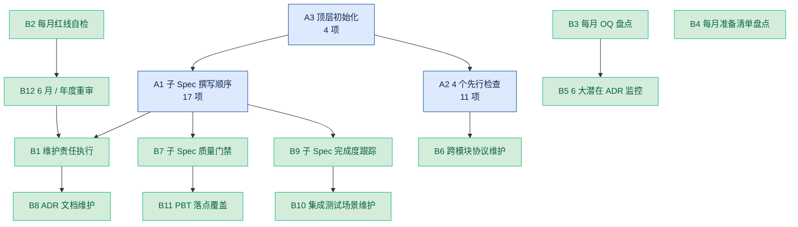

# 00 项目顶层 Spec - Tasks

> **本文档定位**：顶层 spec **不产出业务代码**，本 tasks.md 仅产出 **维护性 / 协调性 / 守护性任务**。
>
> 这些任务分两类：
> 1. **一次性启动任务**（A 类）：开发期前 + 阶段 1 启动前必须完成，奠定 28 个子 spec 撰写的基础
> 2. **持续维护任务**（B 类）：贯穿整个开发期 + 上线后运营期，按周期重复执行
>
> Codex / Claude Code 实施 27 个子 spec 时，**必须先完成 A 类所有任务**，否则后续 spec 无法启动。

---

## 任务总数：A 类 18 项 + B 类 12 项 = 30 项

---

## Phase A：一次性启动任务（18 项）

### A1. 子 Spec 撰写顺序与并行策略检查清单

按 [`design.md` §4](./design.md) 依赖图严格执行。

#### A1.1 阶段 1 基础设施撰写顺序（必须串行）

- [ ] **A1.1.1** 启动 [`01-infra-monorepo`] spec 撰写（≤ 3d）
  - 必读：[`AGENTS.md`](../../../AGENTS.md) + [`design.md` §2 §11 §12](./design.md)
  - 验收：Requirements + Design + Tasks 三件套创始人审过
  - 阻塞：无（最早启动）
- [ ] **A1.1.2** [`01`] 完成后并行启动 [`02-shared-contracts`] / [`03-design-system`] / [`05-windows-desktop`]
  - 必读：[`design.md` §11](./design.md)（packages 层级关系）
  - 验收：三份 spec 三件套创始人审过
  - 阻塞：[`01`] 必须完成
- [ ] **A1.1.3** [`02`] 完成后启动 [`04-ai-gateway`] spec
  - 必读：[`design.md` §9](./design.md)（AI Tier 实现机制） + [`ai-gateway-rules.md`](../../steering/ai-gateway-rules.md)
  - 验收：完整覆盖 BR-501 至 BR-508、BR-321 至 BR-324
  - 阻塞：[`02`] 必须完成（types / errors）
  - ⚠️ **关键阻塞节点**：所有 AI 模块依赖此

#### A1.2 阶段 2 商业核心撰写顺序（强串行）

- [ ] **A1.2.1** [`02`] 完成后启动 [`06-auth-rbac`]
  - 必读：[`design.md` §3 §10](./design.md)（注册时序 + 多租户 4 道防线）+ [`security-rules.md`](../../steering/security-rules.md)
  - 验收：4 大用户大类注册流程全覆盖 + 4 层 WHERE 实现 + 审批引擎设计
- [ ] **A1.2.2** [`06`] 完成后并行启动 [`07-subscription-billing`] / [`08-credit-system`]
  - 验收：BR-401 至 BR-407 / BR-204 / BR-404 / BR-405 全覆盖
- [ ] **A1.2.3** [`07`] [`08`] 完成后启动 [`09-payment-gateway`]
- [ ] **A1.2.4** [`04`] 完成后启动 [`10-report-center`]
  - 必读：[`design.md` §9.5](./design.md)（Tier 输出格式差异）
  - 验收：BR-322 4 强制要素 + 老板版 H5 + 详细版 PDF

#### A1.3 阶段 3 杀手锏 + 补充（可并行 9 个 spec）

- [ ] **A1.3.1** [`04`] [`10`] 完成后**并行启动**：
  - [`11-opportunity-radar`] / [`12-tender-factory`] / [`13-risk-review`] / [`14-qualification-guard`] / [`15-ops-toolkit`]（5 大杀手锏）
  - [`16-project-site`] / [`17-cost-estimate`] / [`18-drawing-recognition`] / [`19-cashflow-finance`]（4 个补充）
  - 验收：每个 spec 三件套创始人审过 + Tier 分级（BR-321）正确
  - ⚠️ 必须遵守 [`memory-management.md` §11](../../steering/memory-management.md) 的"4 个先行"

#### A1.4 阶段 4 知识 + 规则（与阶段 3 并行）

- [ ] **A1.4.1** 启动 [`20-knowledge-system`] / [`21-rules-engine`]（与 [`11`]–[`19`] 并行）
  - 必读：[`design.md` §5.9](./design.md) BR-310（参考价库）
  - 验收：4 大数据库 + 抓取流水线 + 资质 / 合同 / 招标 / 参考价 4 类规则库

#### A1.5 阶段 5 用户工作台

- [ ] **A1.5.1** 阶段 3 大部分完成后启动 [`22-agent-workspace`]
  - 必读：[`design.md` §7 §8](./design.md)（派单序列 + 信誉事件溯源） + [`ADR-002`](../../../docs/decisions/2025-05-15-adr-002-dispatch-mechanism.md)
  - 验收：BR-301 至 BR-316 + BR-331 至 BR-336 全覆盖
  - ⚠️ **核心模块**：派单 + 信誉 + 评分 + 推荐费 + 申诉
- [ ] **A1.5.2** 与 [`22`] 并行启动 [`23-gov-soe-workspace`]
- [ ] **A1.5.3** [`22`] 完成后启动 [`24-admin-console`]
  - 验收：7 大可视化模块 + BR-901 / BR-902 红线监控

#### A1.6 阶段 6 横向能力（串行）

- [ ] **A1.6.1** 启动 [`25-ai-chat-hub`] → [`26-addiction-system`] → [`27-notification-center`]
  - 验收：BR-601 至 BR-604 + 全局聊天入口 + 通知矩阵

#### A1.7 阶段 7 合规总审

- [ ] **A1.7.1** 全部完成后启动 [`28-security-compliance`]
  - 验收：BR-104 / BR-315 / BR-504 / BR-505 + 数据出境合规 + 审计日志 + 备份

---

### A2. 跨子 Spec 的依赖检查清单（"4 个先行"）

并行做多个子 Spec 时必检查。

#### A2.1 共享类型先行

- [ ] **A2.1.1** 在 [`02-shared-contracts`] 实施期间，建立 `packages/types` 目录结构（按 [`design.md` §11](./design.md)）
- [ ] **A2.1.2** 每次新增跨模块 DTO / Enum / 错误码 → **先合 packages/types** → CI 通过 → 再写业务代码
- [ ] **A2.1.3** 共享类型变更必须独立 PR，禁止与业务代码混合提交

#### A2.2 OpenAPI 先行

- [ ] **A2.2.1** 在 [`02`] 实施期间初始化 `packages/contracts/openapi.yaml`
- [ ] **A2.2.2** 每个新 API → **先合 OpenAPI yaml** → 跑 codegen → 再写后端实现
- [ ] **A2.2.3** 后端实现 → 完成后再生成前端 client

#### A2.3 数据库先行

- [ ] **A2.3.1** 在 [`01-infra-monorepo`] 实施期间初始化 `prisma/schema.prisma`
- [ ] **A2.3.2** 任一 schema 改动 → **先合 prisma/schema.prisma + migration** → CI 通过 → 再合业务代码
- [ ] **A2.3.3** Migration 必须可逆（写 down 脚本）

#### A2.4 Spec 先行

- [ ] **A2.4.1** Codex 实施代码前必须读对应子 Spec 的 requirements + design + tasks
- [ ] **A2.4.2** 发现 spec 缺漏 → 先补 spec → 创始人审过 → 再写代码
- [ ] **A2.4.3** 发现需要改架构 → 先发 ADR → 创始人批准 → 再改 spec → 再写代码

#### A2.5 命名空间冲突预防

- [ ] **A2.5.1** 错误码命名空间按 [`design.md` §11.5](./design.md) 严格分配，不允许跨子 Spec 复用
- [ ] **A2.5.2** 数据库表前缀按子 Spec 模块命名（如 `agent_*` / `dispatch_*` / `reputation_*`）

---

### A3. 顶层 Spec 自身的初始化任务

- [ ] **A3.1** 创建 ADR 触发条件监控清单（见 Phase B B5）
- [ ] **A3.2** 在 `apps/admin` 设计阶段（[`24-admin-console`]）预留 BR-901 红线监控看板配置项
- [ ] **A3.3** 在 [`27-notification-center`] 设计阶段预留每月红线自检报告自动推送（BR-902）
- [ ] **A3.4** 创建 `docs/changelog/monthly-review-template.md`（月度复盘模板）

---

## Phase B：持续维护任务（12 项）

### B1. 顶层 Spec 维护责任执行

按 [`design.md` 附录 B](./design.md) 维护责任表执行。

- [ ] **B1.1** **任一 BR 新增 / 修改 / 删除时**：更新 [`requirements.md` §8](./requirements.md) + [`design.md` §5](./design.md) BR 映射表 + 写 ADR
  - 触发：子 Spec 撰写过程中
  - 责任：创始人 + 对应子 Spec owner
- [ ] **B1.2** **任一子 Spec 新增 / 拆分 / 合并时**：更新 [`design.md` §4](./design.md) 依赖图 + [`README.md`](../README.md) + 写 ADR
  - 触发：开发过程中发现需要拆分
  - 责任：创始人
- [ ] **B1.3** **任一关键时序 / 状态机变更时**：更新 [`design.md` §3 §6 §7 §8](./design.md) + 同步对应子 Spec
  - 触发：核心商业流程变化
  - 责任：对应子 Spec owner + 创始人

---

### B2. 每月红线自检（BR-902）

- [ ] **B2.1** 每月 1 号 cron 自动生成红线指标自检报告（实现位置：[`24-admin-console` §5.12](./design.md)）
- [ ] **B2.2** 每月 1 号 + 创始人审阅红线报告 + 在 `docs/changelog/monthly-review-{YYYY-MM}.md` 归档
- [ ] **B2.3** 任一红线指标越界 → 在 24 小时内启动应急响应（按 BR-901 应对方案）

**红线监控指标（实时）**：

| 红线 | 阈值 | 数据源 | 监控位置 |
|---|---|---|---|
| 月流失率 | ≥ 12% | `subscriptions` 状态变化 | [`07`] / [`24`] |
| AI 单点成本 | ≥ ¥0.07 | `ai_cost_logs` | [`04`] / [`24`] |
| 智能管家月活率 | < 30% | `agent_activity_logs` | [`22`] / [`24`] |
| 咨询转化率 | < 2% | `consulting_orders` / 月活客户 | [`22`] / [`24`] |
| 单一渠道占比 | > 60% | `ai_provider_health` | [`04`] / [`24`] |
| 单月退款率 | > 8% | `refunds` / `orders` | [`09`] / [`24`] |

---

### B3. 每月开放问题盘点

按 [`requirements.md` §12](./requirements.md) 的 OQ-001 至 OQ-008 持续观察。

- [ ] **B3.1** 每月 1 号在 `docs/changelog/monthly-review-{YYYY-MM}.md` 中记录每个 OQ 的当前状态
- [ ] **B3.2** 任一 OQ 触发条件达成 → 7 天内召开决策会议 + 产出 ADR
- [ ] **B3.3** 设计层 DOQ-001 至 DOQ-006 在对应子 Spec design 阶段拍板

---

### B4. 每月创始人准备清单盘点

- [ ] **B4.1** 每月底由创始人对照 [`docs/owner-preparation-checklist.md`](../../../docs/owner-preparation-checklist.md) 进行 57 项盘点
- [ ] **B4.2** 盘点结果以 `docs/changelog/monthly-review-{YYYY-MM}.md` 形式归档
- [ ] **B4.3** 任一 P0 项延期超过 1 个月 → 启动应急方案（找替代供应商 / 调整阻塞性依赖）

---

### B5. 6 大潜在 ADR 触发条件监控

按 [`design.md` §15.5](./design.md) 维护：

- [ ] **B5.1** **ADR-003 海外模型直连**：监控 OpenRouter / B.AI 稳定性达标 + HK 公司合规进度
- [ ] **B5.2** **ADR-004 政府版私有化**：监控央国企客户单数 ≥ 5 单且要求私有化
- [ ] **B5.3** **ADR-005 桌面端升级**：监控桌面端日活占比 ≥ 30%
- [ ] **B5.4** **ADR-006 客户层裂变扩展**：监控客户邀请客户的 GMV 占比 ≥ 20%
- [ ] **B5.5** **ADR-007 知识库置信度调整**：监控专家审核工作量 > 100 条/天
- [ ] **B5.6** **ADR-008 第二档咨询产品**：监控标准咨询转化率 < 2% 持续 3 月

监控配置在 [`24-admin-console`] 业务运营看板。

---

### B6. 跨模块协议（附录 A）一致性维护

确保 P-1 至 P-8 跨模块协议在各子 Spec 中正确引用：

- [ ] **B6.1** 每次子 Spec 完成 design 阶段 → 检查是否正确引用 P-1 至 P-8（不重复定义）
- [ ] **B6.2** 任一协议需要变更 → 先发 ADR → 更新 [`design.md` 附录 A](./design.md) → 全部相关子 Spec 检查影响

---

### B7. 子 Spec 撰写质量门禁

每个子 Spec 完成 design 阶段必须通过：

- [ ] **B7.1** **BR 引用完整性**：design.md 引用了所有相关 BR 编号（不遗漏）
- [ ] **B7.2** **跨模块协议引用**：design.md 引用 P-1 至 P-8 而非重新定义
- [ ] **B7.3** **PBT 落点声明**：design.md 中明确说明本模块的 PBT 强度（按 [`design.md` §13.7](./design.md)）
- [ ] **B7.4** **错误码命名空间不冲突**：按 [`design.md` §11.5](./design.md) 分配
- [ ] **B7.5** **依赖关系一致**：与 [`design.md` §4](./design.md) 依赖图一致

---

### B8. ADR 文档维护

- [ ] **B8.1** 每个新 ADR 创建后立即更新 [`design.md` §15.4](./design.md) 已落地 ADR 索引
- [ ] **B8.2** 每个 ADR 的状态变更（accepted → superseded by ADR-X）必须同步更新 [`design.md` §15.4](./design.md) + ADR 文件本身

---

### B9. 子 Spec 完成度跟踪

- [ ] **B9.1** 维护 [`README.md`](../README.md) 的 28 个子 Spec 状态（⏳ 进行中 / ✅ 完成 / 🔒 阻塞）
- [ ] **B9.2** 每个子 Spec tasks.md 全部勾选 → 状态改为 ✅ 完成
- [ ] **B9.3** 任一子 Spec 阻塞 ≥ 1 周 → 在月度复盘中报警 + 追溯阻塞原因

---

### B10. 集成测试场景维护（design.md §13）

- [ ] **B10.1** 5 个 e2e 场景作为 CI 必跑套件（跑不过不能合 main）
- [ ] **B10.2** 任一场景需要新增 / 修改 → 先更新 [`design.md` §13](./design.md) + ADR + 同步对应子 Spec
- [ ] **B10.3** 每月监控 e2e 通过率 ≥ 95%（持续低于阈值触发应急）

---

### B11. PBT 落点全面覆盖（design.md §13.7）

- [ ] **B11.1** 每个 P0 / P1 子 Spec 完成时检查 PBT 强度满足 [`design.md` §13.7](./design.md) 强制要求
- [ ] **B11.2** 弱 PBT（用例子测试）的子 Spec 必须在 design.md 中明确说明原因
- [ ] **B11.3** 强 PBT 失败 → 视为 CI fail，必须修复

---

### B12. 顶层 Spec 自身重审

- [ ] **B12.1** 上线 6 个月后**全面重审本顶层 Spec**：
  - requirements.md 12 个 Requirement + 61 条 BR 是否全部仍合理
  - design.md 8 个权衡是否需要调整（按真实数据）
  - 17 大功能区是否需要新增 / 合并
  - 5 年愿景是否需要校准
  - 写 ADR 归档调整结果
- [ ] **B12.2** 每年 1 次年度复盘，写 `docs/changelog/yearly-review-{YYYY}.md`

---

## 任务依赖图

---

## 完成标准

| 任务类别 | 完成标准 |
|---|---|
| Phase A 一次性启动 | 全部 18 项勾选 ✅ + 28 个子 Spec README 状态全部 ⏳ 或 ✅ |
| Phase B 持续维护 | 每月按周期执行 + 月度复盘归档到 `docs/changelog/` |
| 顶层 Spec 总体完成 | 28 个子 Spec 全部 ✅ + 上线 6 个月 + B12 重审完成 |

---

## 注意事项

> ❗ **顶层 Spec 不产业务代码**。本 tasks.md 的所有任务都是**协调性 / 维护性 / 守护性**任务，不直接对应代码 PR。
>
> ❗ **27 个子 Spec 各自走完整流程**：Requirements → Design → Tasks → Implementation。子 Spec 的代码实现由对应 spec 的 tasks.md 驱动，而非本文档。
>
> ❗ **B 类任务必须按周期执行**：错过红线监控 / 月度复盘会导致风险累积，OPC 模式下尤其致命。
