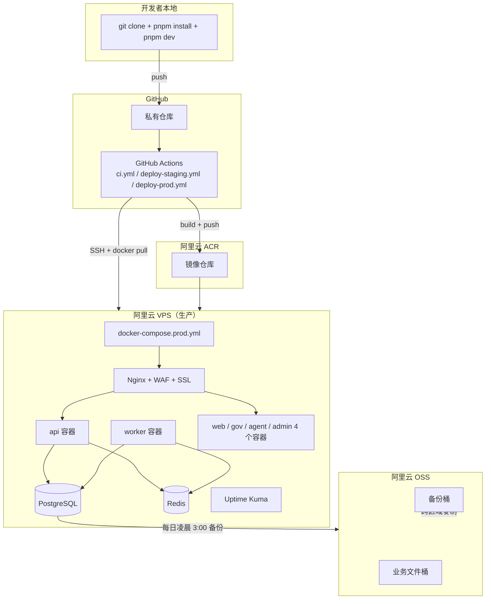

# 01 Monorepo 基础设施 - Design

> **本文档**：把 Requirements 转换为可执行的工程设计。Codex 实施 tasks 时严格按本文档执行。

---

## 1. 整体架构图



---

## 2. 技术栈版本（强制锁定）

| 类别 | 技术 | 版本 | 选型理由 |
|---|---|---|---|
| 包管理 | pnpm | 9.x | workspace 性能最好、磁盘占用小 |
| Mono 工具 | Turborepo | 2.x | 增量构建 + 远程缓存（不强制远程缓存）|
| Node | Node.js | 22 LTS | 性能 + 长期支持 |
| 语言 | TypeScript | 5.4+ | strict 模式 |
| 后端 | NestJS | 10.x | 模块化 + 装饰器 + DI |
| 前端 | Next.js | 14.x (App Router) | RSC + standalone 输出 |
| 桌面 | Tauri | 2.x | 比 Electron 轻 5 倍 |
| ORM | Prisma | 5.x | 类型安全 + migration |
| 数据库 | PostgreSQL | 15+ | 全功能 + jsonb |
| 缓存/队列 | Redis | 7+ | 通用 |
| 队列引擎 | BullMQ | 5.x | Redis 原生 |
| 文件存储 | 阿里云 OSS | — | 国内合规 |
| 镜像 | Docker | 24+ | 容器标准 |
| 反向代理 | Nginx | 1.25+ | 稳定 |
| CI/CD | GitHub Actions | — | 私有仓库免费额度足够 |
| 监控 | Uptime Kuma + 阿里 SLS | — | 自部署免费 |

---

## 3. Monorepo 详细文件清单

### 3.1 根目录文件

```
package.json              # workspace 根 + scripts
pnpm-workspace.yaml       # workspace 声明
turbo.json                # Turbo pipeline 配置
tsconfig.base.json        # TS 基础配置
.eslintrc.json            # ESLint 配置
.prettierrc               # Prettier 配置
.editorconfig             # 编辑器统一
.gitignore
.gitattributes
.dockerignore
.env.example              # 环境变量模板（已存在）
.husky/                   # Git hooks
  ├── pre-commit          # lint-staged
  └── commit-msg          # commitlint
.commitlintrc.json
.npmrc                    # pnpm 配置（节点版本约束）
README.md                 # 已存在，需补本地开发段落
LICENSE                   # 私有项目可选
```

### 3.2 packages/ 详细结构

每个 package 的标准结构：
```
packages/{name}/
├── package.json
├── tsconfig.json         # extends 根
├── src/
│   ├── index.ts          # 主导出
│   └── ...
├── tests/
└── README.md
```

#### packages/types
- 导出全部跨模块共享 types / DTO / Enum
- 内容由后续子 spec 增量填充

#### packages/contracts
- `openapi.yaml` 主契约文件
- 用 `openapi-typescript-codegen` 自动生成 client / server types 到 `generated/`
- npm script：`pnpm gen:api`

#### packages/permissions
- 角色枚举 / 岗位标签枚举 / 权限点常量
- 内容由 [`06-auth-rbac`] 填充

#### packages/errors
- BaseError 基类 + BusinessError + ValidationError + 错误码命名空间
- 内容遵守 [顶层 design §11.5](../00-project-overview/design.md)

#### packages/constants
- 全局常量：定价 / 扣点 / 红线阈值 / 派单规则 等
- 详见 [顶层 design §5](../00-project-overview/design.md) BR 映射表

#### packages/ui
- shadcn/ui 封装 + 业务组件（PageHeader / EmptyState / RiskBadge 等）
- 由 [`03-design-system`] 详细填充

#### packages/utils
- 日期 / 金额 / 字符串 / 加解密 工具

#### packages/test-fixtures
- 用户 / 企业 / 合同 / 资质 / 招标 等 mock 数据
- 用于单测 + e2e

### 3.3 apps/ 详细结构

#### apps/api（NestJS）
```
apps/api/
├── package.json
├── tsconfig.json
├── nest-cli.json
├── src/
│   ├── main.ts                 # 启动入口
│   ├── app.module.ts
│   ├── modules/                # 业务模块（auth / contract / ...）
│   ├── ai-gateway/             # AI Gateway（详见 [04]）
│   ├── common/                 # 拦截器 / 守卫 / 装饰器 / 过滤器
│   ├── database/               # Prisma 客户端 + base repository
│   └── config/                 # 配置加载（@nestjs/config）
├── tests/
│   ├── unit/
│   └── e2e/
└── README.md
```

#### apps/worker（NestJS）
```
apps/worker/
├── package.json
├── src/
│   ├── main.ts
│   ├── jobs/                   # BullMQ jobs
│   │   ├── ai-task.job.ts
│   │   ├── notification.job.ts
│   │   ├── data-crawl.job.ts
│   │   └── reputation-event.job.ts
│   └── workers/                # job processor
└── README.md
```

#### apps/web / gov / agent / admin（Next.js）
统一结构（详见 [`frontend-rules.md` §2](../../steering/frontend-rules.md)）：
```
apps/{name}/
├── package.json
├── tsconfig.json
├── next.config.mjs             # standalone output
├── tailwind.config.ts
├── postcss.config.js
├── src/
│   ├── app/                    # App Router
│   ├── components/
│   ├── lib/
│   ├── hooks/
│   ├── i18n/zh-CN.ts
│   └── styles/
├── public/
└── README.md
```

四个前端的 next.config 主要差别：
- `apps/web`：accent = 同乾金
- `apps/gov`：accent = 移除（庄重）；字号 +1 档；使用 primary-700 强化深蓝
- `apps/agent`：accent = 同乾金 + LV5 紫色渐变可用
- `apps/admin`：表格密度 +20%；移除装饰

#### apps/desktop（Tauri）
```
apps/desktop/
├── package.json
├── src-tauri/
│   ├── Cargo.toml
│   ├── tauri.conf.json
│   ├── src/main.rs
│   └── icons/
├── README.md
└── 复用 apps/web 编译产物作为前端
```

### 3.4 prisma/

```
prisma/
├── schema.prisma           # 总 schema（Codex 后续按 BR 映射表分块添加）
├── migrations/
└── seed/
    ├── index.ts            # 主 seed（按依赖顺序）
    ├── tenants.seed.ts
    ├── users.seed.ts
    ├── reference-prices.seed.ts
    └── ...
```

### 3.5 infra/

```
infra/
├── docker/
│   ├── Dockerfile.api
│   ├── Dockerfile.worker
│   ├── Dockerfile.next      # 通用 Next 镜像，build-arg 区分 4 个前端
│   └── Dockerfile.nginx
├── docker-compose.yml       # 本地开发（仅基础设施）
├── docker-compose.prod.yml  # 生产
├── nginx/
│   ├── nginx.conf           # 主配置
│   ├── conf.d/
│   │   ├── web.conf         # 建筑企业前端
│   │   ├── gov.conf
│   │   ├── agent.conf
│   │   ├── admin.conf
│   │   └── api.conf         # 后端 API
│   └── ssl/                 # Let's Encrypt 证书挂载点
└── deploy/
    ├── deploy.sh            # 主部署脚本
    ├── rollback.sh
    ├── backup.sh
    ├── restore.sh
    ├── health-check.sh
    └── canary.sh            # 灰度发布
```

---

## 4. 配置文件详细规范

### 4.1 根 package.json

```json
{
  "name": "tongqian-jianzhu-ai",
  "version": "0.1.0",
  "private": true,
  "engines": {
    "node": ">=22.0.0",
    "pnpm": ">=9.0.0"
  },
  "packageManager": "pnpm@9.12.0",
  "scripts": {
    "dev": "turbo dev",
    "build": "turbo build",
    "lint": "turbo lint",
    "typecheck": "turbo typecheck",
    "test": "turbo test",
    "clean": "turbo clean && rm -rf node_modules",
    "db:migrate": "pnpm --filter prisma migrate dev",
    "db:deploy": "pnpm --filter prisma migrate deploy",
    "db:seed": "pnpm --filter prisma seed",
    "db:studio": "pnpm --filter prisma studio",
    "db:setup": "pnpm db:deploy && pnpm db:seed",
    "docker:up": "docker compose -f infra/docker-compose.yml up -d",
    "docker:down": "docker compose -f infra/docker-compose.yml down",
    "docker:logs": "docker compose -f infra/docker-compose.yml logs -f",
    "gen:api": "pnpm --filter @tongqian/contracts gen",
    "prepare": "husky"
  },
  "devDependencies": {
    "turbo": "^2.0.0",
    "typescript": "^5.4.0",
    "husky": "^9.0.0",
    "lint-staged": "^15.0.0",
    "@commitlint/cli": "^19.0.0",
    "@commitlint/config-conventional": "^19.0.0",
    "prettier": "^3.0.0",
    "eslint": "^9.0.0"
  }
}
```

### 4.2 pnpm-workspace.yaml

```yaml
packages:
  - "apps/*"
  - "packages/*"
  - "prisma"
```

### 4.3 turbo.json

```json
{
  "$schema": "https://turbo.build/schema.json",
  "globalDependencies": [".env*"],
  "globalEnv": ["NODE_ENV", "TZ"],
  "pipeline": {
    "build": {
      "dependsOn": ["^build"],
      "outputs": ["dist/**", ".next/**", "!.next/cache/**"]
    },
    "dev": {
      "cache": false,
      "persistent": true
    },
    "lint": {
      "outputs": []
    },
    "typecheck": {
      "dependsOn": ["^build"],
      "outputs": []
    },
    "test": {
      "dependsOn": ["^build"],
      "outputs": ["coverage/**"]
    },
    "clean": {
      "cache": false
    }
  }
}
```

### 4.4 tsconfig.base.json

```json
{
  "compilerOptions": {
    "target": "ES2022",
    "module": "NodeNext",
    "moduleResolution": "NodeNext",
    "lib": ["ES2022", "DOM", "DOM.Iterable"],
    "strict": true,
    "noImplicitAny": true,
    "noUncheckedIndexedAccess": true,
    "noFallthroughCasesInSwitch": true,
    "noImplicitOverride": true,
    "verbatimModuleSyntax": false,
    "esModuleInterop": true,
    "skipLibCheck": true,
    "forceConsistentCasingInFileNames": true,
    "isolatedModules": true,
    "resolveJsonModule": true,
    "incremental": true,
    "experimentalDecorators": true,
    "emitDecoratorMetadata": true
  }
}
```

### 4.5 ESLint 配置（`.eslintrc.json`）

```json
{
  "root": true,
  "parser": "@typescript-eslint/parser",
  "plugins": ["@typescript-eslint", "import", "unused-imports"],
  "extends": [
    "eslint:recommended",
    "plugin:@typescript-eslint/recommended-type-checked",
    "plugin:@typescript-eslint/strict",
    "plugin:import/recommended",
    "plugin:import/typescript",
    "prettier"
  ],
  "parserOptions": {
    "project": ["./tsconfig.base.json", "./apps/*/tsconfig.json", "./packages/*/tsconfig.json"]
  },
  "rules": {
    "@typescript-eslint/no-explicit-any": "error",
    "@typescript-eslint/consistent-type-imports": "error",
    "@typescript-eslint/no-unused-vars": "off",
    "unused-imports/no-unused-imports": "error",
    "import/order": ["error", {
      "groups": ["builtin", "external", "internal", "parent", "sibling", "index"],
      "newlines-between": "always",
      "alphabetize": { "order": "asc" }
    }]
  }
}
```

### 4.6 Prettier 配置（`.prettierrc`）

```json
{
  "semi": true,
  "trailingComma": "all",
  "singleQuote": true,
  "printWidth": 100,
  "tabWidth": 2,
  "useTabs": false,
  "bracketSpacing": true,
  "arrowParens": "always",
  "endOfLine": "lf"
}
```

---

## 5. Docker 详细设计

### 5.1 通用 Next.js Dockerfile

```dockerfile
# infra/docker/Dockerfile.next
ARG APP_NAME

FROM node:22-alpine AS base
RUN corepack enable && corepack prepare pnpm@9.12.0 --activate

FROM base AS deps
WORKDIR /app
COPY pnpm-workspace.yaml package.json pnpm-lock.yaml ./
COPY packages packages
COPY apps/${APP_NAME}/package.json apps/${APP_NAME}/package.json
RUN pnpm install --frozen-lockfile

FROM base AS builder
ARG APP_NAME
WORKDIR /app
COPY --from=deps /app/node_modules ./node_modules
COPY . .
RUN pnpm --filter ./apps/${APP_NAME} build

FROM node:22-alpine AS runner
ARG APP_NAME
WORKDIR /app
ENV NODE_ENV=production
RUN addgroup --system --gid 1001 nodejs && adduser --system --uid 1001 nextjs

COPY --from=builder --chown=nextjs:nodejs /app/apps/${APP_NAME}/.next/standalone ./
COPY --from=builder --chown=nextjs:nodejs /app/apps/${APP_NAME}/.next/static ./apps/${APP_NAME}/.next/static
COPY --from=builder --chown=nextjs:nodejs /app/apps/${APP_NAME}/public ./apps/${APP_NAME}/public

USER nextjs
EXPOSE 3000
ENV PORT=3000
ENV HOSTNAME="0.0.0.0"

HEALTHCHECK --interval=30s --timeout=5s --retries=3 \
  CMD wget -qO- http://localhost:3000/api/health || exit 1

CMD ["node", "apps/${APP_NAME}/server.js"]
```

### 5.2 NestJS API Dockerfile

```dockerfile
# infra/docker/Dockerfile.api
FROM node:22-alpine AS base
RUN corepack enable && corepack prepare pnpm@9.12.0 --activate

FROM base AS deps
WORKDIR /app
COPY pnpm-workspace.yaml package.json pnpm-lock.yaml ./
COPY packages packages
COPY apps/api/package.json apps/api/package.json
COPY prisma prisma
RUN pnpm install --frozen-lockfile

FROM base AS builder
WORKDIR /app
COPY --from=deps /app/node_modules ./node_modules
COPY . .
RUN pnpm --filter @tongqian/api build
RUN pnpm --filter @tongqian/api deploy --prod /prod-api

FROM node:22-alpine AS runner
WORKDIR /app
ENV NODE_ENV=production
RUN addgroup --system --gid 1001 nodejs && adduser --system --uid 1001 nestjs

COPY --from=builder --chown=nestjs:nodejs /prod-api ./
USER nestjs
EXPOSE 4000

HEALTHCHECK --interval=30s --timeout=5s --retries=3 \
  CMD wget -qO- http://localhost:4000/health || exit 1

CMD ["node", "dist/main.js"]
```

### 5.3 docker-compose.yml（本地开发）

```yaml
version: '3.9'

services:
  postgres:
    image: postgres:15-alpine
    container_name: tqj-postgres
    environment:
      POSTGRES_USER: postgres
      POSTGRES_PASSWORD: postgres
      POSTGRES_DB: tongqian_dev
    ports:
      - "5432:5432"
    volumes:
      - ./data/pg:/var/lib/postgresql/data
    healthcheck:
      test: ["CMD-SHELL", "pg_isready -U postgres"]
      interval: 5s
      timeout: 5s
      retries: 10

  redis:
    image: redis:7-alpine
    container_name: tqj-redis
    ports:
      - "6379:6379"
    volumes:
      - ./data/redis:/data
    command: redis-server --appendonly yes

  minio:
    image: minio/minio:latest
    container_name: tqj-minio
    ports:
      - "9000:9000"
      - "9001:9001"
    environment:
      MINIO_ROOT_USER: minioadmin
      MINIO_ROOT_PASSWORD: minioadmin
    volumes:
      - ./data/minio:/data
    command: server /data --console-address ":9001"

  mailhog:
    image: mailhog/mailhog:latest
    container_name: tqj-mailhog
    ports:
      - "1025:1025"
      - "8025:8025"
```

### 5.4 docker-compose.prod.yml（生产，仅展示骨架）

```yaml
version: '3.9'

services:
  nginx:
    image: nginx:1.25-alpine
    ports: ["80:80", "443:443"]
    volumes:
      - ./infra/nginx:/etc/nginx
      - ./data/ssl:/etc/letsencrypt
    depends_on: [api, web, gov, agent, admin]
    restart: unless-stopped

  postgres:
    image: postgres:15-alpine
    env_file: .env.prod
    volumes: ["./data/pg:/var/lib/postgresql/data"]
    restart: unless-stopped

  redis:
    image: redis:7-alpine
    command: redis-server --appendonly yes --requirepass ${REDIS_PASSWORD}
    env_file: .env.prod
    restart: unless-stopped

  api:
    image: registry.cn-hangzhou.aliyuncs.com/tongqian/api:${TAG:-prod-latest}
    env_file: .env.prod
    depends_on: [postgres, redis]
    restart: unless-stopped

  worker:
    image: registry.cn-hangzhou.aliyuncs.com/tongqian/worker:${TAG:-prod-latest}
    env_file: .env.prod
    depends_on: [postgres, redis]
    restart: unless-stopped

  web:
    image: registry.cn-hangzhou.aliyuncs.com/tongqian/web:${TAG:-prod-latest}
    env_file: .env.prod
    restart: unless-stopped

  gov:
    image: registry.cn-hangzhou.aliyuncs.com/tongqian/gov:${TAG:-prod-latest}
    env_file: .env.prod
    restart: unless-stopped

  agent:
    image: registry.cn-hangzhou.aliyuncs.com/tongqian/agent:${TAG:-prod-latest}
    env_file: .env.prod
    restart: unless-stopped

  admin:
    image: registry.cn-hangzhou.aliyuncs.com/tongqian/admin:${TAG:-prod-latest}
    env_file: .env.prod
    restart: unless-stopped

  uptime-kuma:
    image: louislam/uptime-kuma:1
    ports: ["3010:3001"]
    volumes: ["./data/uptime-kuma:/app/data"]
    restart: unless-stopped
```

---

## 6. Nginx 配置策略

### 6.1 host 路由

```
www.tongqian.cn       → web 容器 :3000
gov.tongqian.cn       → gov 容器 :3003
agent.tongqian.cn     → agent 容器 :3002
admin.tongqian.cn     → admin 容器 :3001
api.tongqian.cn       → api 容器 :4000
```

### 6.2 SSL termination

- Let's Encrypt 自动续期（certbot 容器或 acme.sh 脚本）
- HSTS / TLS 1.2+ / 强加密套件
- HTTP → HTTPS 强制跳转

### 6.3 灰度发布机制

`upstream api { server api-blue:4000 weight=N; server api-green:4000 weight=M; }` 通过修改 weight + reload 切换流量比。

---

## 7. CI/CD 详细 workflow

### 7.1 ci.yml（每个 PR 跑）

```yaml
name: CI
on:
  push:
    branches: ['**']
  pull_request:
    branches: [main, develop]

jobs:
  ci:
    runs-on: ubuntu-latest
    steps:
      - uses: actions/checkout@v4
      - uses: pnpm/action-setup@v3
        with: { version: 9 }
      - uses: actions/setup-node@v4
        with: { node-version: 22, cache: pnpm }
      - run: pnpm install --frozen-lockfile
      - run: pnpm typecheck
      - run: pnpm lint
      - run: pnpm test --run
      - run: pnpm build
```

### 7.2 deploy-prod.yml（main 分支自动部署）

简化骨架（具体在 tasks 中实现）：
```yaml
name: Deploy Production
on:
  push:
    branches: [main]
jobs:
  build-and-push:
    # 构建 7 个镜像 + 推 ACR
  deploy:
    needs: build-and-push
    # SSH 到 VPS + docker-compose pull + canary
```

---

## 8. 部署脚本（infra/deploy/）

### 8.1 deploy.sh

```bash
#!/usr/bin/env bash
set -euo pipefail

TAG=${1:-prod-latest}
echo "Deploying tag: $TAG"

# 1. pull 新镜像
TAG=$TAG docker compose -f docker-compose.prod.yml pull

# 2. 灰度发布
./canary.sh $TAG

# 3. 健康检查
./health-check.sh

echo "Deployment OK"
```

### 8.2 backup.sh（每日 cron）

```bash
#!/usr/bin/env bash
DATE=$(date +%Y%m%d-%H%M%S)
docker exec tqj-postgres pg_dump -U postgres tongqian_prod | gzip > /data/backup/pg-$DATE.sql.gz
ossutil cp /data/backup/pg-$DATE.sql.gz oss://tongqian-backup/pg/
find /data/backup -name "pg-*.sql.gz" -mtime +30 -delete
```

---

## 9. 监控架构

```
应用容器 stdout
   ↓ Docker logging driver
   ↓
阿里云 SLS（日志服务）
   ↓
Grafana / SLS 内置看板
   ↓
告警规则触发 → 企业微信群机器人 webhook
```

应用层结构化日志（pino）字段：

```ts
{
  ts: Date,
  level: 'info' | 'warn' | 'error' | 'fatal',
  module: string,
  traceId: string,
  userId?: string,
  tenantId?: string,
  msg: string,
  err?: { name, message, stack }
}
```

---

## 10. 性能与容量

| 项 | 单 VPS 8C16G 容量 |
|---|---|
| 并发用户 | ≤ 5000 |
| API QPS | ≤ 100 |
| AI 任务 / 分钟 | ≤ 60（受模型限流）|
| PG 连接池 | 100 |
| Redis 内存 | 4GB |

二期演进触发：客户数 ≥ 5 万 → 双 VPS + RDS 主从。

---

## 11. 关键决策权衡

| 决策 | 选择 | 备选 | 理由 |
|---|---|---|---|
| Mono 工具 | Turborepo | Nx | Turbo 更轻量，Next.js 一级支持 |
| 包管理 | pnpm | npm / yarn | pnpm 磁盘 + 速度 + workspace 最佳 |
| 部署 | Docker Compose | K8s | OPC 模式 K8s 过重 |
| CI | GitHub Actions | Gitea Actions / Drone | 私有仓库免费额度足够，集成度最高 |
| Next.js 输出 | standalone | export(SSG) | 业务有 SSR 需求 |
| Nginx 还是 Traefik | Nginx | Traefik | 业内最熟，社区资源最多 |

---

## 12. 风险与缓解

| 风险 | 影响 | 缓解 |
|---|---|---|
| GitHub 在国内访问慢 | CI 缓慢 | 用 GitHub Actions 自带 ubuntu-latest 没问题；自托管 runner 备用 |
| 阿里云 ACR 鉴权 | 推镜像失败 | 临时令牌 + Secrets 双备份 |
| 单 VPS 单点故障 | 全站宕机 | 二期升级双热备 + DNS 切换 |
| pnpm lock 文件冲突 | 多人合并冲突 | 强制：所有依赖变动单独 PR |
| Docker 构建慢 | 部署超时 | layer 缓存 + GitHub Actions cache |

---

## 13. 后续扩展接口

- 二期可平滑切到 K8s（Dockerfile 不变）
- 二期可加 RDS 替换自管 PG（仅改 DATABASE_URL）
- 二期可加 SLB（Nginx 上层）
- 二期可加 CDN（前端 static 资产）

---

## 14. PBT 落点

本 spec 不写代码，**不适用 PBT**。但 CI 中要验证：
- 镜像构建可重复（同一 commit 构建出的镜像 size 差 ≤ 5%）
- docker-compose up -d 后所有 healthcheck 在 60s 内 pass
