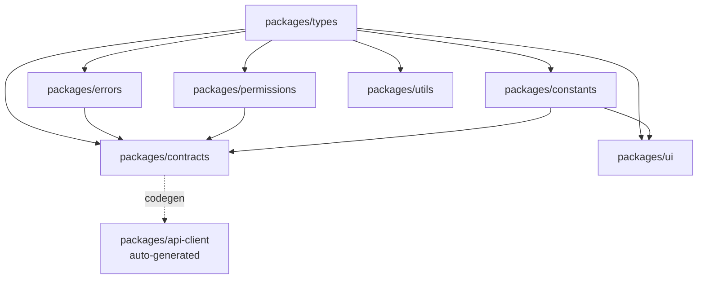

# 02 共享契约 - Design

## 1. 包间架构



## 2. 关键文件清单（每个 package 起步）

### packages/types/src/index.ts（起步 + 后续 spec 增量）

```ts
// 起步导出（顶层 spec 已涉及的）
export * from './auth/role';
export * from './auth/position-tag';
export * from './auth/tenant';
export * from './auth/scope';
export * from './subscription/plan';
export * from './subscription/status';
export * from './credit/transaction';
export * from './ai-task/task-type';
export * from './ai-task/tier';
export * from './dispatch/need-class';
export * from './reputation/score';
export * from './reputation/level';
export * from './report/required-elements';
export * from './common/api-response';
export * from './common/pagination';
export * from './common/id';
export * from './common/money';
export * from './common/audit';
export * from './common/trace';
export * from './common/async-task';
export * from './common/idempotency';
export * from './approval/flow';

// 后续 spec 增量（每完成一个子 spec 在这里追加导出）
```

### packages/errors/src/index.ts（起步骨架）

```ts
export { BaseError } from './base-error';
export { BusinessError } from './business-error';
export { ValidationError } from './validation-error';
export { AuthError } from './auth-error';
export { PermissionError } from './permission-error';
export { NotFoundError } from './not-found-error';
export { ConflictError } from './conflict-error';
export { RateLimitError } from './rate-limit-error';
export { UpstreamError } from './upstream-error';
export { ErrorCodes, ErrorCode } from './codes';
export { isBusinessError, getErrorMessage } from './utils';
```

### packages/permissions/src/roles.ts

```ts
export enum UserRole {
  BUILDING_COMPANY = 'BUILDING_COMPANY_USER',
  GOV_USER = 'GOV_USER',
  AGENT = 'AGENT',
  PLATFORM = 'PLATFORM',
}

// 平台运营子角色
export enum PlatformRole {
  PLATFORM_OWNER = 'PLATFORM_OWNER',
  OPS_MGR = 'OPS_MGR',
  PLATFORM_FIN = 'PLATFORM_FIN',
  PLATFORM_CS = 'PLATFORM_CS',
  PLATFORM_QA = 'PLATFORM_QA',
  PLATFORM_EXPERT = 'PLATFORM_EXPERT',
  PLATFORM_CONSULT = 'PLATFORM_CONSULT',
  PLATFORM_AUDIT = 'PLATFORM_AUDIT',
}

// 智能管家子类型
export enum AgentSubtype {
  AGENT_QUAL = 'AGENT_QUAL',
  AGENT_TENDER = 'AGENT_TENDER',
  AGENT_FIN = 'AGENT_FIN',
  AGENT_GENERAL = 'AGENT_GENERAL',
}

// 建筑企业岗位标签（30+）
export enum PositionTag {
  OWNER = 'OWNER',
  BIZ_DIRECTOR = 'BIZ_DIRECTOR',
  TECH_DIRECTOR = 'TECH_DIRECTOR',
  FIN_DIRECTOR = 'FIN_DIRECTOR',
  CONTRACT_MGR = 'CONTRACT_MGR',
  HR = 'HR',
  LEGAL = 'LEGAL',
  BIZ_MGR = 'BIZ_MGR',
  TENDER_WRITER = 'TENDER_WRITER',
  PM = 'PM',
  PM_CHIEF_TECH = 'PM_CHIEF_TECH',
  PM_BIZ = 'PM_BIZ',
  PM_SAFETY = 'PM_SAFETY',
  PM_QC = 'PM_QC',
  PM_DOC = 'PM_DOC',
  PM_CONSTRUCTION = 'PM_CONSTRUCTION',
  PM_LAB = 'PM_LAB',
  PM_MATERIAL = 'PM_MATERIAL',
  PM_LABOR = 'PM_LABOR',
  PM_EQUIPMENT = 'PM_EQUIPMENT',
  DESIGNER = 'DESIGNER',
}
```

### packages/permissions/src/permission-points.ts

```ts
// 业务权限点（{resource}:{action}）
export const PermissionPoints = {
  // 合同
  CONTRACT_VIEW: 'contract:view',
  CONTRACT_CREATE: 'contract:create',
  CONTRACT_UPDATE: 'contract:update',
  CONTRACT_DELETE: 'contract:delete',
  CONTRACT_APPROVE: 'contract:approve',
  CONTRACT_REVIEW: 'contract:review',
  // 订阅
  SUBSCRIPTION_VIEW: 'subscription:view',
  SUBSCRIPTION_UPGRADE: 'subscription:upgrade',
  SUBSCRIPTION_CANCEL: 'subscription:cancel',
  // 派单
  DISPATCH_ACCEPT: 'dispatch:accept',
  DISPATCH_QUOTE: 'dispatch:quote',
  // 数据导出
  DATA_EXPORT_TRIGGER: 'data-export:trigger',
  // 提现
  WITHDRAWAL_REQUEST: 'withdrawal:request',
  WITHDRAWAL_APPROVE: 'withdrawal:approve',
  // 智能管家申诉
  APPEAL_DECIDE_INITIAL: 'appeal:decide:initial',
  APPEAL_DECIDE_RISK: 'appeal:decide:risk',
  APPEAL_DECIDE_FINAL: 'appeal:decide:final',
  // 平台运营
  PROMPT_EDIT: 'prompt:edit',
  MODEL_ROUTE_EDIT: 'model-route:edit',
  RULE_REVIEW: 'rule:review',
  REPUTATION_ADJUST: 'reputation:adjust',
  // ... 后续子 spec 增量
} as const;

export type PermissionPoint = typeof PermissionPoints[keyof typeof PermissionPoints];
```

### packages/errors/src/codes.ts（起步示例，后续按命名空间增量）

```ts
import { z } from 'zod';

export interface ErrorCodeDef {
  code: string;
  httpStatus: number;
  message: string;
  userActionable: boolean;
}

export const ErrorCodes = {
  // ============ AUTH ============
  AUTH_LOGIN_PASSWORD_INVALID: {
    code: 'AUTH.LOGIN.PASSWORD_INVALID',
    httpStatus: 401,
    message: '用户名或密码错误',
    userActionable: true,
  },
  AUTH_TOKEN_EXPIRED: {
    code: 'AUTH.TOKEN.EXPIRED',
    httpStatus: 401,
    message: '登录已过期，请重新登录',
    userActionable: true,
  },
  // ============ TENANT ============
  TENANT_ALREADY_EXISTS: {
    code: 'TENANT.CREATE.ALREADY_EXISTS',
    httpStatus: 409,
    message: '该统一社会信用代码已注册',
    userActionable: true,
  },
  // ============ CREDIT ============
  CREDIT_INSUFFICIENT: {
    code: 'CREDIT.DEDUCT.INSUFFICIENT',
    httpStatus: 422,
    message: '点数余额不足',
    userActionable: true,
  },
  // ============ AI ============
  AI_GATEWAY_UNAVAILABLE: {
    code: 'AI.GATEWAY.UNAVAILABLE',
    httpStatus: 503,
    message: 'AI 服务暂时不可用，已退还点数',
    userActionable: true,
  },
  // ============ DISPATCH ============
  DISPATCH_NO_AGENT_MATCHED: {
    code: 'DISPATCH.MATCH.NO_AGENT',
    httpStatus: 422,
    message: '当前无可派单智能管家，已转人工处理',
    userActionable: false,
  },
  // ... 完整列表由各子 spec 增量添加
} as const satisfies Record<string, ErrorCodeDef>;

export type ErrorCode = keyof typeof ErrorCodes;
```

### packages/types/src/common/api-response.ts

```ts
import { z } from 'zod';

export const ApiResponseSchema = z.object({
  code: z.union([z.literal(0), z.string()]),
  data: z.unknown().nullable(),
  message: z.string(),
  traceId: z.string(),
  details: z.unknown().optional(),
});

export type ApiResponse<T = unknown> = {
  code: 0 | string;
  data: T | null;
  message: string;
  traceId: string;
  details?: unknown;
};

export type ApiResponseList<T = unknown> = ApiResponse<{
  items: T[];
  total: number;
  page: number;
  pageSize: number;
  hasMore: boolean;
}>;
```

### packages/types/src/auth/scope.ts（4 层 WHERE 类型）

```ts
export type ScopeType = 'tenant' | 'project' | 'owner';

export interface ScopeContext {
  tenantId: string;
  userId: string;
  scopeType: ScopeType;
  projectId?: string;
  ownerOnly?: boolean;
  roles: string[];
  positionTags: string[];
  traceId: string;
}

export interface ScopeWhere {
  tenant_id: string;
  scope_type?: ScopeType;
  project_id?: string;
  owner_id?: string;
  deleted_at: null;
}
```

### packages/types/src/ai-task/task-type.ts（AI 任务总枚举）

```ts
// 全部 AI 任务类型，由各子 spec 增量添加
export enum AiTaskType {
  // chat
  CHAT_SHORT = 'chat.short',
  CHAT_LONG = 'chat.long',
  CHAT_KPI_QUERY = 'chat.kpi_query',
  // contract
  CONTRACT_REVIEW_BASIC = 'contract.review.basic',
  CONTRACT_REVIEW_PRO = 'contract.review.pro',
  // tender
  TENDER_SUMMARY = 'tender.summary',
  TENDER_ELIGIBILITY = 'tender.eligibility',
  TENDER_FRAMEWORK = 'tender.framework',
  // qualification
  QUAL_CHECKUP = 'qualification.checkup',
  QUAL_UPGRADE_PATH = 'qualification.upgrade_path',
  // opportunity
  OPP_INVESTABILITY = 'opportunity.investability',
  OPP_BUSINESS_PROFILE = 'opportunity.business_profile',
  OPP_AUTHENTICITY = 'opportunity.authenticity',
  // ops
  OPS_REMINDER_LETTER = 'ops.reminder_letter',
  OPS_MEETING_MINUTES = 'ops.meeting_minutes',
  OPS_WORK_REPORT = 'ops.work_report',
  // ... 后续子 spec 增量添加
}
```

## 3. OpenAPI 主文件骨架

```yaml
# packages/contracts/openapi.yaml
openapi: 3.1.0
info:
  title: 同乾方略 · 建筑 AI 经营管家 API
  version: '1.0.0'
  description: |
    所有业务端点的契约文件。修改此文件请遵守 packages 修改顺序（types 先行）。
servers:
  - url: https://api.tongqian.cn/api/v1
    description: 生产
  - url: https://api-staging.tongqian.cn/api/v1
    description: 测试
  - url: http://localhost:4000/api/v1
    description: 本地

components:
  securitySchemes:
    bearerAuth:
      type: http
      scheme: bearer
      bearerFormat: JWT

security:
  - bearerAuth: []

paths:
  /health:
    get:
      summary: 健康检查
      security: []
      responses:
        '200':
          description: ok
  # 业务路径由各子 spec 用 $ref 引入
  /auth/register:
    $ref: './paths/auth.yaml#/register'
  /subscriptions:
    $ref: './paths/subscriptions.yaml#/list'
  # ...
```

## 4. PBT 落点

适用 PBT 的部分：
- **scope-guard.ts**：任意 ScopeContext + 任意 where → 自动注入 4 层 WHERE 不丢字段
- **error 序列化**：任意 BusinessError → JSON.stringify → 反序列化 → 还原原始 code/message
- **api-response schema**：任意 typed data → 包装 → 解包 → 完整 round-trip
