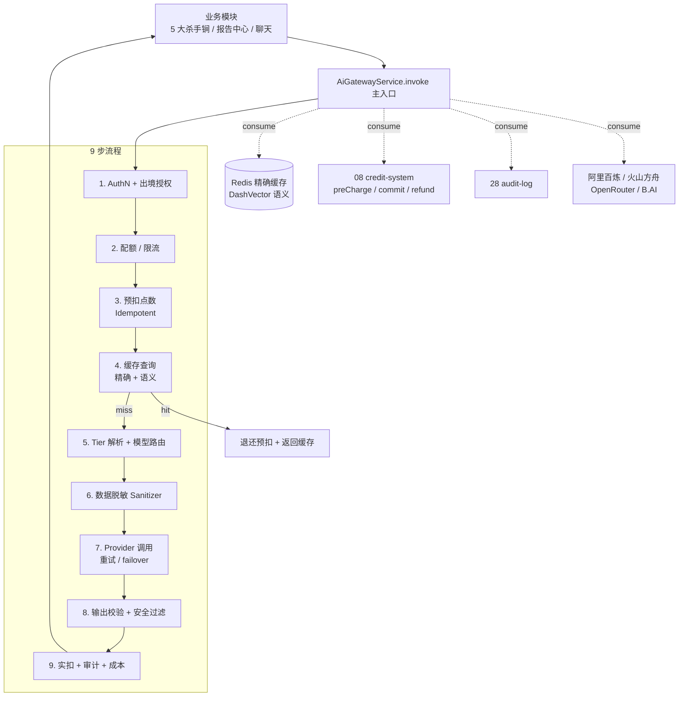

# 04 AI Gateway - Design

## 1. 整体架构



## 2. 模块目录

```
apps/api/src/ai-gateway/
├── ai-gateway.module.ts
├── ai-gateway.service.ts          # 主入口 invoke<T>
├── orchestrator.service.ts        # 9 步编排
├── tier-resolver.service.ts       # Tier 1-4 解析
├── output-validator.service.ts    # 4 强制要素 + schema
├── safety-filter.service.ts       # 输出敏感词
├── cost-meter.service.ts          # 成本统计
├── prompt-builder.service.ts      # System + User + few-shot 拼装
├── routing/
│   ├── default-routing.ts         # 任务 → 模型默认映射
│   ├── routing.service.ts         # 含后台覆盖逻辑
│   └── tier-prompt-injector.ts    # 按 tier 注入引导文案
├── providers/
│   ├── ai-provider.interface.ts
│   ├── aliyun-bailian.provider.ts
│   ├── volc-ark.provider.ts
│   ├── openrouter.provider.ts
│   ├── bai.provider.ts
│   ├── provider-router.service.ts # 选 provider + failover
│   └── health-monitor.worker.ts   # 健康监控
├── cache/
│   ├── exact-cache.service.ts     # Redis
│   └── semantic-cache.service.ts  # DashVector
├── sanitizer/
│   ├── sanitizer.service.ts       # mask / unmask
│   ├── company-name.detector.ts
│   ├── person-name.detector.ts
│   ├── amount.detector.ts
│   └── ... 6 类检测器
├── credit/
│   ├── pre-charge.service.ts      # 预扣（idempotent）
│   ├── commit.service.ts          # 实扣
│   └── refund.service.ts          # 退还（idempotent，BR-204）
├── audit/
│   └── ai-export-audit.service.ts
└── types/
    ├── ai-request.ts
    ├── ai-response.ts
    ├── prompt-template.ts
    └── tier-context.ts
```

## 3. 核心类型

```ts
// types/ai-request.ts
export interface AiRequest {
  taskType: AiTaskType;
  userId: string;
  tenantId: string;
  input: unknown;                  // 业务输入（zod 校验由 PromptTemplate.inputSchema 控制）
  context: TierContext;            // tier 解析所需
  options?: {
    enableCache?: boolean;
    timeoutMs?: number;
    idempotencyKey?: string;
  };
}

export interface AiResponse<T = unknown> {
  data: T;                         // 业务输出
  traceId: string;
  modelUsed: string;
  providerUsed: string;
  cost: { credits: number; rmb: Decimal };
  tier: 1 | 2 | 3 | 4;
  confidence: 'high' | 'medium' | 'low';
  nextStepHint: NextStepHint;
  cacheHit: boolean;
}

// types/prompt-template.ts
export interface PromptTemplate<TIn = unknown, TOut = unknown> {
  taskType: AiTaskType;
  version: string;
  description: string;
  primaryModel: string;
  fallbackModel: string;
  needsSanitize: boolean;
  cacheStrategy: 'exact' | 'semantic' | 'none';
  cacheTTL?: number;
  cost: number;                    // 默认扣点（system_configs 可覆盖）
  tier: (ctx: TierContext) => 1 | 2 | 3 | 4;
  inputSchema: z.ZodType<TIn>;
  outputSchema: z.ZodType<TOut>;
  systemPrompt: string;
  userTemplate: string;
  fewShotExamples: Array<{ name: string; input: TIn; output: TOut }>;
  fallbackText: string;
  safetyChecks: ('no_political' | 'no_pii_leak' | 'no_jailbreak')[];
}
```

## 4. 9 步编排（伪代码）

```ts
async invoke<T>(req: AiRequest): Promise<AiResponse<T>> {
  const traceId = req.traceId ?? generateTraceId();
  const template = await this.registry.get(req.taskType);

  // 1. 鉴权 + 出境授权
  if (template.needsSanitize && !await this.consent.has(req.userId, 'oversea_model')) {
    template.primaryModel = template.domesticFallbackModel;  // 自动降级
  }

  // 2. 限流
  await this.rateLimit.check(req.userId, req.tenantId);

  // 3. 预扣
  const cost = await this.pricing.resolve(template);
  const lockKey = req.options?.idempotencyKey ?? generateLockKey(req);
  await this.credit.preCharge(req.userId, cost, { idempotencyKey: lockKey });

  try {
    // 4. 缓存查询
    if (req.options?.enableCache !== false) {
      const cached = await this.cache.lookup(template, req.input);
      if (cached) {
        await this.credit.refund(req.userId, cost, { idempotencyKey: lockKey });
        return { ...cached, cacheHit: true };
      }
    }

    // 5. Tier 解析
    const tier = this.tierResolver.resolve(template, req.context);
    if (tier === 4) {
      await this.credit.refund(req.userId, cost, { idempotencyKey: lockKey });
      return this.buildHumanTakeoverCard(req, traceId);
    }

    // 5b. 模型路由
    const { provider, model } = await this.routing.select(template, req.context);

    // 6. 脱敏
    const { masked, replacements } = template.needsSanitize
      ? await this.sanitizer.mask(req.input)
      : { masked: req.input, replacements: null };

    // 6b. Prompt 组装（按 tier 注入引导）
    const messages = this.promptBuilder.build(template, masked, tier);

    // 7. 调用（重试 + failover）
    const raw = await this.providerRouter.invoke(provider, model, messages, {
      timeoutMs: req.options?.timeoutMs ?? 60000,
    });

    // 8. 还原 + 输出校验 + 安全过滤
    const restored = replacements ? this.sanitizer.unmask(raw, replacements) : raw;
    const parsed = await this.outputValidator.validate(restored, template.outputSchema);
    await this.safetyFilter.check(parsed, template.safetyChecks);

    // 9. 实扣 + 审计 + 成本
    await this.credit.commit(req.userId, cost, { idempotencyKey: lockKey });
    await this.audit.write({ action: 'AI_INVOKE', taskType: req.taskType, /*...*/ });
    await this.costMeter.track(req, parsed, raw.usage);

    if (template.cacheStrategy !== 'none') {
      await this.cache.set(template, req.input, parsed);
    }

    return { data: parsed, traceId, modelUsed: model, providerUsed: provider.name, /*...*/ };
  } catch (e) {
    await this.credit.refund(req.userId, cost, { idempotencyKey: lockKey });
    throw this.classify(e);
  }
}
```

## 5. Tier Prompt 注入策略（BR-321 / BR-323 / BR-324）

详见 [`design-flows.md` §9.4](../00-project-overview/design-flows.md)。本 spec 实现 `tier-prompt-injector.ts`：

```ts
const TIER_PROMPTS = {
  1: '你可以主动给出可执行的方案与具体建议。',
  2: '请给出分析框架与关键风险点；结尾必须追加："建议申请人工复核以获得专业判断。"',
  3: '你只做信息整理与风险提示，SHALL NOT 直接给方案；结尾必须追加："涉及重大决策，请申请同乾方略人工咨询。"',
  4: '不应到达此分支：tier=4 应在调用模型前被拦截。',
};

const RED_LINE_RULES = [
  '禁用绝对化表述：必须 / 一定 / 绝对 / 我建议你这样做',
  '必用参考性表述：建议关注 / 通常做法 / 参考行业惯例',
  '不出具正式法律 / 财务 / 投资意见',
];

// 输出阶段拦截（BR-323）：检测到禁词 → 重生成（最多 1 次）
```

## 6. 数据模型

```prisma
model AiTask {
  id           String   @id @default(cuid())
  task_type    String
  user_id      String
  tenant_id    String
  status       AiTaskStatus  // queued / processing / completed / failed
  tier         Int
  confidence   String?
  next_step    String?
  input_hash   String        // sha256(normalizedInput)
  model_used   String?
  provider_used String?
  cache_hit    Boolean   @default(false)
  cost_credits Int?
  cost_rmb     Decimal?  @db.Decimal(10,4)
  duration_ms  Int?
  trace_id     String
  created_at   DateTime  @default(now())
  completed_at DateTime?
  error_code   String?

  @@index([tenant_id, created_at])
  @@index([task_type, created_at])
  @@index([trace_id])
}

model AiCostLog {
  id              String   @id @default(cuid())
  ai_task_id      String   @unique
  input_tokens    Int
  output_tokens   Int
  input_cost_rmb  Decimal  @db.Decimal(10,6)
  output_cost_rmb Decimal  @db.Decimal(10,6)
  total_cost_rmb  Decimal  @db.Decimal(10,4)
  credits_charged Int
  profit_rmb      Decimal  @db.Decimal(10,4)
  cache_hit       Boolean  @default(false)
  created_at      DateTime @default(now())

  @@index([created_at])
}

model AiProviderHealth {
  id              String   @id @default(cuid())
  provider_name   String
  status          String   // healthy / degraded / down
  error_rate_5min Decimal  @db.Decimal(5,4)
  p95_latency_ms  Int?
  last_check_at   DateTime
  @@unique([provider_name])
}

model AiExportAudit {
  id            String   @id @default(cuid())
  ai_task_id    String
  input_hash    String   // 脱敏前
  masked_hash   String   // 脱敏后
  provider_name String   // OpenRouter / B.AI
  field_count   Int      // 脱敏字段数
  trace_id      String
  created_at    DateTime @default(now())

  @@index([created_at])
}

enum AiTaskStatus {
  queued
  processing
  completed
  failed
}
```

## 7. 关键 API（[`02`] OpenAPI yaml 注册）

```yaml
# packages/contracts/paths/ai-tasks.yaml
/ai-tasks:
  post:
    summary: 创建 AI 任务（异步）
    requestBody: { ... }
    responses:
      '201':
        description: 已排队
        content:
          application/json:
            schema:
              $ref: '#/components/schemas/AiTaskCreated'

/ai-tasks/{id}:
  get:
    summary: 查询任务状态
    responses:
      '200':
        $ref: '#/components/schemas/AiTask'

/ai-tasks/{id}/events:
  get:
    summary: SSE 进度推送
```

❗ 同步接口仅在内部 `aiGateway.invoke()` 调用，不暴露 HTTP（< 3s 的任务由业务模块直接 await）。

## 8. 4 大 Provider 实现要点

### 8.1 阿里百炼（默认主渠道）
- baseUrl：`https://dashscope.aliyuncs.com/api/v1`
- 模型：Qwen-Max / Qwen-Plus / Qwen-VL-Max / DashScope embedding
- 免脱敏（国产）

### 8.2 火山方舟
- baseUrl：`https://ark.cn-beijing.volces.com/api/v3`
- 模型：DeepSeek-V3 / DeepSeek-Lite / Doubao
- 免脱敏

### 8.3 OpenRouter（合规中转）
- baseUrl：`https://openrouter.ai/api/v1`
- 模型：claude-sonnet-4-6 / gpt-5 / gpt-5-vision
- **必脱敏 + 用户级出境授权**（BR-505）

### 8.4 B.AI（孙宇晨合规中转）
- baseUrl：从 admin 配置（创始人提供）
- 模型：同 OpenRouter
- **必脱敏 + 出境授权**

## 9. 测试与 PBT

### 9.1 PBT 强制要求

| 属性 | 函数 / 模块 |
|---|---|
| Tier 解析单调性 | tier-resolver：projectAmount ↑ → tier 单调非递减 |
| 4 要素完整性 | output-validator：缺一项必失败 |
| 红线表述拦截 | safety-filter：含"必须 / 一定 / 绝对" → blocked |
| 脱敏 round-trip | sanitizer：unmask(mask(x)) === x |
| 预扣 / 实扣 / 退还幂等 | credit/* 三服务：同 idempotencyKey 重复调用结果一致 |
| 缓存命中退点 | invoke 流程：cache hit → 用户净扣 0 |

### 9.2 e2e

- 注册 → 订阅 → 上传合同 → 报告生成（场景 1，[`design-protocols.md` §13.2](../00-project-overview/design-protocols.md)）

## 10. 错误码命名空间

`AI.*`，详见 requirements §12。

## 11. 后台覆盖（system_configs）

| key | 控制内容 | 默认值 |
|---|---|---|
| `ai.routing.{taskType}` | 任务 → 模型 + provider 路由 | `default-routing.ts` |
| `ai.credit_pricing.{taskType}` | 扣点价格 | `credit-pricing.ts` |
| `ai.tier_thresholds.{taskType}` | Tier 金额阈值 | `tier-thresholds.ts` |
| `ai.rate_limits` | 用户 / 租户 / 全平台限流 | `ai-rate-limits.ts` |
| `ai.cache_ttl.{taskType}` | 缓存 TTL | 24h |

修改后台 → Redis pub/sub 失效缓存（按 [`design.md` §5.14](../00-project-overview/design.md) 契约）。

## 12. 关键设计权衡

| 决策 | 选择 | 理由 |
|---|---|---|
| Tier 解析位置 | Prompt 模板内 `tier(ctx)` | DOQ-003 顶层倾向（[`design.md` §14.5](../00-project-overview/design.md)）|
| 缓存粒度 | 双层（精确 + 语义）| 精确缓存命中率高、语义缓存挽回相似查询 |
| 失败策略 | 重试 1 次同模型 → 切兜底模型 → 切下一渠道 → 退点 | OPC 模式优先用户体验 |
| 异步阈值 | ≥ 3s | 实测 5 大杀手锏 30s+，保留短任务同步通道 |
| 脱敏实现 | 规则引擎（正则 + NER）+ 后台白名单 | 一期不引 LLM 脱敏（成本 / 双重风险）|

## 13. 风险与缓解

| 风险 | 缓解 |
|---|---|
| 海外模型限流 | 多 provider 路由 + 后台一键切（BR-507）|
| 出境合规 | 强制脱敏 + 用户授权 + 政府版禁用（BR-505）|
| 模型输出违法内容 | safety-filter 输出过滤 + 拒绝返回 |
| 缓存雪崩 | exact 用 Redis TTL 抖动 + 语义缓存兜底 |
| 扣点重复 | idempotency-key 幂等保证 |

## 14. 后续扩展

- 二期可加 Anthropic 直连（HK 公司合规后，潜 ADR-003）
- 二期可加 LangSmith / Helicone 观测平台
- 二期可加自研推理服务（少量任务）
