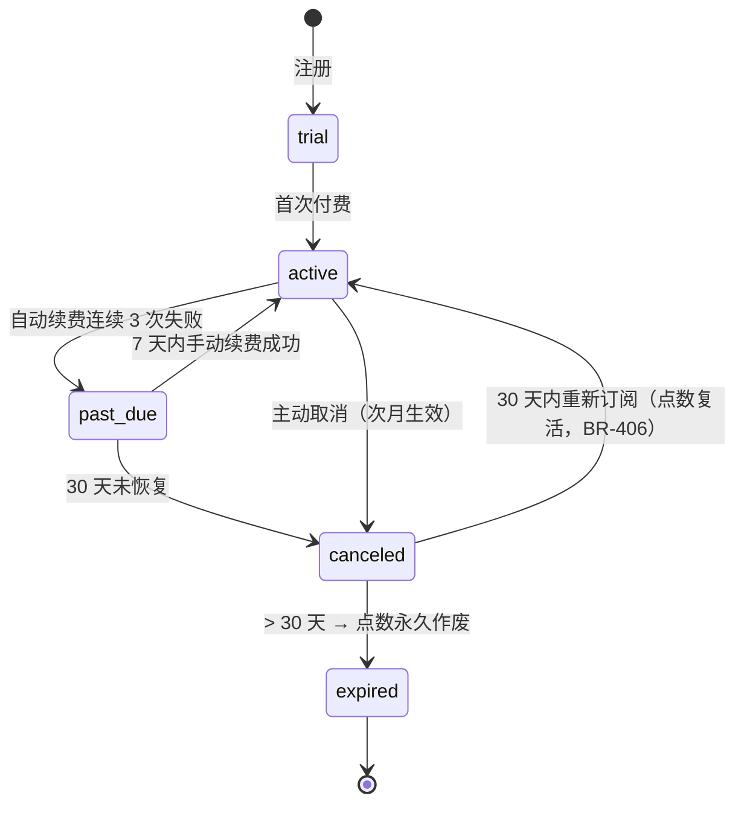

# 07 订阅与计费 - Design

## 1. 模块结构

```
apps/api/src/modules/subscription/
├── subscription.module.ts
├── subscription.service.ts
├── subscription.controller.ts
├── plans/
│   └── plan.service.ts                 # 5 档读取（含 system_configs 覆盖）
├── ladder.service.ts                   # 阶梯优惠 counter
├── discount-rebate.service.ts          # BR-205 返点实现
├── auto-renewal.worker.ts              # BullMQ cron + 重试 3
├── change-plan.service.ts              # 升降档
├── reactivation.service.ts             # 30 天复活（BR-406）
├── concierge.service.ts                # 旗舰版专属顾问分配（BR-409）
├── invoice.service.ts
└── status-machine.ts                   # BR-408 状态转移
```

## 2. 数据模型

```prisma
model SubscriptionPlan {
  id              String   @id @default(cuid())
  code            String   @unique  // trial / lite / std / ent / flag
  name            String
  monthly_price   Decimal  @db.Decimal(10,2)
  credits_per_month Int
  features        Json     // 功能开关
  is_active       Boolean  @default(true)
}

model Subscription {
  id                    String   @id @default(cuid())
  tenant_id             String   @unique  // 一企业一订阅
  plan_code             String
  status                SubStatus
  consecutive_months    Int      @default(0)  // 阶梯优惠 counter（BR-402）
  auto_renew            Boolean  @default(true)
  current_period_start  DateTime
  current_period_end    DateTime
  canceled_at           DateTime?
  expired_at            DateTime?
  past_due_since        DateTime?
  total_paid            Decimal  @db.Decimal(12,2)
  total_paid_months     Int      @default(0)
  concierge_user_id     String?  // 旗舰版专属顾问
  meta                  Json?
  created_at            DateTime @default(now())
  updated_at            DateTime @updatedAt

  @@index([status, current_period_end])
  @@index([past_due_since])
}

model SubscriptionChange {
  id              String   @id @default(cuid())
  subscription_id String
  from_plan       String
  to_plan         String
  type            String   // upgrade / downgrade / cancel / reactivate
  effective_at    DateTime
  prorate_amount  Decimal? @db.Decimal(10,2)
  initiated_by    String
  created_at      DateTime @default(now())
}

model RenewalAttempt {
  id              String   @id @default(cuid())
  subscription_id String
  attempt_no      Int
  result          String   // success / failure
  payment_id      String?
  error_code      String?
  attempted_at    DateTime @default(now())
}

model Invoice {
  id              String   @id @default(cuid())
  tenant_id       String
  subscription_id String
  amount          Decimal  @db.Decimal(10,2)
  invoice_no      String   @unique
  invoice_url     String?  // OSS
  email_sent_at   DateTime?
  status          String   // pending / issued / failed
  created_at      DateTime @default(now())
}

enum SubStatus { trial active past_due canceled expired }
```

## 3. 状态机（BR-408）



## 4. 阶梯优惠 counter 算法（PBT 强制）

```ts
class LadderService {
  /**
   * PBT 属性：
   * 1. counter 每次 successful 续费 +1
   * 2. 任一月未续费 → counter = 0
   * 3. 重新订阅 → counter = 1
   * 4. 一次性预付不影响 counter
   */
  async onRenewalSuccess(subId: string): Promise<{ counter: number; discount: Decimal }> {
    const sub = await this.repo.findOne(subId);
    const counter = sub.consecutive_months + 1;
    const discount = this.resolveDiscount(counter);
    await this.repo.update(subId, { consecutive_months: counter });
    return { counter, discount };
  }

  private resolveDiscount(counter: number): Decimal {
    if (counter >= 12) return new Decimal(0.7);
    if (counter >= 6)  return new Decimal(0.8);
    if (counter >= 3)  return new Decimal(0.85);
    return new Decimal(1.0);
  }
}
```

## 5. BR-205 返点实现

```ts
async chargeWithLadderRebate(subId: string): Promise<void> {
  const sub = await this.repo.findOne(subId);
  const plan = await this.planService.get(sub.plan_code);
  const { discount } = await this.ladder.onRenewalSuccess(subId);

  // 客户付原价
  const orderId = await this.paymentGw.charge({
    tenantId: sub.tenant_id,
    amount: plan.monthly_price,  // 原价
    metadata: { type: 'subscription.renew', subId },
  });

  // 差价 × 100 转赠送点数
  const rebate = plan.monthly_price.mul(new Decimal(1).sub(discount));
  if (rebate.gt(0)) {
    await this.creditSystem.gift({
      userId: sub.concierge_user_id ?? this.getOwnerUserId(sub.tenant_id),
      amount: rebate.mul(100).toNumber(),
      source: 'subscription.ladder.rebate',
      expiresInDays: 90,
      idempotencyKey: `${orderId}.rebate`,
    });
  }
}
```

## 6. 自动续费 Worker

```ts
@Processor('auto-renewal')
export class AutoRenewalWorker {
  // cron 每天 02:00 扫描即将到期 + 已到期未续
  // 提醒：到期前 7/3/1 天 → 推送
  // 到期当天扣款 → 失败立即重试 1（24h 后）→ 重试 2 → 重试 3 → 转 past_due
}
```

## 7. 关键 API

```yaml
GET  /api/v1/subscriptions/plans
GET  /api/v1/subscriptions/me
POST /api/v1/subscriptions               # 首次订阅
POST /api/v1/subscriptions/:id/change-plan  # 升降档
POST /api/v1/subscriptions/:id/cancel
POST /api/v1/subscriptions/reactivate    # 30 天内重新订阅
PATCH /api/v1/subscriptions/:id/auto-renewal  # 开关自动续费
GET  /api/v1/invoices                    # 我的发票
```

## 8. 错误码

`SUB.*`：
- `SUB.PLAN.NOT_FOUND` (404)
- `SUB.RENEWAL.PAYMENT_FAILED` (502)
- `SUB.STATUS.INVALID_TRANSITION` (409)
- `SUB.REACTIVATION.WINDOW_EXPIRED` (422)
- `SUB.CONCIERGE.OVERLOAD` (503)

## 9. PBT 落点（强制）

| 属性 | 函数 |
|---|---|
| counter 单调或重置 | `LadderService` |
| 状态转移合法性 | `status-machine.ts` |
| 返点金额 = 原价 × (1 - 折扣) × 100 | `discount-rebate.service` |
| 重复续费 idempotent | `subscription.service.renew` |

## 10. 后台覆盖

| key | 内容 |
|---|---|
| `subscription.plans.v1` | 5 档定价 + 含点数 + 功能开关 |
| `subscription.discount_ladders` | 阶梯阈值与折扣 |
| `subscription.renewal_retry` | 重试次数 + 间隔 |
| `subscription.reactivation_window_days` | 默认 30 |
| `subscription.concierge_max_per_user` | 默认 30 |
