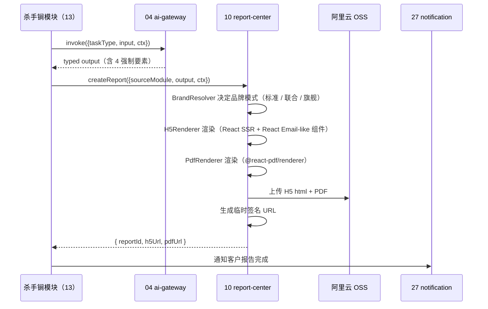

# 10 报告中心 - Design

## 1. 模块结构

```
apps/api/src/modules/report-center/
├── report-center.module.ts
├── report.service.ts                 # 创建 / 读取 / 列表
├── report.controller.ts
├── builder/
│   ├── report-builder.service.ts     # 主编排
│   ├── h5-renderer.service.ts        # 服务端 React 渲染（renderToString）
│   ├── pdf-renderer.service.ts       # @react-pdf/renderer
│   └── brand-resolver.service.ts     # 联合品牌选择
├── template/
│   └── template.service.ts           # 模板版本管理
├── rating/
│   └── rating.service.ts
├── escalation/
│   ├── human-review.service.ts       # Tier 2 申请人工
│   └── consult.service.ts            # Tier 3 引导咨询
└── storage/
    └── oss-uploader.service.ts
```

## 2. 数据模型

```prisma
model Report {
  id             String   @id @default(cuid())
  tenant_id      String
  user_id        String
  source_module  String   // 11-opportunity-radar / 13-risk-review / ...
  source_task_id String   // ai_task_id
  ai_task_type   String
  tier           Int
  confidence     String
  next_step      String

  h5_url         String?
  pdf_url        String?
  template_version Int

  brand_mode     String   // standard / co_brand_agent / co_brand_flagship
  agent_id       String?  // 联合品牌智能管家

  data_snapshot  Json     // AI 输出原始 typed data
  created_at     DateTime @default(now())

  rating         ReportRating?
}

model ReportRating {
  id          String   @id @default(cuid())
  report_id   String   @unique
  stars       Int      // 1-5
  feedback    String?
  rated_at    DateTime @default(now())
}

model ReportTemplate {
  id          String   @id @default(cuid())
  source_module String  // 报告类型（合同审查 / 招标速读 / ...）
  version     Int
  layout_schema Json
  is_active   Boolean  @default(true)
  created_at  DateTime @default(now())
  @@unique([source_module, version])
}

model ReportEscalation {
  id          String   @id @default(cuid())
  report_id   String
  type        String   // human_review / tongqian_consult
  status      String
  ticket_id   String?  // 关联 [`24-admin-console`] 工单
  created_at  DateTime @default(now())
}
```

## 3. 报告生成时序



## 4. 联合品牌选择（BrandResolver）

```ts
class BrandResolverService {
  resolve(report: Report, sub: Subscription, attribution?: ClientAttribution): BrandMode {
    if (sub.plan_code === 'flag') return 'co_brand_flagship';
    if (sub.plan_code === 'ent' && attribution?.agent_id) return 'co_brand_agent';
    if (sub.plan_code === 'std' && attribution?.agent_id) return 'co_brand_agent';
    return 'standard';
  }
}
```

## 5. 关键 API

```yaml
POST /api/v1/reports                 # 内部，业务模块创建
GET  /api/v1/reports/me              # 我的报告列表
GET  /api/v1/reports/:id             # 详情（返回 H5 / PDF 临时签名 URL）
POST /api/v1/reports/:id/rate
POST /api/v1/reports/:id/escalate    # 申请人工复核 / 同乾方略咨询
GET  /api/v1/admin/templates         # 模板管理
PUT  /api/v1/admin/templates/:id
```

## 6. 错误码

`REPORT.*`：
- `REPORT.RENDER.FAILED` (502)
- `REPORT.STORAGE.UPLOAD_FAILED` (502)
- `REPORT.NOT_FOUND` (404)
- `REPORT.URL.EXPIRED` (410)

## 7. PBT

| 属性 | 函数 |
|---|---|
| 4 强制要素出现率 100% | report-builder（缺失抛 schema error）|
| 品牌选择确定性 | BrandResolver |
| 临时 URL TTL 准确 | oss-uploader |

## 8. 后台覆盖

| key | 内容 |
|---|---|
| `report.template.{source_module}.active_version` | 当前活跃模板 |
| `report.signed_url_ttl_min` | 签名 URL 有效期（默认 60）|


---

## V4 升级·执行难度雷达图 + 报告水印（R8-R10 设计）

### V4.1 执行难度雷达图（R8 实现）

```prisma
model ReportDifficultyRadar {
  id            String   @id @default(cuid())
  report_id     String   @unique
  professional Int       // 0-100 专业性
  time_hours   Int       // 自己执行预估工时
  risk_score   Int       // 0-100 风险系数
  cost_score   Int       // 0-100 成本系数
  agent_alternative Json  // { days, compensation, success_rate }
  rendered_svg String?   // 雷达图 SVG 缓存
}
```

```
apps/api/src/modules/report/difficulty-radar/
├── radar-calculator.service.ts        # 4 维计算
├── radar-renderer.service.ts          # SVG 雷达图
└── alternative-comparator.service.ts  # 自己执行 vs 智能管家代办
```

约束（V4 BR-325）：
- SHALL NOT 故意夸大难度诱导转人工
- SHALL 基于真实数据：专业性来自任务类型 / 时间来自行业平均 / 风险来自规则库 / 成本来自市场参考
- 政企版禁用游戏化雷达图（用纯文字描述）

### V4.2 报告水印 + traceId（R9 实现）

```
apps/api/src/modules/report/watermark/
├── inline-watermark.service.ts        # 政企版 45° 倾斜 5% 透明度
├── meta-injector.service.ts           # 生成人 + 时间 + IP + traceId
├── trace-qrcode.service.ts            # 末页 traceId 二维码
└── tamper-detector.service.ts         # 检测尝试去水印 → 写审计
```

水印模板：
- 政企版：`内部使用，不对外 · {生成人} · {时间} · {IP}`
- 联合品牌：智能管家公司 LOGO + 同乾方略 LOGO + traceId
- 标准版：同乾方略 LOGO + traceId

### V4.3 5 引导按钮按角色裁剪（R10 实现）

```typescript
type GuidanceButton = {
  label: string;
  action: 'self_execute' | 'request_agent' | 'request_tongqian' | 'request_review' | 'request_expert' | 'execute_plan' | 'recommend_to_tongqian' | 'contact_cs' | 'report_to_owner';
  highlighted?: boolean;
};

function getGuidanceButtons(role: UserRole, tier: 1|2|3|4): GuidanceButton[] {
  switch (role) {
    case 'BUILDING_COMPANY_OWNER':
      return [
        { label: '自己执行', action: 'self_execute' },
        { label: '申请智能管家协助', action: 'request_agent', highlighted: tier <= 2 },
        { label: '申请同乾方略接管', action: 'request_tongqian', highlighted: tier === 3 },
        { label: '申请人工复核', action: 'request_review' },
        { label: '申请专家小时咨询', action: 'request_expert' }
      ];
    case 'AGENT':
      return [
        { label: '按方案执行', action: 'execute_plan' },
        { label: '推荐给同乾方略', action: 'recommend_to_tongqian', highlighted: tier >= 2 },
        { label: '咨询平台客服', action: 'contact_cs' }
      ];
    case 'GOV_USER':
      return [
        { label: '自己执行', action: 'self_execute' },
        { label: '申请同乾方略接管', action: 'request_tongqian' },
        { label: '申请专家小时咨询', action: 'request_expert' }
      ];
    case 'BUILDING_COMPANY_EMPLOYEE':
      return [
        { label: '自己执行', action: 'self_execute' },
        { label: '上报 OWNER', action: 'report_to_owner' }
      ];
  }
}
```

### V4.4 4 强制要素自动注入（R10 / BR-322）

```
apps/api/src/modules/report/required-elements/
├── disclaimer-builder.service.ts      # 免责声明 + 数据源列表
├── tier-badge.service.ts              # Tier 1-4 徽章
├── confidence-builder.service.ts      # 4 圆点 ●●●○ 信心度
└── element-validator.service.ts       # 自动校验缺失则报错
```

自动校验规则（PBT 测试）：
- 任意报告生成 → 必含免责 / Tier / 信心度 / 5 引导（按角色）
- 缺失任一 → 抛 `REPORT.REQUIRED_ELEMENT_MISSING` 错误
