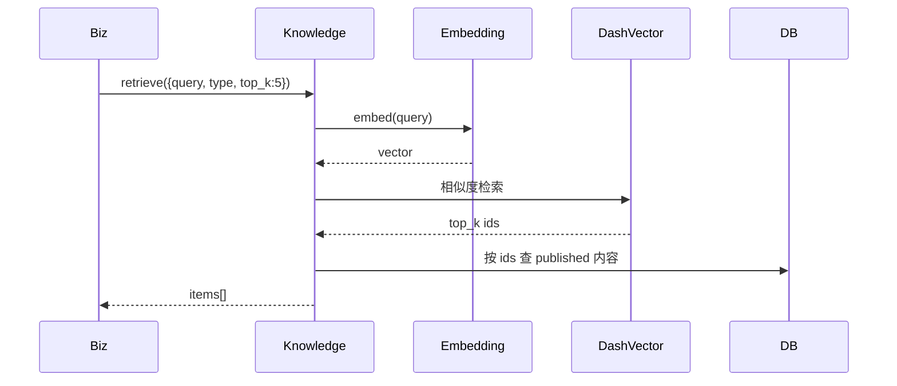

# 20 知识系统 - Design

## 1. 模块结构

```
apps/api/src/modules/knowledge/
├── knowledge.module.ts
├── policies/
│   ├── policy.service.ts
│   └── policy.controller.ts
├── performances/
│   └── performance.service.ts
├── contract-clauses/
│   └── clause.service.ts
├── tender-structures/
│   └── structure.service.ts
├── crawler/
│   ├── crawler.module.ts
│   ├── policy-crawler.worker.ts
│   ├── tender-crawler.worker.ts
│   └── performance-crawler.worker.ts
├── extractor/
│   ├── extractor.service.ts          # AI 抽取
│   └── prompts/
├── retrieval/
│   ├── embedding.service.ts          # 嵌入 + DashVector 写入
│   └── retrieval.service.ts          # RAG 查询
└── review/
    └── review.service.ts             # 专家审核台后端
```

## 2. 数据模型

```prisma
model Policy {
  id              String   @id @default(cuid())
  title           String
  level           String   // 中央 / 省 / 市 / 县
  topics          Json     // ['基建', '化债']
  publish_org     String
  publish_date    DateTime
  raw_text        String   @db.Text
  ai_summary      String
  status          String   // pending_review / published / rejected
  vector_id       String?  // DashVector
  reviewed_by     String?
  reviewed_at     DateTime?
  created_at      DateTime @default(now())

  @@index([status, publish_date])
}

model Performance {
  id              String   @id @default(cuid())
  source_url      String
  industry        String
  region          String
  amount          Decimal  @db.Decimal(15,2)
  winner_company  String
  raw_data        Json
  status          String
  vector_id       String?
}

model ContractClause {
  id              String   @id @default(cuid())
  type            String
  risk_level      String   // red / yellow / green
  category        String   // 担保 / 工期 / 付款 / ...
  clause_text     String   @db.Text
  standard_wording String   @db.Text
  suggestion      String
  status          String
  vector_id       String?
}

model TenderStructure {
  id              String   @id @default(cuid())
  industry        String
  project_type    String
  template_outline Json
  scoring_template Json
  status          String
  vector_id       String?
}

model CrawlJob {
  id              String   @id @default(cuid())
  source          String
  type            String   // policy / performance / tender
  status          String
  fetched_count   Int      @default(0)
  error           String?
  started_at      DateTime
  ended_at        DateTime?
}
```

## 3. RAG 查询时序



## 4. 关键 API

```yaml
GET  /api/v1/policies                    # 列表 + 主题 + 等级过滤
GET  /api/v1/policies/:id
PUT  /api/v1/policies/preferences

GET  /api/v1/performances                # 内部，被 [`11`] / [`14`] 用

GET  /api/v1/contract-clauses            # 内部，被 [`13`] 用

GET  /api/v1/tender-structures           # 内部，被 [`12`] 用

POST /api/v1/admin/knowledge/review      # 专家审核
POST /api/v1/admin/knowledge/crawler/trigger  # 手动触发抓取
```

## 5. 错误码 `KB.*`

- `KB.CRAWL.SOURCE_UNAVAILABLE` (502)
- `KB.EXTRACT.LOW_CONFIDENCE` (warning)
- `KB.RETRIEVAL.EMPTY` (200, empty result)

## 6. PBT

| 属性 | 函数 |
|---|---|
| RAG 召回 ≤ top_k | retrieval |
| 仅 published 进入业务查询 | services |

## 7. 后台覆盖

| key | 内容 |
|---|---|
| `kb.crawler.frequency.{source}` | 抓取频率 |
| `kb.extract.confidence_threshold` | 默认 0.85（OQ-005）|
| `kb.retrieval.top_k` | 默认 5 |
