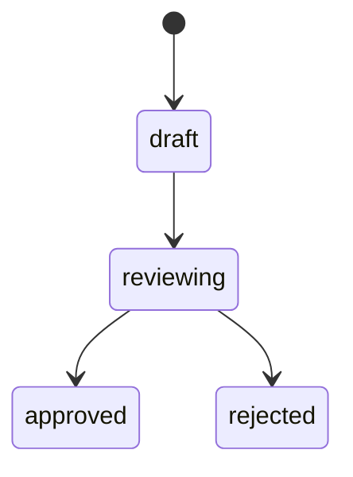

# Spec 模板（Spec Template）

> 用法：每个新模块的 spec 按下面 3 份模板填空。Codex / Claude Code 严格按 spec 执行，禁止超出 spec 范围。

## 0. 硬约束（必读）

> 防止 spec 文件过大导致 Codex 单会话失忆 / 上下文溢出。

| 约束 | 上限 | 超限时 |
|---|---|---|
| **单 spec 文件行数** | ≤ 800 行（业务子 spec）/ ≤ 900 行（顶层引用层 00-project-overview + 含大量配置代码块的基础设施 spec 如 01-infra-monorepo）| 拆分为 `design.md` + `design-flows.md`（业务时序）+ `design-protocols.md`（横切协议）|
| 单 Requirement 用户故事数 | ≤ 10 | 拆分为 Requirement A / B / C |
| 单 BR 描述行数 | ≤ 30 | 抽出为子 BR 或独立 ADR |
| tasks.md 单任务文件数 | ≤ 5 | 拆分为子任务（如 A1a / A1b）|
| tasks.md 单任务行数 | ≤ 500 | 同上 |

❗ 撰写到 700 行时**主动停下**评估是否需要拆分；900 行仍未拆分 → CI 拒绝合并。

## 模板 1：requirements.md

```markdown
# {模块名} - Requirements

## 1. 模块定位
- 一句话说明本模块解决什么问题
- 服务哪些角色
- 与其他模块的关系

## 2. 用户故事（User Stories）

### US-001：作为 {角色}，我希望 {功能}，以便 {价值}
- 验收标准 1
- 验收标准 2
- 验收标准 3

### US-002：...

## 3. 功能清单

| 编号 | 功能 | 优先级 | 描述 |
|---|---|---|---|
| F1 | xxx | P0 | xxx |
| F2 | xxx | P0 | xxx |
| F3 | xxx | P1 | xxx |

P0 = 必做，P1 = 应做，P2 = 可选

## 4. 业务规则

### BR-001：{规则名}
- 触发条件
- 业务约束
- 边界情况

## 5. 数据需求
- 需要哪些实体
- 关键字段
- 与其他模块的数据关系

## 6. 接口需求
- 需要对外暴露的 API
- 需要消费的 API

## 7. UI 需求
- 涉及哪些页面
- 关键交互流程

## 8. 非功能需求
- 性能：QPS / 响应时间
- 安全：权限边界 / 敏感数据
- 合规：数据出境 / 审计

## 9. 边界（不做什么）
- 列出明确不做的功能（防止范围蔓延）

## 10. 依赖
- 依赖的其他 spec / 系统
- 阻塞性依赖

## 11. 风险与开放问题
- 已知风险
- 待用户决策的问题
```

## 模板 2：design.md

```markdown
# {模块名} - Design

## 1. 整体架构

### 1.1 数据流向图
```
[用户] → [前端] → [API] → [Service] → [Repository] → [DB]
                            ↓
                       [AI Gateway]
                            ↓
                       [Worker]
```

### 1.2 模块边界
- 模块内部的子模块划分
- 与其他模块的边界

## 2. 数据模型

### 2.1 Prisma Schema 增量
（直接给出本模块新增 / 修改的 model）

```prisma
model Contract {
  id          String   @id @default(cuid())
  tenant_id   String
  // ...
}
```

### 2.2 索引设计
- 必须的索引
- 复合索引

### 2.3 状态机
- 用 mermaid stateDiagram



## 3. API 设计

### 3.1 接口列表

| 方法 | 路径 | 描述 | 权限 |
|---|---|---|---|
| POST | `/api/v1/contracts` | 创建合同 | contract:create |
| GET | `/api/v1/contracts` | 列表 | contract:list |
| ... | | | |

### 3.2 关键接口详细

#### POST /api/v1/contracts/review

**Request**:
```json
{
  "fileId": "string",
  "options": { "depth": "basic" | "pro" }
}
```

**Response (201)**:
```json
{
  "code": 0,
  "data": { "taskId": "string", "status": "queued" },
  "message": "ok",
  "traceId": "..."
}
```

**Errors**:
- `CONTRACT.REVIEW.FILE_NOT_FOUND` → 404
- `CREDIT.INSUFFICIENT` → 422

## 4. 服务层设计

### 4.1 Service 类
```ts
class ContractReviewService {
  async createReview(input: CreateReviewInput): Promise<ReviewTask>;
  async getReviewStatus(taskId: string): Promise<ReviewStatus>;
  // ...
}
```

### 4.2 关键算法
（用伪代码描述核心算法）

### 4.3 事务边界
- 哪些操作必须在同一事务
- 跨服务调用 / 队列消息

## 5. 前端设计

### 5.1 页面树
```
/contracts
├── /contracts                   # 列表页
├── /contracts/new                # 上传页
├── /contracts/:id                # 详情页
│   ├── overview                  # 概览
│   ├── risks                     # 风险列表
│   └── history                   # 历史
└── /contracts/:id/edit
```

### 5.2 关键组件
- `ContractList`：列表
- `ContractCard`：卡片
- `RiskBadge`：风险标签
- `ReviewProgress`：审查进度

### 5.3 用户流程
- 流程 1：上传合同 → 等待 AI 分析 → 查看报告
- 流程 2：...

## 6. AI 调用

### 6.1 涉及的 AI 任务
- `CONTRACT_REVIEW_BASIC`：基础审查
- `CONTRACT_REVIEW_PRO`：专业审查

### 6.2 Prompt 设计
- 详见 `apps/api/src/prompts/contract/review-pro.ts`
- 输出 schema：`ContractReviewOutputSchema`

### 6.3 模型路由
- 主：Claude Sonnet 4.6
- 兜底：Qwen-Max

## 7. 权限设计

| 操作 | 角色 |
|---|---|
| `contract:create` | OWNER, BIZ_DIRECTOR, CONTRACT_MGR |
| `contract:approve` | OWNER, FIN_DIRECTOR |
| `contract:delete` | OWNER（仅草稿状态）|

## 8. 性能与缓存

- 列表查询缓存 60s
- AI 审查结果缓存 24h（按文件 hash）
- 大列表用游标分页

## 9. 安全考虑

- 文件上传校验：扩展名 + magic number + 大小
- 数据出境：长合同必须脱敏后调海外模型
- 权限隔离：所有查询带 tenant_id
- 审计：所有审批操作写审计日志

## 10. 监控指标

- 审查任务排队时长
- 审查成功率 / 失败率
- 单次平均成本
- 用户对报告的满意度评分

## 11. 开放问题

- 待用户决策的问题
```

## 模板 3：tasks.md

```markdown
# {模块名} - Tasks

> 任务清单。Codex / Claude Code 按顺序推进，每完成一个勾选一个。

## 任务总数：N

## Phase A：数据层

- [ ] A1. 在 prisma/schema.prisma 添加 Contract / ContractReview / ContractRisk model
  - 文件：prisma/schema.prisma
  - 跑 `prisma migrate dev --name add_contract_models`
  - 验收：migration 成功 + Prisma Client 生成

- [ ] A2. 实现 ContractRepository
  - 文件：apps/api/src/modules/contract/contract.repository.ts
  - 必须方法：findById / findMany / create / update / softDelete
  - 必须支持 tenant_id 过滤
  - 验收：单元测试覆盖率 ≥ 80%

## Phase B：Service 层

- [ ] B1. 实现 ContractService.createReview
  - 文件：apps/api/src/modules/contract/contract.service.ts
  - 验收：单测通过 happy / 文件不存在 / 配额不足 三种场景

- [ ] B2. 实现 AI Gateway 集成（CONTRACT_REVIEW_PRO 任务）
  - 文件：apps/api/src/prompts/contract/review-pro.ts
  - 文件：apps/api/src/modules/contract/contract.service.ts
  - 验收：调用 Gateway 成功 + 失败退点

## Phase C：Controller

- [ ] C1. 实现 POST /api/v1/contracts/review
  - 文件：apps/api/src/modules/contract/contract.controller.ts
  - 验收：e2e 测试通过

- [ ] C2. 实现 GET /api/v1/contracts/:id/review-status
  - ...

## Phase D：前端

- [ ] D1. 创建合同审查上传页 /contracts/new
  - 文件：apps/web/src/app/(main)/contracts/new/page.tsx
  - 文件：apps/web/src/app/(main)/contracts/new/_components/upload-form.tsx
  - 验收：能上传 + 创建任务 + 跳转到详情

- [ ] D2. 创建合同审查详情页
  - ...

## Phase E：通知 + 推送

- [ ] E1. 审查完成 → 通知用户
  - ...

## Phase F：测试

- [ ] F1. e2e 测试：上传合同 → AI 审查 → 查看报告
- [ ] F2. 性能测试：100 并发上传

## Phase G：文档与发布

- [ ] G1. 写模块 README
  - 文件：apps/api/src/modules/contract/README.md

- [ ] G2. 更新 OpenAPI yaml
  - 文件：packages/contracts/openapi.yaml

- [ ] G3. 更新 docs/changelog/
```

## Spec 推进规则

每个 spec 三阶段独立 commit：

```
feat(contract): add requirements
feat(contract): add design
feat(contract): add tasks
```

每阶段用户审过才进下一阶段。
